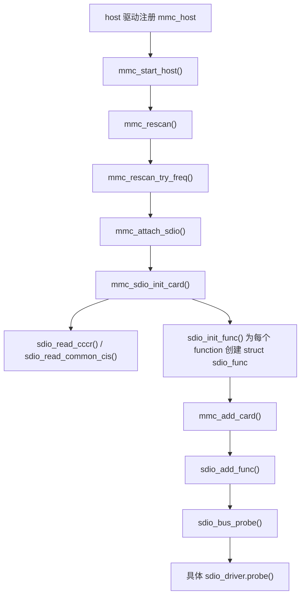

# SDIO 源码解析总览

## 学习目标

- 建立 SDIO 学习项目的阅读地图
- 区分 `mmc_host`、`mmc_card`、`sdio_func`、`sdio_driver` 各自所在层次
- 明确 SDIO 卡枚举、function 设备创建、总线匹配、function driver probe 的完整顺序
- 把 HI3516CV610 的 `nebula,sdhci` 板级落地放回 Linux 标准 SDIO 主线里理解
- 为后续 SDIO WiFi/BT 模组调试建立工程排查入口
- 用达标检查清单判断学习完成后是否已经具备独立阅读和排查 SDIO 问题的能力
- 按“字段来源、入口上游、请求下发路径、多 IRQ 边界、板级消费路径、达标复盘”这套结构复看每一章

## 导读

### 本章定位

这一章是 SDIO 笔记的总入口，负责先搭出对象层、源码层、枚举链路、板级落地和阅读顺序。

### 核心对象

- `struct mmc_host`
  - SoC 侧 MMC/SD/SDIO 控制器对象
  - 它代表板子上的一套控制器实例，负责发命令、搬数据、切时钟/电压、上报中断
  - SDIO 主线的起点通常就是 host 驱动先把 `mmc_host` 注册给 MMC core
- `struct mmc_card`
  - 被 MMC core 识别出来的一张卡
  - 它代表“整张卡”的公共身份，保存 OCR、CCCR、CIS、function 数量等整卡级信息
  - 先有 `mmc_card`，后面才会继续为卡上的每个 function 创建 `sdio_func`
- `struct sdio_func`
  - SDIO 卡上的一个 function 设备
  - `function` 可以理解成“卡上的一个独立功能单元”，一张 SDIO 卡上可以有多个 function
  - 例如 WiFi 常常挂在 `function 1`，后续具体驱动也是按 `sdio_func` 为单位进入 `probe()`
  - `sdio_func` 进入 driver model 以后，会作为 `sdio bus` 上的一个 device 去和 `sdio_driver` 匹配
- `struct sdio_driver`
  - 绑定到具体 function 的驱动对象
  - 它的 `id_table` 决定驱动能绑定哪些 `sdio_func`
  - 真正的芯片私有初始化、I/O、IRQ、remove 清理，通常都从 `sdio_driver.probe/remove` 开始展开

### 关键函数

- `mmc_attach_sdio()`
- `mmc_sdio_init_card()`
- `sdio_init_func()`
- `sdio_add_func()`
- `sdio_bus_probe()`
- `sdio_enable_func()`
- `sdio_claim_irq()`

### 主流程

host 控制器注册 -> MMC core rescan -> 优先尝试 SDIO attach -> SDIO 卡识别 -> 整卡初始化 -> 创建 function -> 注册到 sdio bus -> 匹配 `sdio_driver` -> 进入 function driver probe -> 建立 I/O 与 IRQ 通路

## 这一章按什么逻辑展开

这一章按“先搭地图，再给主线，再安排阅读顺序”的逻辑展开。

这样拆的原因是：

- 总览章的任务不是立刻深入某个函数
- 而是先把对象层、源码入口、主流程和章节顺序站稳
- 后面各章再分别展开枚举、probe、I/O、中断和板级落地

所以本章后面的结构是：

1. 先给解析基线，固定源码范围
2. 再说明这套笔记具体要解决什么问题
3. 再给阅读顺序，避免后面章节跳读失去主线
4. 最后用总图和关键函数把整条 SDIO 主线串起来

## 1. 解析基线

- 远端实际源码路径：`/home/ipc/Hi3516/1.0.1.0/Hi3516CV610_SDK_V1.0.1.0/open_source/linux/linux-5.10.y`
- 本地镜像路径：`linux-5.10.y`
- 内核版本：`Linux 5.10.221`
- SoC/板级：`HI3516CV610`

这套笔记只围绕当前 SDK 内核树展开，不混入其他主线版本差异。这样 Obsidian 里的函数名、文件路径、DTS 节点和实际环境可以直接对应。

## 2. 这套笔记解决什么问题

- SDIO 在 Linux 5.10 里是怎么被识别出来的
- `struct sdio_func` 是什么时候创建的
- `sdio_driver` 是怎么和具体 function 匹配上的
- 数据读写 API 到底落到哪里
- 入门文章里的最小 `sdio_driver` 模板、字符设备读写例子，和真实 WiFi/BT function driver 的边界在哪里
- SDIO 中断从 host 到 function driver 是怎么传递的
- HI3516CV610 上这条链路在 DTS 和 `nebula` host 驱动里是怎么落地的

## 3. 阅读顺序

1. [[01-SDIO核心数据结构]]
2. [[02-SDIO卡枚举与初始化]]
3. [[03-SDIO总线匹配与probe]]
4. [[04-SDIO数据通路与常用API]]
5. [[05-SDIO中断机制]]
6. [[06-典型Function驱动例子]]
7. [[07-HI3516CV610板级落地]]
8. [[08-SDIO调试与阅读建议]]
9. [[09-SDIO实际工程问题问答]]
10. [[10-SDIO学习达标检查清单]]

这里把 [[06-典型Function驱动例子]] 放在 [[07-HI3516CV610板级落地]] 前面，原因是：

- `06` 先把标准 SDIO function driver 的最小顺序站稳
  - `probe -> enable_func -> set_block_size -> I/O -> IRQ -> bus ops/transport -> remove`
- `07` 再按这条顺序对照 HI3516CV610 的真实板级实现
  - 先看 DTS 怎么选 host
  - 再看 `nebula,sdhci` 怎么注册 `mmc_host`
  - 最后看标准枚举链怎么继续走到 `sdio_func` 和具体 function driver

按最新学习架构复盘时，每章都要带着下面几个问题读：

- 入口是谁触发的，上游链路从哪里来
- 当前对象的关键字段从哪里填，后续被谁消费
- 如果这里有寄存器访问、协议命令或数据请求，它最后如何落到 host/controller
- 如果这里用了教学型字符设备例子，要能说明它和真实子系统驱动的差别
- 如果这里涉及设备树，DTS 属性最终映射到哪个 Linux 对象或资源
- 如果这里涉及 IRQ，要分清是 host/controller 内部中断、SDIO in-band IRQ，还是外部平台 IRQ
- 学完本章后，能否在 [[10-SDIO学习达标检查清单]] 里找到对应自测题并回答

## 4. 最重要的一条主线



### 4.1 这条图里的每一步在做什么

- `host 驱动注册 mmc_host`
  - 作用：把控制器实例交给 MMC core
  - 含义：从这一刻开始，内核才有一套可以用来做 SDIO 枚举的 host
- `mmc_start_host() -> mmc_rescan()`
  - 作用：host 注册完成后，MMC core 安排并执行一次扫描
  - 含义：SDIO attach 不是凭空发生的，而是 rescan 按 SDIO、SD、MMC 的顺序尝试识别出来的
- `mmc_attach_sdio()`
  - 作用：确认当前这张卡按 SDIO 路线继续初始化
  - 含义：这是 SDIO 主线的入口函数
- `mmc_sdio_init_card()`
  - 作用：完成整张卡级别的初始化
  - 含义：这里先处理的是 `mmc_card`，还不是具体 function driver
- `sdio_read_cccr() / sdio_read_common_cis()`
  - 作用：读取 SDIO 公共控制寄存器和 card 级 CIS
  - 含义：用来填充整张卡支持什么能力、有哪些公共属性
- `sdio_init_func()`
  - 作用：为卡上的每个 function 创建一个 `struct sdio_func`
  - 含义：这里解决的是“对象创建”，把卡上的功能单元一个个建出来
- `mmc_add_card()`
  - 作用：把整张卡注册进 MMC 设备模型
  - 含义：这是 card 级对象的注册点
- `sdio_add_func()`
  - 作用：把单个 `sdio_func` 注册成 sdio bus 上的 device
  - 含义：这里解决的是“设备注册”，之后才可能匹配具体驱动
- `sdio_bus_probe()`
  - 作用：SDIO 总线层做统一的匹配后准备，再转发给具体 function driver
  - 含义：这里是 bus 层和 function driver 的分界点
- `具体 sdio_driver.probe()`
  - 作用：进入芯片私有初始化逻辑
  - 含义：从这一刻开始，才真正进入 WiFi、BT、GNSS 或其他模组自己的驱动代码

### 4.2 这条图最容易混的两个点

- `mmc_sdio_init_card()` 处理的是整张卡
  - 这里主要围绕 `mmc_card` 展开，先把整卡能力读出来
- `sdio_driver.probe()` 处理的是单个 function
  - 这里围绕 `sdio_func` 展开，一个 function 对应一个 function driver 视角下的设备

所以这条链需要分成两段看：

```text
前半段:
host -> card -> function 对象创建

后半段:
function 设备注册 -> sdio bus 匹配 -> 具体驱动 probe
```

理解这条主线后，再看任意一个 SDIO WiFi、BT、GNSS、模组驱动，都能先判断问题落在 host、core、bus 还是 function driver。

## 5. 对应源码入口

### 5.1 SDIO core

- `drivers/mmc/core/sdio.c`
- `drivers/mmc/core/sdio_bus.c`
- `drivers/mmc/core/sdio_io.c`
- `drivers/mmc/core/sdio_irq.c`
- `include/linux/mmc/sdio_func.h`
- `include/linux/mmc/host.h`
- `include/linux/mmc/card.h`

### 5.2 HI3516CV610 板级落地

- `arch/arm/boot/dts/hi3516cv610.dtsi`
- `arch/arm/boot/dts/hi3516cv610-demb.dts`
- `drivers/vendor/mmc/sdhci_nebula.c`
- `drivers/vendor/mmc/dtsi_usage.txt`

## 6. 先给结论

### 6.1 从 Linux 的视角看

SDIO 不是“单一设备驱动”，而是三层叠起来：

- `MMC host controller`：控制器驱动，负责发命令、搬数据、上报 IRQ
- `MMC/SDIO core`：负责识别卡、创建 `mmc_card` 和 `sdio_func`
- `SDIO function driver`：真正对接芯片功能，比如 WiFi/BT

### 6.2 从 HI3516CV610 的视角看

HI3516CV610 这里并没有改掉 Linux 的 SDIO core 主线，它只是把最底层 host 换成了自己的 `nebula,sdhci`：

- SoC DTS 里定义了 `mmc0`、`sdio0`、`sdio1`
- 板级 DTS 选择启用哪个节点
- `drivers/vendor/mmc/sdhci_nebula.c` 把硬件适配到标准 `sdhci + mmc core` 框架
- 所以上层 `sdio.c / sdio_bus.c / sdio_io.c / sdio_irq.c` 的行为仍然基本是标准 Linux 5.10 逻辑

## 7. 当前板级配置要点

根据 `hi3516cv610-demb.dts`：

- `&mmc0 { status = "disabled"; }`
- `&sdio0 { status = "okay"; }`
- `&sdio1 { status = "disabled"; }`

这说明当前板级选择的是 `sdio0`，不是 `mmc0`，也不是 `sdio1`。而 `hi3516cv610.dtsi` 里可以看到：

- `mmc0` 和 `sdio0` 共享同一套控制器基地址 `0x10030000`
- 区别不在“硬件地址不同”，而在“DTS 把这套控制器按哪种用途暴露给内核”

这点对调试非常关键，后面会反复用到。

## 8. 这套笔记回答的问题

- SDIO 卡是从哪一个入口被识别出来的
- `mmc_card` 和 `sdio_func` 分别在什么时候创建
- `sdio_driver.probe()` 为什么不是插卡后立刻调用
- `sdio_claim_host()` 为什么几乎贯穿所有 I/O 路径
- SDIO 中断为什么要分 host 层和 core 分发层看
- HI3516CV610 的 `sdio0` 如何通过 `nebula,sdhci` 接回标准 SDHCI/MMC/SDIO 主线
- 实际工程里 probe 不进、读写超时、中断不来、WiFi 模组不工作时应该按什么层次排查
- 学完 SDIO 项目后应该达到什么效果，以及如何对照清单判断是否达标
