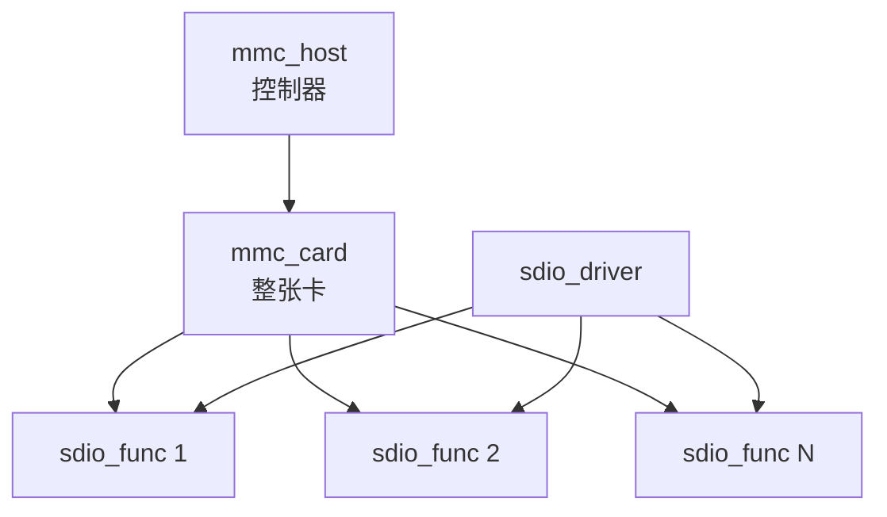

# SDIO 核心数据结构

## 导读

### 本章定位

这一章先建立 SDIO 的对象模型。后续枚举、probe、I/O、中断、板级落地都会围绕 `mmc_host`、`mmc_card`、`sdio_func`、`sdio_driver` 这四个对象展开。

### 核心对象

- `struct mmc_host`
  - 控制器实例
- `struct mmc_card`
  - 被识别出来的整张卡
- `struct sdio_func`
  - SDIO 卡上的一个 function
- `struct sdio_driver`
  - 绑定到 function 的驱动

### 关键函数

- `mmc_alloc_host()`
- `mmc_add_host()`
- `mmc_attach_sdio()`
- `sdio_init_func()`
- `sdio_add_func()`
- `sdio_register_driver()`

### 主流程

host 驱动注册 `mmc_host` -> core 识别出 `mmc_card` -> core 为每个 function 创建 `sdio_func` -> function 设备进入 sdio bus -> `sdio_driver` 匹配并 probe。

```c
static struct bus_type sdio_bus_type = {
	.name		= "sdio",
	.dev_groups	= sdio_dev_groups,
	.match		= sdio_bus_match,
	.uevent		= sdio_bus_uevent,
	.probe		= sdio_bus_probe,
	.remove		= sdio_bus_remove,
	.pm		= &sdio_bus_pm_ops,
};
```
## 这一章按什么逻辑展开

这一章按“先把对象拆开，再用对象关系把主线串起来”的逻辑展开。

这样拆的原因是：

- 后面枚举、probe、I/O、中断几章，都会不断回到 `mmc_host`、`mmc_card`、`sdio_func`、`sdio_driver`
- 如果这四个对象的层次和边界不先站稳，后面的函数调用链会看起来像在空中跳转

所以本章后面的结构是：

1. 先逐个展开四个核心对象
2. 再交代关键字段为什么重要
3. 最后把对象关系收回到一条主流程上

## 1. 先抓住四个核心对象

### 1.1 `struct mmc_host`

文件：

- `include/linux/mmc/host.h`
#mmc_host
>[!INFO]
```C {5,37,75,167,169,146} fold:"mmc_host"
struct mmc_host {
	struct device		*parent;
	struct device		class_dev;
	int			index;
	const struct mmc_host_ops *ops;
	struct mmc_pwrseq	*pwrseq;
	unsigned int		f_min;
	unsigned int		f_max;
	unsigned int		f_init;
	u32			ocr_avail;
	u32			ocr_avail_sdio;	/* SDIO-specific OCR */
	u32			ocr_avail_sd;	/* SD-specific OCR */
	u32			ocr_avail_mmc;	/* MMC-specific OCR */
	struct wakeup_source	*ws;		/* Enable consume of uevents */
	u32			max_current_330;
	u32			max_current_300;
	u32			max_current_180;

#define MMC_VDD_165_195		0x00000080	/* VDD voltage 1.65 - 1.95 */
#define MMC_VDD_20_21		0x00000100	/* VDD voltage 2.0 ~ 2.1 */
#define MMC_VDD_21_22		0x00000200	/* VDD voltage 2.1 ~ 2.2 */
#define MMC_VDD_22_23		0x00000400	/* VDD voltage 2.2 ~ 2.3 */
#define MMC_VDD_23_24		0x00000800	/* VDD voltage 2.3 ~ 2.4 */
#define MMC_VDD_24_25		0x00001000	/* VDD voltage 2.4 ~ 2.5 */
#define MMC_VDD_25_26		0x00002000	/* VDD voltage 2.5 ~ 2.6 */
#define MMC_VDD_26_27		0x00004000	/* VDD voltage 2.6 ~ 2.7 */
#define MMC_VDD_27_28		0x00008000	/* VDD voltage 2.7 ~ 2.8 */
#define MMC_VDD_28_29		0x00010000	/* VDD voltage 2.8 ~ 2.9 */
#define MMC_VDD_29_30		0x00020000	/* VDD voltage 2.9 ~ 3.0 */
#define MMC_VDD_30_31		0x00040000	/* VDD voltage 3.0 ~ 3.1 */
#define MMC_VDD_31_32		0x00080000	/* VDD voltage 3.1 ~ 3.2 */
#define MMC_VDD_32_33		0x00100000	/* VDD voltage 3.2 ~ 3.3 */
#define MMC_VDD_33_34		0x00200000	/* VDD voltage 3.3 ~ 3.4 */
#define MMC_VDD_34_35		0x00400000	/* VDD voltage 3.4 ~ 3.5 */
#define MMC_VDD_35_36		0x00800000	/* VDD voltage 3.5 ~ 3.6 */

	u32			caps;		/* Host capabilities */

#define MMC_CAP_4_BIT_DATA	(1 << 0)	/* Can the host do 4 bit transfers */
#define MMC_CAP_MMC_HIGHSPEED	(1 << 1)	/* Can do MMC high-speed timing */
#define MMC_CAP_SD_HIGHSPEED	(1 << 2)	/* Can do SD high-speed timing */
#define MMC_CAP_SDIO_IRQ	(1 << 3)	/* Can signal pending SDIO IRQs */
#define MMC_CAP_SPI		(1 << 4)	/* Talks only SPI protocols */
#define MMC_CAP_NEEDS_POLL	(1 << 5)	/* Needs polling for card-detection */
#define MMC_CAP_8_BIT_DATA	(1 << 6)	/* Can the host do 8 bit transfers */
#define MMC_CAP_AGGRESSIVE_PM	(1 << 7)	/* Suspend (e)MMC/SD at idle  */
#define MMC_CAP_NONREMOVABLE	(1 << 8)	/* Nonremovable e.g. eMMC */
#define MMC_CAP_WAIT_WHILE_BUSY	(1 << 9)	/* Waits while card is busy */
#define MMC_CAP_3_3V_DDR	(1 << 11)	/* Host supports eMMC DDR 3.3V */
#define MMC_CAP_1_8V_DDR	(1 << 12)	/* Host supports eMMC DDR 1.8V */
#define MMC_CAP_1_2V_DDR	(1 << 13)	/* Host supports eMMC DDR 1.2V */
#define MMC_CAP_DDR		(MMC_CAP_3_3V_DDR | MMC_CAP_1_8V_DDR | \
				 MMC_CAP_1_2V_DDR)
#define MMC_CAP_POWER_OFF_CARD	(1 << 14)	/* Can power off after boot */
#define MMC_CAP_BUS_WIDTH_TEST	(1 << 15)	/* CMD14/CMD19 bus width ok */
#define MMC_CAP_UHS_SDR12	(1 << 16)	/* Host supports UHS SDR12 mode */
#define MMC_CAP_UHS_SDR25	(1 << 17)	/* Host supports UHS SDR25 mode */
#define MMC_CAP_UHS_SDR50	(1 << 18)	/* Host supports UHS SDR50 mode */
#define MMC_CAP_UHS_SDR104	(1 << 19)	/* Host supports UHS SDR104 mode */
#define MMC_CAP_UHS_DDR50	(1 << 20)	/* Host supports UHS DDR50 mode */
#define MMC_CAP_UHS		(MMC_CAP_UHS_SDR12 | MMC_CAP_UHS_SDR25 | \
				 MMC_CAP_UHS_SDR50 | MMC_CAP_UHS_SDR104 | \
				 MMC_CAP_UHS_DDR50)
#define MMC_CAP_SYNC_RUNTIME_PM	(1 << 21)	/* Synced runtime PM suspends. */
#define MMC_CAP_NEED_RSP_BUSY	(1 << 22)	/* Commands with R1B can't use R1. */
#define MMC_CAP_DRIVER_TYPE_A	(1 << 23)	/* Host supports Driver Type A */
#define MMC_CAP_DRIVER_TYPE_C	(1 << 24)	/* Host supports Driver Type C */
#define MMC_CAP_DRIVER_TYPE_D	(1 << 25)	/* Host supports Driver Type D */
#define MMC_CAP_DONE_COMPLETE	(1 << 27)	/* RW reqs can be completed within mmc_request_done() */
#define MMC_CAP_CD_WAKE		(1 << 28)	/* Enable card detect wake */
#define MMC_CAP_CMD_DURING_TFR	(1 << 29)	/* Commands during data transfer */
#define MMC_CAP_CMD23		(1 << 30)	/* CMD23 supported. */
#define MMC_CAP_HW_RESET	(1 << 31)	/* Reset the eMMC card via RST_n */

	u32			caps2;		/* More host capabilities */

#define MMC_CAP2_BOOTPART_NOACC	(1 << 0)	/* Boot partition no access */
#define MMC_CAP2_FULL_PWR_CYCLE	(1 << 2)	/* Can do full power cycle */
#define MMC_CAP2_FULL_PWR_CYCLE_IN_SUSPEND (1 << 3) /* Can do full power cycle in suspend */
#define MMC_CAP2_HS200_1_8V_SDR	(1 << 5)        /* can support */
#define MMC_CAP2_HS200_1_2V_SDR	(1 << 6)        /* can support */
#define MMC_CAP2_HS200		(MMC_CAP2_HS200_1_8V_SDR | \
				 MMC_CAP2_HS200_1_2V_SDR)
#define MMC_CAP2_CD_ACTIVE_HIGH	(1 << 10)	/* Card-detect signal active high */
#define MMC_CAP2_RO_ACTIVE_HIGH	(1 << 11)	/* Write-protect signal active high */
#define MMC_CAP2_NO_PRESCAN_POWERUP (1 << 14)	/* Don't power up before scan */
#define MMC_CAP2_HS400_1_8V	(1 << 15)	/* Can support HS400 1.8V */
#define MMC_CAP2_HS400_1_2V	(1 << 16)	/* Can support HS400 1.2V */
#define MMC_CAP2_HS400		(MMC_CAP2_HS400_1_8V | \
				 MMC_CAP2_HS400_1_2V)
#define MMC_CAP2_HSX00_1_8V	(MMC_CAP2_HS200_1_8V_SDR | MMC_CAP2_HS400_1_8V)
#define MMC_CAP2_HSX00_1_2V	(MMC_CAP2_HS200_1_2V_SDR | MMC_CAP2_HS400_1_2V)
#define MMC_CAP2_SDIO_IRQ_NOTHREAD (1 << 17)
#define MMC_CAP2_NO_WRITE_PROTECT (1 << 18)	/* No physical write protect pin, assume that card is always read-write */
#define MMC_CAP2_NO_SDIO	(1 << 19)	/* Do not send SDIO commands during initialization */
#define MMC_CAP2_HS400_ES	(1 << 20)	/* Host supports enhanced strobe */
#define MMC_CAP2_NO_SD		(1 << 21)	/* Do not send SD commands during initialization */
#define MMC_CAP2_NO_MMC		(1 << 22)	/* Do not send (e)MMC commands during initialization */
#define MMC_CAP2_CQE		(1 << 23)	/* Has eMMC command queue engine */
#define MMC_CAP2_CQE_DCMD	(1 << 24)	/* CQE can issue a direct command */
#define MMC_CAP2_AVOID_3_3V	(1 << 25)	/* Host must negotiate down from 3.3V */
#define MMC_CAP2_MERGE_CAPABLE	(1 << 26)	/* Host can merge a segment over the segment size */

	int			fixed_drv_type;	/* fixed driver type for non-removable media */

	mmc_pm_flag_t		pm_caps;	/* supported pm features */

	/* host specific block data */
	unsigned int		max_seg_size;	/* see blk_queue_max_segment_size */
	unsigned short		max_segs;	/* see blk_queue_max_segments */
	unsigned short		unused;
	unsigned int		max_req_size;	/* maximum number of bytes in one req */
	unsigned int		max_blk_size;	/* maximum size of one mmc block */
	unsigned int		max_blk_count;	/* maximum number of blocks in one req */
	unsigned int		max_busy_timeout; /* max busy timeout in ms */

	/* private data */
	spinlock_t		lock;		/* lock for claim and bus ops */

	struct mmc_ios		ios;		/* current io bus settings */

	/* group bitfields together to minimize padding */
	unsigned int		use_spi_crc:1;
	unsigned int		claimed:1;	/* host exclusively claimed */
	unsigned int		bus_dead:1;	/* bus has been released */
	unsigned int		doing_init_tune:1; /* initial tuning in progress */
	unsigned int		can_retune:1;	/* re-tuning can be used */
	unsigned int		doing_retune:1;	/* re-tuning in progress */
	unsigned int		retune_now:1;	/* do re-tuning at next req */
	unsigned int		retune_paused:1; /* re-tuning is temporarily disabled */
	unsigned int		use_blk_mq:1;	/* use blk-mq */
	unsigned int		retune_crc_disable:1; /* don't trigger retune upon crc */
	unsigned int		can_dma_map_merge:1; /* merging can be used */
	unsigned int		vqmmc_enabled:1; /* vqmmc regulator is enabled */

	int			rescan_disable;	/* disable card detection */
	int			rescan_entered;	/* used with nonremovable devices */

	int			need_retune;	/* re-tuning is needed */
	int			hold_retune;	/* hold off re-tuning */
	unsigned int		retune_period;	/* re-tuning period in secs */
	struct timer_list	retune_timer;	/* for periodic re-tuning */

	bool			trigger_card_event; /* card_event necessary */

	struct mmc_card		*card;		/* device attached to this host */

	wait_queue_head_t	wq;
	struct mmc_ctx		*claimer;	/* context that has host claimed */
	int			claim_cnt;	/* "claim" nesting count */
	struct mmc_ctx		default_ctx;	/* default context */

	struct delayed_work	detect;
	int			detect_change;	/* card detect flag */
#ifdef CONFIG_ARCH_BSP
	u32			card_status;
#define MMC_CARD_UNINIT         0
#define MMC_CARD_INIT           1
#define MMC_CARD_INIT_FAIL      2
#endif
	struct mmc_slot		slot;

	const struct mmc_bus_ops *bus_ops;	/* current bus driver */
	unsigned int		bus_refs;	/* reference counter */

	unsigned int		sdio_irqs;
	struct task_struct	*sdio_irq_thread;
	struct delayed_work	sdio_irq_work;
	bool			sdio_irq_pending;
	atomic_t		sdio_irq_thread_abort;

	mmc_pm_flag_t		pm_flags;	/* requested pm features */

	struct led_trigger	*led;		/* activity led */

#ifdef CONFIG_REGULATOR
	bool			regulator_enabled; /* regulator state */
#endif
	struct mmc_supply	supply;

	struct dentry		*debugfs_root;

	/* Ongoing data transfer that allows commands during transfer */
	struct mmc_request	*ongoing_mrq;

#ifdef CONFIG_FAIL_MMC_REQUEST
	struct fault_attr	fail_mmc_request;
#endif

	unsigned int		actual_clock;	/* Actual HC clock rate */

	unsigned int		slotno;	/* used for sdio acpi binding */

	int			dsr_req;	/* DSR value is valid */
	u32			dsr;	/* optional driver stage (DSR) value */

	/* Command Queue Engine (CQE) support */
	const struct mmc_cqe_ops *cqe_ops;
	void			*cqe_private;
	int			cqe_qdepth;
	bool			cqe_enabled;
	bool			cqe_on;

	/* Host Software Queue support */
	bool			hsq_enabled;

	unsigned long		private[] ____cacheline_aligned;
};
```
职责：

- 代表一个 MMC/SD/SDIO 控制器
- 保存 host 能力、时钟、电压、总线宽度、当前卡对象
- 提供一组 `ops` 给 core 调用

它是 SDIO 链路最底层的软件入口，可以理解成“控制器实例”。

字段分组理解：

| 字段 | 来源/填充时机 | 作用和后续影响 |
| --- | --- | --- |
| `parent` | host 控制器驱动创建 `mmc_host` 时传入，一般是 platform device 或控制器 device | 表示 `mmc_host` 挂在哪个真实控制器下面，后续 sysfs 设备层级、电源管理、DMA mask 等都会沿着这个父设备走。 |
| `class_dev` | `mmc_alloc_host()` 初始化，`mmc_add_host()` 通过 `device_add()` 注册 | 这是 `mmc_host` 暴露到 Linux driver model 的设备对象，常见 sysfs 形态是 `/sys/class/mmc_host/mmcX`。 |
| `index` | MMC core 分配 | host 编号，对应 `mmc0`、`mmc1` 这类名字。调试日志里的 `mmc0:`、`mmc1:` 就是从这里来的。 |
| `ops` | host controller driver 填，比如 SDHCI host 会提供对应的 request/set_ios/get_cd/enable_sdio_irq 等回调 | 这是 MMC core 调硬件的入口。core 不直接操作寄存器，而是通过 `host->ops->request()` 发 CMD，通过 `host->ops->set_ios()` 切时钟/电压/总线宽度。 |
| `pwrseq` | 设备树或板级代码配置 power sequence 时建立 | 描述卡上电/复位顺序，例如 WiFi 模组常见的 reset GPIO、power enable GPIO。枚举前如果电源时序不对，后面的 CMD5 可能完全没有响应。 |
| `f_min` / `f_max` / `f_init` | host 驱动根据控制器能力填写，core 在扫描时设置初始频率 | `f_min/f_max` 是 host 支持的时钟边界；`f_init` 是枚举阶段尝试用的低速初始化频率。`mmc_rescan_try_freq()` 会按初始化频率启动识别。 |
| `actual_clock` | host 驱动实际设置时钟后记录 | 表示硬件最终跑到的真实时钟，可能和 `ios.clock` 期望值不完全一致。调试吞吐或时序问题时比只看配置值更有意义。 |
| `ocr_avail` | MMC core 选择当前协议后使用的可用电压集合 | 表示 host 当前允许给卡协商的电压范围。SDIO attach 时如果有 `ocr_avail_sdio`，会把 `ocr_avail` 切到 SDIO 专用集合。 |
| `ocr_avail_sdio` / `ocr_avail_sd` / `ocr_avail_mmc` | host 驱动、设备树、regulator 或 core 解析得到 | 分协议保存 host 的供电能力。这里是 host 能力，不是 card 的 OCR；card 的 OCR 是 CMD5/CMD1 等命令响应回来的工作条件。 |
| `max_current_330` / `max_current_300` / `max_current_180` | host/regulator 能力解析得到 | 表示不同电压下可提供的最大电流，用于和卡的供电需求匹配。对高功耗 SDIO WiFi 模组，供电能力不足会表现为枚举不稳或运行中掉线。 |
| `caps` | host 驱动按硬件能力填写 | 第一组 host 能力位。SDIO 常看的有 `MMC_CAP_4_BIT_DATA`、`MMC_CAP_SDIO_IRQ`、`MMC_CAP_NONREMOVABLE`、`MMC_CAP_POWER_OFF_CARD`、`MMC_CAP_UHS_*`。 |
| `caps2` | host 驱动按硬件能力或限制填写 | 第二组 host 能力位。SDIO 枚举特别要看 `MMC_CAP2_NO_SDIO`，它会让 core 跳过 SDIO 命令；`MMC_CAP2_NO_SD`、`MMC_CAP2_NO_MMC` 会影响 rescan 的协议尝试范围。 |
| `pm_caps` | host 驱动声明 | 表示 host 支持哪些系统睡眠/唤醒能力，例如保持供电、SDIO IRQ 唤醒。后面 suspend/resume 是否能让 WiFi 保持唤醒能力，要看这里和 function driver 的配合。 |
| `max_seg_size` / `max_segs` | host 驱动根据 DMA/ADMA 能力填写 | 限制一次请求最多能拆成多少段 scatterlist，以及每段最大多大。大块 CMD53 传输最终会受这些字段影响。 |
| `max_req_size` | host 驱动填写 | 一次 MMC 请求允许的最大字节数。SDIO `sdio_memcpy_toio/fromio()` 做大块搬运时，core 会按 host 限制拆请求。 |
| `max_blk_size` / `max_blk_count` | host 驱动填写 | 一次数据传输的 block 大小和 block 数上限。`sdio_set_block_size()` 会把 function 的 `max_blksize` 和 host 的 `max_blk_size` 一起取限制。 |
| `max_busy_timeout` | host 驱动填写 | host 能等待 busy 的最长时间。更常见于带 busy 响应的命令，对 SDIO function enable/disable 等流程也会影响等待策略。 |
| `lock` | core 初始化 | 保护 host claim、bus_ops、card 等核心状态。SDIO function driver 调 `sdio_claim_host()` 后，最终就是围绕这个 host 独占模型工作。 |
| `ios` | MMC core 维护，host 驱动在 `ops->set_ios()` 中落实到硬件 | 当前总线状态快照，包含 `clock`、`vdd`、`power_mode`、`bus_width`、`timing`、`signal_voltage`、`drv_type`。它回答的是“core 认为总线现在应该跑在什么状态”。 |
| `claimed` / `claimer` / `claim_cnt` / `wq` | `mmc_claim_host()`、`mmc_release_host()` 维护 | 表示当前 host 是否被某个上下文独占。SDIO I/O、中断注册、function enable 通常要求先 claim host，避免多个上下文同时发命令。 |
| `rescan_disable` | start/stop host 和 suspend 路径维护 | 为 1 时停止卡检测。调试“为什么不重新枚举”时，要检查是否被 stop/suspend 路径关掉。 |
| `rescan_entered` | `mmc_rescan()` 维护 | 对 non-removable 设备，只允许第一次扫描真正尝试枚举，避免固定焊接设备反复 rescan。 |
| `detect` / `detect_change` | `mmc_alloc_host()` 初始化 delayed work，`_mmc_detect_change()` 触发 | `detect` 是真正执行 `mmc_rescan()` 的工作项；`detect_change` 表示检测事件已经发生。02 章的 rescan 入口就是从这里进入。 |
| `slot` | card detect / write protect GPIO 等插槽信息 | 对可插拔 SD 卡很重要；对板载 SDIO WiFi，常见情况是配合 `non-removable`，不依赖真实 CD 引脚。 |
| `card` | SDIO/SD/MMC attach 成功后由 core 设置 | 指向当前 host 上识别出的 `mmc_card`。从 host 走到 card 的主线就是靠这个指针连接起来。 |
| `bus_ops` / `bus_refs` / `bus_dead` | `mmc_attach_bus()`、`mmc_detach_bus()` 维护 | 表示当前 host 已经绑定到哪种上层协议逻辑。SDIO 成功后会绑定 `mmc_sdio_ops`，后续 detect/remove/alive 都走 SDIO bus_ops。 |
| `sdio_irqs` | `sdio_claim_irq()` / `sdio_release_irq()` 维护 | 当前有多少个 function 注册了 SDIO IRQ。大于 0 时 core 才需要持续处理 SDIO 中断。 |
| `sdio_irq_thread` / `sdio_irq_work` | SDIO IRQ 路径创建 | SDIO in-band IRQ 的处理上下文。host 收到 IRQ 后，不是直接进 function driver，而是经过这个分发线程/工作项再调用 `func->irq_handler`。 |
| `sdio_irq_pending` | host IRQ 或轮询路径设置 | 表示 host 层已经发现 SDIO IRQ pending。单 function 优化路径会结合 `card->sdio_single_irq` 直接调用对应 handler。 |
| `sdio_irq_thread_abort` | remove/stop 路径使用 | 用于停止 SDIO IRQ 线程，避免设备移除时中断线程继续访问已经释放的 function。 |
| `pm_flags` | card/function driver 或 PM core 请求 | 表示当前设备希望 host 在电源管理中保留哪些能力，例如 `MMC_PM_KEEP_POWER`、`MMC_PM_WAKE_SDIO_IRQ`。 |
| `supply` / `regulator_enabled` | regulator 框架解析和 core 电源路径维护 | 记录 vmmc/vqmmc 等供电资源。SDIO 枚举失败时，如果 CMD 完全无响应，电源字段和 regulator 状态经常是第一批检查点。 |
| `debugfs_root` | debugfs 打开时创建 | 对应 `/sys/kernel/debug/mmc*` 下的调试入口，适合查 host 状态、时钟、错误统计等。 |
| `private[]` | `mmc_alloc_host(extra, dev)` 额外分配 | host controller driver 的私有数据区域，通常通过 `mmc_priv(host)` 取回。SDHCI 平台适配层会把自己的私有对象挂在这里或相关 host 私有结构中。 |

`mmc_host` 最核心的读法是：`ops` 是 core 调硬件的门，`caps/caps2` 是 core 能不能尝试某个能力的开关，`ios` 是当前总线运行状态，`detect/rescan` 是枚举入口，`card` 是枚举成功后的上层对象。

### 1.2 `struct mmc_card`

文件：

- `include/linux/mmc/card.h`
#mmc_card
>[!INFO]
```C {6,4,5,54,52,56} fold:"mmc_card"
struct mmc_card {
	struct mmc_host		*host;		/* the host this device belongs to */
	struct device		dev;		/* the device */
	u32			ocr;		/* the current OCR setting */
	unsigned int		rca;		/* relative card address of device */
	unsigned int		type;		/* card type */
#define MMC_TYPE_MMC		0		/* MMC card */
#define MMC_TYPE_SD		1		/* SD card */
#define MMC_TYPE_SDIO		2		/* SDIO card */
#define MMC_TYPE_SD_COMBO	3		/* SD combo (IO+mem) card */
	unsigned int		state;		/* (our) card state */
	unsigned int		quirks; 	/* card quirks */
	unsigned int		quirk_max_rate;	/* max rate set by quirks */
#define MMC_QUIRK_LENIENT_FN0	(1<<0)		/* allow SDIO FN0 writes outside of the VS CCCR range */
#define MMC_QUIRK_BLKSZ_FOR_BYTE_MODE (1<<1)	/* use func->cur_blksize */
						/* for byte mode */
#define MMC_QUIRK_NONSTD_SDIO	(1<<2)		/* non-standard SDIO card attached */
						/* (missing CIA registers) */
#define MMC_QUIRK_NONSTD_FUNC_IF (1<<4)		/* SDIO card has nonstd function interfaces */
#define MMC_QUIRK_DISABLE_CD	(1<<5)		/* disconnect CD/DAT[3] resistor */
#define MMC_QUIRK_INAND_CMD38	(1<<6)		/* iNAND devices have broken CMD38 */
#define MMC_QUIRK_BLK_NO_CMD23	(1<<7)		/* Avoid CMD23 for regular multiblock */
#define MMC_QUIRK_BROKEN_BYTE_MODE_512 (1<<8)	/* Avoid sending 512 bytes in */
						/* byte mode */
#define MMC_QUIRK_LONG_READ_TIME (1<<9)		/* Data read time > CSD says */
#define MMC_QUIRK_SEC_ERASE_TRIM_BROKEN (1<<10)	/* Skip secure for erase/trim */
#define MMC_QUIRK_BROKEN_IRQ_POLLING	(1<<11)	/* Polling SDIO_CCCR_INTx could create a fake interrupt */
#define MMC_QUIRK_TRIM_BROKEN	(1<<12)		/* Skip trim */
#define MMC_QUIRK_BROKEN_HPI	(1<<13)		/* Disable broken HPI support */
#define MMC_QUIRK_BROKEN_SD_DISCARD	(1<<14)	/* Disable broken SD discard support */

	bool			reenable_cmdq;	/* Re-enable Command Queue */

	unsigned int		erase_size;	/* erase size in sectors */
 	unsigned int		erase_shift;	/* if erase unit is power 2 */
 	unsigned int		pref_erase;	/* in sectors */
	unsigned int		eg_boundary;	/* don't cross erase-group boundaries */
	unsigned int		erase_arg;	/* erase / trim / discard */
 	u8			erased_byte;	/* value of erased bytes */

	u32			raw_cid[4];	/* raw card CID */
	u32			raw_csd[4];	/* raw card CSD */
	u32			raw_scr[2];	/* raw card SCR */
	u32			raw_ssr[16];	/* raw card SSR */
	struct mmc_cid		cid;		/* card identification */
	struct mmc_csd		csd;		/* card specific */
	struct mmc_ext_csd	ext_csd;	/* mmc v4 extended card specific */
	struct sd_scr		scr;		/* extra SD information */
	struct sd_ssr		ssr;		/* yet more SD information */
	struct sd_switch_caps	sw_caps;	/* switch (CMD6) caps */

	unsigned int		sdio_funcs;	/* number of SDIO functions */
	atomic_t		sdio_funcs_probed; /* number of probed SDIO funcs */
	struct sdio_cccr	cccr;		/* common card info */
	struct sdio_cis		cis;		/* common tuple info */
	struct sdio_func	*sdio_func[SDIO_MAX_FUNCS]; /* SDIO functions (devices) */
	struct sdio_func	*sdio_single_irq; /* SDIO function when only one IRQ active */
	u8			major_rev;	/* major revision number */
	u8			minor_rev;	/* minor revision number */
	unsigned		num_info;	/* number of info strings */
	const char		**info;		/* info strings */
	struct sdio_func_tuple	*tuples;	/* unknown common tuples */

	unsigned int		sd_bus_speed;	/* Bus Speed Mode set for the card */
	unsigned int		mmc_avail_type;	/* supported device type by both host and card */
	unsigned int		drive_strength;	/* for UHS-I, HS200 or HS400 */

	struct dentry		*debugfs_root;
	struct mmc_part	part[MMC_NUM_PHY_PARTITION]; /* physical partitions */
	unsigned int    nr_parts;

	unsigned int		bouncesz;	/* Bounce buffer size */
	struct workqueue_struct *complete_wq;	/* Private workqueue */
};
```
职责：

- 代表一张已经被识别出来的卡
- 对 SDIO 来说，它既可能是纯 SDIO 卡，也可能是 SD combo 卡

字段分组理解：

| 字段 | 来源/填充时机 | 作用和后续影响 |
| --- | --- | --- |
| `host` | `mmc_alloc_card()` 创建 card 时绑定 | 指回所属 `mmc_host`。从 card 发任何 SDIO 命令，最终都要通过 `card->host` 回到底层控制器。 |
| `dev` | `mmc_alloc_card()` 初始化，`mmc_add_card()` 注册 | card 自己在 Linux driver model 里的设备对象。`sdio_func->dev.parent` 会指向它，所以 card 必须先注册，function 才能作为子设备注册。 |
| `ocr` | SDIO 初始化阶段由 CMD5 结果和 `mmc_select_voltage()` 选择结果确定 | OCR 是 Operation Conditions Register，可以理解成“卡的工作条件响应”。SDIO 初始化早期通过 CMD5 读回来，主要告诉 host：这张卡支持哪些电压、是否 ready、有没有 memory 部分、function 数量等。它偏“这张卡能不能上电工作、按什么条件工作”。 |
| `rca` | `mmc_send_relative_addr()` 或对应初始化流程分配/读取 | RCA 是 Relative Card Address，表示卡在当前总线上的相对地址。SDIO 后续 select card、部分命令阶段会用它，不等同于 vendor/device ID。 |
| `type` | `mmc_sdio_init_card()` 等 attach 流程设置 | 表示整张卡类型。SDIO 相关常见是 `MMC_TYPE_SDIO` 和 `MMC_TYPE_SD_COMBO`；combo 表示同一张卡既有 IO function，也有 memory 部分。 |
| `state` | core 在 add/remove/suspend/resume 等路径维护 | 表示 card 当前状态，例如是否 present、是否 suspended 等。它是 core 管生命周期的内部状态，不是 SDIO 协议里某个寄存器的直接镜像。 |
| `quirks` | 根据设备 ID、非标准卡标记、板级特殊处理设置 | 用来绕过或修正某些卡的不标准行为。SDIO 常见要注意 `MMC_QUIRK_NONSTD_SDIO`、`MMC_QUIRK_NONSTD_FUNC_IF`、`MMC_QUIRK_BROKEN_IRQ_POLLING`。 |
| `quirk_max_rate` | quirk 匹配后设置 | 限制某些问题卡的最高速率。遇到高速不稳定、降频后稳定的情况，可能会通过 quirk 限速。 |
| `raw_cid` / `cid` | SD 或 combo memory 初始化时读取 | CID 是 Card Identification，主要描述存储卡身份。纯 SDIO 卡通常不靠 CID 匹配 function driver；SD combo 才更需要关注。 |
| `raw_csd` / `csd` | SD/MMC memory 初始化时读取 | CSD 是存储能力描述，和容量、块长度、访问时序有关。纯 SDIO I/O function 的核心匹配不靠它。 |
| `raw_scr` / `scr` | SD card 初始化时读取 | SCR 是 SD Configuration Register，描述 SD 规范版本和总线能力。纯 SDIO 主线一般重点看 CCCR/CIS。 |
| `sdio_funcs` | `mmc_attach_sdio()` 从 CMD5 返回的 OCR 中解析 | 表示这张 SDIO 卡有几个 function，范围最多到 `SDIO_MAX_FUNCS`。后面 `for (i = 0; i < funcs; i++)` 就根据它创建 `sdio_func`。 |
| `sdio_funcs_probed` | `sdio_bus_probe()` / remove 路径维护 | 统计已经完成 probe 的 function 数量。电源管理和 remove 流程需要知道 function driver 是否已经绑定。 |
| `cccr` | `sdio_read_cccr()` 通过 CMD52 读取 function 0 的 CCCR 区后填充 | CCCR 是 Card Common Control Registers，可以理解成“SDIO 公共控制寄存器区”。它是 SDIO card 的公共寄存器，用 CMD52 读取，里面有 SDIO 版本、CCCR 版本、是否支持 4-bit、high-speed、interrupt enable、function enable/ready 等信息。它偏“这张 SDIO 卡公共控制能力是什么”。 |
| `cis` | `sdio_read_common_cis()` 读取 common CIS tuple 后填充 | CIS 是 Card Information Structure，可以理解成“卡/功能的信息描述表”。它由一组 tuple 组成，描述厂商、设备 ID、function 信息、最大 block size 等。SDIO 里既有 common CIS，也有 function 自己的 CIS。它偏“这张卡或某个 function 的身份和描述信息”。 |
| `sdio_func[]` | `sdio_init_func()` 分配每个 `struct sdio_func` 后填入 | 从整卡对象连接到每个 function 对象。数组下标是 `fn - 1`，所以 function 1 放在 `sdio_func[0]`。 |
| `sdio_single_irq` | `sdio_single_irq_set()` 根据已注册 IRQ handler 的 function 数量维护 | 当只有一个 function 使用 SDIO IRQ 时，core 可以少读一次 pending bitmap，直接调用该 function 的 `irq_handler`。 |
| `major_rev` / `minor_rev` | common CIS/version tuple 解析得到 | 描述 card 级版本号，会暴露到 sysfs。它不是 SDIO 协议版本，协议版本在 `cccr.sdio_vsn`。 |
| `num_info` / `info` | common CIS 中的字符串 tuple 解析得到 | 保存厂商字符串、产品字符串等文本信息，主要用于 sysfs 展示和调试识别，不直接参与 `sdio_driver` 匹配。 |
| `tuples` | CIS 解析时保存 core 不认识或暂不解析的 tuple | 给特殊 function driver 留后路。标准字段不够用时，驱动可以遍历 tuple 找厂商自定义信息。 |
| `sd_bus_speed` / `drive_strength` | SD/UHS 或相关高速协商流程设置 | 记录总线速度模式和驱动强度。纯 SDIO 也可能受 high-speed/1.8V 协商影响，但具体是否使用取决于 host 和 card 能力。 |
| `debugfs_root` | debugfs 路径创建 | card 级调试入口，适合观察 card 状态、错误、能力等。 |
| `bouncesz` / `complete_wq` | block 层或请求完成路径使用 | 更偏存储卡和通用 MMC 请求处理。对 SDIO WiFi I/O 主线不是第一优先级，但说明 `mmc_card` 同时服务 SD/MMC/SDIO 共用框架。 |

`card->cccr` 里面的字段可以继续细分：

| 字段 | 含义 |
| --- | --- |
| `sdio_vsn` | SDIO 协议版本，例如 SDIO 1.0、1.1、2.0、3.0。决定 core 能否使用某些 SDIO 特性。 |
| `sd_vsn` | 底层 SD 物理规范版本，影响部分总线能力判断。 |
| `multi_block` | 卡是否支持 CMD53 multi-block 传输。大块数据传输性能和它有关。 |
| `low_speed` | 表示 low-speed SDIO card。低速卡对总线宽度和速率有额外限制。 |
| `wide_bus` | 表示 low-speed card 是否也支持 4-bit；普通 SDIO 卡是否切 4-bit 还要看 host 的 `MMC_CAP_4_BIT_DATA`。 |
| `high_power` | 是否支持 high-power 模式。高功耗模组可能需要结合供电能力判断。 |
| `high_speed` | 是否支持 SDIO high-speed。后续是否真的进入高速，还要同时看 host 的 high-speed/UHS 能力。 |
| `disable_cd` | 是否支持断开 DAT3/CD 上拉。部分板级设计会受 CD/DAT3 复用影响。 |

`card->cis` 里面的字段可以这样理解：

| 字段 | 含义 |
| --- | --- |
| `vendor` | common CIS 里的厂商 ID。function CIS 没有单独给 vendor 时，function 会回退使用这个值。 |
| `device` | common CIS 里的设备 ID。function CIS 没有单独给 device 时，function 会回退使用这个值。 |
| `blksize` | common function/basic function 的最大 block size 信息，非标准 SDIO 分支会用它填 `func->max_blksize`。 |
| `max_dtr` | CIS 描述的最大数据传输速率，参与速度选择和调试判断。 |

`mmc_card` 最核心的读法是：`host/dev/type/ocr/rca` 描述“这是一张什么卡、挂在哪里、如何通信”，`cccr/cis` 描述“SDIO 公共能力和身份信息”，`sdio_funcs/sdio_func[]` 把整张卡拆成多个真正会匹配驱动的 function。

### 1.3 `struct sdio_func`

文件：

- `include/linux/mmc/sdio_func.h`
#sdio_func
>[!INFO]
```C {2,3,4,5,7,8,9,11,12} fold:"sdio_func"
struct sdio_func {
	struct mmc_card		*card;		/* the card this device belongs to */
	struct device		dev;		/* the device */
	sdio_irq_handler_t	*irq_handler;	/* IRQ callback */
	unsigned int		num;		/* function number */

	unsigned char		class;		/* standard interface class */
	unsigned short		vendor;		/* vendor id */
	unsigned short		device;		/* device id */

	unsigned		max_blksize;	/* maximum block size */
	unsigned		cur_blksize;	/* current block size */

	unsigned		enable_timeout;	/* max enable timeout in msec */

	unsigned int		state;		/* function state */
#define SDIO_STATE_PRESENT	(1<<0)		/* present in sysfs */

	u8			*tmpbuf;	/* DMA:able scratch buffer */

	u8			major_rev;	/* major revision number */
	u8			minor_rev;	/* minor revision number */
	unsigned		num_info;	/* number of info strings */
	const char		**info;		/* info strings */

	struct sdio_func_tuple *tuples;
};
```
职责：

- 代表 SDIO 卡上的一个 function
- 一个 function 就是一个device，最终对应一个 function driver

字段分组理解：

| 字段 | 来源/填充时机 | 作用和后续影响 |
| --- | --- | --- |
| `card` | `sdio_alloc_func(card)` 设置 | 指回所属整卡对象。function driver 拿到 `func` 后，所有 host/card 级信息都可以通过 `func->card` 找回去。 |
| `dev` | `sdio_alloc_func()` 初始化，`sdio_add_func()` 调 `device_add()` 注册 | function 作为 Linux device 的实体。进入 `sdio bus` 后，`sdio_bus_match()` 才能拿它和 `sdio_driver.id_table` 匹配。 |
| `irq_handler` | function driver 调 `sdio_claim_irq(func, handler)` 后设置 | SDIO IRQ 分发的最终回调。host 只知道有 SDIO IRQ，core 根据 pending function 找到对应 `sdio_func`，再调用这个 handler。 |
| `num` | `sdio_init_func(card, fn)` 设置 | function 编号，合法范围是 1 到 7。很多 WiFi 模组只有 function 1；多功能卡可能同时有蓝牙、WLAN、厂商自定义 function。 |
| `class` | `sdio_read_fbr()` 读取 FBR 的 `SDIO_FBR_STD_IF` 或 `SDIO_FBR_STD_IF_EXT` 后设置 | function 标准接口类型，例如 WLAN、UART、GPS 等。它参与 `sdio_device_id.class` 匹配，也会出现在 modalias 的 `cXX` 部分。 |
| `vendor` | `sdio_read_func_cis()` 解析 function CIS 的 `CISTPL_MANFID` 设置；如果 function CIS 没给，则回退到 `card->cis.vendor` | 厂商 ID，参与 `sdio_device_id.vendor` 匹配，也会出现在 modalias 的 `vXXXX` 部分。 |
| `device` | `sdio_read_func_cis()` 解析 function CIS 的 `CISTPL_MANFID` 设置；如果 function CIS 没给，则回退到 `card->cis.device` | 设备 ID，参与 `sdio_device_id.device` 匹配，也会出现在 modalias 的 `dXXXX` 部分。 |
| `max_blksize` | `sdio_read_func_cis()` 解析 function CIS 的 FUNCE tuple 设置 | function 支持的最大 block size。`sdio_set_block_size()` 不能超过它，也不能超过 host 的 `max_blk_size`。 |
| `cur_blksize` | function driver 调 `sdio_set_block_size()` 后设置 | 当前实际使用的 CMD53 block size。`sdio_io_rw_ext_helper()` 拆分数据时会按它决定 block mode/byte mode 和请求边界。 |
| `enable_timeout` | `sdio_read_func_cis()` 解析 function enable timeout；旧版本卡可能使用默认值 | `sdio_enable_func()` 使能 function 后，会在这个超时时间内轮询 IORx ready 位。WiFi function 上电慢时，这个字段直接影响 enable 是否误超时。 |
| `state` | `sdio_add_func()` 成功后设置 `SDIO_STATE_PRESENT`，remove 路径清理 | 表示 function 是否已经 present in sysfs。它是 Linux device 生命周期状态，不是 SDIO 协议里的 ready 位。 |
| `tmpbuf` | `sdio_alloc_func()` 单独分配 4 字节 DMA-safe buffer | 给 `sdio_readw/readl/writew/writel()` 这类小宽度访问当临时 DMA 安全缓冲区用。不要把它理解成驱动私有数据区。 |
| `major_rev` / `minor_rev` | function CIS 版本 tuple 解析得到 | function 级版本号，和 card 级版本不同。调试多个 function 或不同固件版本时可以在 sysfs 里看到。 |
| `num_info` / `info` | function CIS 字符串 tuple 解析得到 | function 级描述字符串，主要用于 sysfs 展示和人工识别。 |
| `tuples` | function CIS 中 core 不认识或保留的 tuple 链表 | 厂商私有信息可能留在这里。某些驱动会扫描 tuple 读取额外能力，而不是只靠 class/vendor/device。 |

`class/vendor/device` 三个字段最容易混在一起，来源要分开记：

```text
FBR STD_IF / STD_IF_EXT  -> func->class      // function 标准接口类型
function CIS MANFID      -> func->vendor     // function 自己的厂商 ID
function CIS MANFID      -> func->device     // function 自己的设备 ID
common CIS MANFID        -> vendor/device 的 fallback
```

对应到匹配路径就是：

```text
sdio_add_func()
-> device_add(&func->dev)
-> sdio_bus_match()
-> sdio_match_one()
-> 比较 id->class  和 func->class
-> 比较 id->vendor 和 func->vendor
-> 比较 id->device 和 func->device
```

最重要的理解是：`mmc_card` 是“整张卡”，`sdio_func` 是“卡上的功能单元”。一张卡最多可以有多个 function，真正进入 function driver probe 的对象是 `sdio_func`，不是 `mmc_card`。

### 1.4 `struct sdio_driver`

文件：

- `include/linux/mmc/sdio_func.h`
- #sdio_driver
>[!INFO]
```C 
struct sdio_driver {
	char *name;
	const struct sdio_device_id *id_table;

	int (*probe)(struct sdio_func *, const struct sdio_device_id *);
	void (*remove)(struct sdio_func *);

	struct device_driver drv;
};


struct sdio_device_id {
	__u8	class;			/* Standard interface or SDIO_ANY_ID */
	__u16	vendor;			/* Vendor or SDIO_ANY_ID */
	__u16	device;			/* Device ID or SDIO_ANY_ID */
	kernel_ulong_t driver_data;	/* Data private to the driver */
};
```
职责：

- function driver 的注册对象
- 类似 `platform_driver`、`pci_driver`、`usb_driver`

字段分组理解：

| 字段 | 来源/填充时机 | 作用和后续影响 |
| --- | --- | --- |
| `name` | function driver 静态定义 | 驱动名，用于日志、sysfs、driver model 注册。它不是匹配依据，匹配主要看 `id_table`。 |
| `id_table` | function driver 静态定义 | SDIO 匹配表。每一项都是一个 `struct sdio_device_id`，由 `class/vendor/device` 三元组描述这个驱动支持哪些 function。 |
| `probe` | function driver 静态定义，匹配成功后由 `sdio_bus_probe()` 调用 | function driver 真正开始工作的入口。此时 `sdio_func` 已经完成枚举、注册、匹配，驱动通常在这里 `sdio_claim_host()`、`sdio_enable_func()`、设置 block size、下载固件、注册网络设备等。 |
| `remove` | function driver 静态定义，设备移除或驱动卸载时调用 | 清理 `probe()` 建立的资源，例如释放 IRQ、disable function、释放私有对象、注销 netdev。 |
| `drv` | `sdio_register_driver()` 注册时嵌入通用 driver model | 通用 `device_driver`。PM 回调、owner、driver name、sysfs 绑定都通过它接入 Linux driver model。 |

`struct sdio_device_id` 是 function driver 的“匹配规则”，不是设备本体。设备本体是枚举出来的 `struct sdio_func`。

| 字段 | 含义 | 和 `sdio_func` 的关系 |
| --- | --- | --- |
| `class` | 要匹配的标准接口类型，或者 `SDIO_ANY_ID` | 和 `func->class` 比较。使用 `SDIO_DEVICE(vendor, device)` 时 class 会被设成 wildcard。 |
| `vendor` | 要匹配的厂商 ID，或者 `SDIO_ANY_ID` | 和 `func->vendor` 比较。使用 `SDIO_DEVICE_CLASS(class)` 时 vendor 会被设成 wildcard。 |
| `device` | 要匹配的设备 ID，或者 `SDIO_ANY_ID` | 和 `func->device` 比较。多数具体芯片驱动使用 vendor/device 精确匹配。 |
| `driver_data` | 驱动私有匹配数据 | core 不解释这个字段，只是把匹配到的 `id` 传给 `probe()`。驱动可用它区分不同芯片版本、能力表或 quirks。 |

常见匹配宏可以这样读：

```c
SDIO_DEVICE(vend, dev)
// class = SDIO_ANY_ID，只按 vendor/device 匹配具体芯片

SDIO_DEVICE_CLASS(dev_class)
// vendor/device = SDIO_ANY_ID，只按标准 class 匹配一类 function
```

真正比较发生在 `sdio_match_one()`：

```text
id->class  != SDIO_ANY_ID 时，必须等于 func->class
id->vendor != SDIO_ANY_ID 时，必须等于 func->vendor
id->device != SDIO_ANY_ID 时，必须等于 func->device
```

`sdio_driver` 最核心的读法是：`id_table` 负责“能不能绑定”，`probe` 负责“绑定后怎么初始化芯片”，`remove` 负责“离开时怎么收尾”，`drv` 负责“接入通用驱动模型和 PM”。

## 2. 它们之间的关系



这张图更适合按三层读：

1. `mmc_host -> mmc_card`
   - 先从控制器进入整张卡
   - 说明 SDIO 主线的起点不是 function driver，而是 host 先把卡识别出来
2. `mmc_card -> sdio_func 1..N`
   - 再从整张卡拆成多个 function
   - 说明 `sdio_func` 是 card 下面的功能单元，不是另一张卡
3. `sdio_driver -> sdio_func`
   - 最后才是具体驱动绑定到某个 function
   - 说明 `probe()` 入口建立在前两层已经完成之后

这张图解决的是“谁先谁后、谁归谁管”的问题。

把它和本章前面的对象字段对应起来，就是：

- `mmc_host`
  - 控制器和总线事务入口
- `mmc_card`
  - 整卡级公共信息容器
- `sdio_func`
  - function 级设备对象
- `sdio_driver`
  - 最终和具体 function 匹配的驱动对象

后面再看枚举、probe、I/O、中断时，只要先判断当前代码操作的是哪一层对象，主线就不会乱。

## 3. 一个常见误区

第一次看 SDIO 代码时，最容易把“卡驱动”和“function 驱动”混在一起。

实际上要分两层：

- `mmc/sdio core` 先把整张卡识别出来
- 然后再把卡上的每个 function 逐个挂到 `sdio bus`

所以 `probe()` 并不是在“卡刚插入”那一刻直接进入 function driver，而是要先经过一轮 `mmc_card` 初始化。

## 4. 和 HI3516CV610 的关系

在 HI3516CV610 上，这些抽象并没有变：

- 底层 host 是 `nebula,sdhci`
- host 驱动是 `drivers/vendor/mmc/sdhci_nebula.c`
- 但它最终仍然向上交付一个标准 `mmc_host`

所以：

- `sdhci_nebula.c` 负责“怎么操作这块控制器”
- `sdio.c` 负责“怎么识别出 SDIO 卡”
- `sdio_bus.c` 负责“怎么把 function 交给具体驱动”

## 5. 阅读源码时的观察顺序

固定按四步观察：

1. 当前代码操作的是 `mmc_host`、`mmc_card` 还是 `sdio_func`
2. 这是在做“整卡级别”的事，还是在做“function 级别”的事
3. 现在是否已经拿到了 host lock
4. 这一步之后是回到 core，还是进入 function driver

只要这四点不乱，SDIO 源码就不会越看越绕。

## 6. 一句话总结

`mmc_host` 代表控制器，`mmc_card` 代表整张卡，`sdio_func` 代表卡上的功能单元，`sdio_driver` 代表真正绑定到 function 的驱动。
