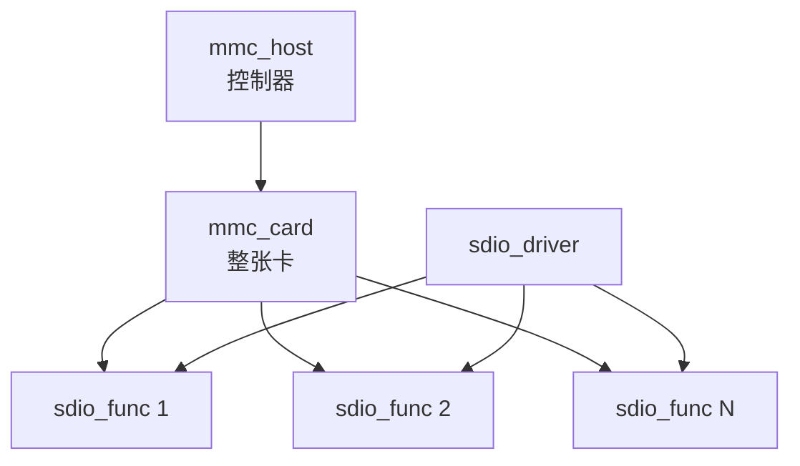

# SDIO 核心数据结构

## 导读

### 本章定位

这一章先建立 SDIO 的对象模型。后续枚举、probe、I/O、中断、板级落地都会围绕 `mmc_host`、`mmc_card`、`sdio_func`、`sdio_driver` 这四个对象展开。

### 核心对象

- `struct mmc_host`
  - 控制器实例
- `struct mmc_card`
  - 被识别出来的整张卡
- `struct sdio_func`
  - SDIO 卡上的一个 function
- `struct sdio_driver`
  - 绑定到 function 的驱动

### 关键函数

- `mmc_alloc_host()`
- `mmc_add_host()`
- `mmc_attach_sdio()`
- `sdio_init_func()`
- `sdio_add_func()`
- `sdio_register_driver()`

### 主流程

host 驱动注册 `mmc_host` -> core 识别出 `mmc_card` -> core 为每个 function 创建 `sdio_func` -> function 设备进入 sdio bus -> `sdio_driver` 匹配并 probe。

## 这一章按什么逻辑展开

这一章按“先把对象拆开，再用对象关系把主线串起来”的逻辑展开。

这样拆的原因是：

- 后面枚举、probe、I/O、中断几章，都会不断回到 `mmc_host`、`mmc_card`、`sdio_func`、`sdio_driver`
- 如果这四个对象的层次和边界不先站稳，后面的函数调用链会看起来像在空中跳转

所以本章后面的结构是：

1. 先逐个展开四个核心对象
2. 再交代关键字段为什么重要
3. 最后把对象关系收回到一条主流程上

## 1. 先抓住四个核心对象

### 1.1 `struct mmc_host`

文件：

- `include/linux/mmc/host.h`
#mmc_host
>[!INFO]
```C {5,37,75,167,169,146} fold:"mmc_host"
struct mmc_host {
	struct device		*parent;
	struct device		class_dev;
	int			index;
	const struct mmc_host_ops *ops;
	struct mmc_pwrseq	*pwrseq;
	unsigned int		f_min;
	unsigned int		f_max;
	unsigned int		f_init;
	u32			ocr_avail;
	u32			ocr_avail_sdio;	/* SDIO-specific OCR */
	u32			ocr_avail_sd;	/* SD-specific OCR */
	u32			ocr_avail_mmc;	/* MMC-specific OCR */
	struct wakeup_source	*ws;		/* Enable consume of uevents */
	u32			max_current_330;
	u32			max_current_300;
	u32			max_current_180;

#define MMC_VDD_165_195		0x00000080	/* VDD voltage 1.65 - 1.95 */
#define MMC_VDD_20_21		0x00000100	/* VDD voltage 2.0 ~ 2.1 */
#define MMC_VDD_21_22		0x00000200	/* VDD voltage 2.1 ~ 2.2 */
#define MMC_VDD_22_23		0x00000400	/* VDD voltage 2.2 ~ 2.3 */
#define MMC_VDD_23_24		0x00000800	/* VDD voltage 2.3 ~ 2.4 */
#define MMC_VDD_24_25		0x00001000	/* VDD voltage 2.4 ~ 2.5 */
#define MMC_VDD_25_26		0x00002000	/* VDD voltage 2.5 ~ 2.6 */
#define MMC_VDD_26_27		0x00004000	/* VDD voltage 2.6 ~ 2.7 */
#define MMC_VDD_27_28		0x00008000	/* VDD voltage 2.7 ~ 2.8 */
#define MMC_VDD_28_29		0x00010000	/* VDD voltage 2.8 ~ 2.9 */
#define MMC_VDD_29_30		0x00020000	/* VDD voltage 2.9 ~ 3.0 */
#define MMC_VDD_30_31		0x00040000	/* VDD voltage 3.0 ~ 3.1 */
#define MMC_VDD_31_32		0x00080000	/* VDD voltage 3.1 ~ 3.2 */
#define MMC_VDD_32_33		0x00100000	/* VDD voltage 3.2 ~ 3.3 */
#define MMC_VDD_33_34		0x00200000	/* VDD voltage 3.3 ~ 3.4 */
#define MMC_VDD_34_35		0x00400000	/* VDD voltage 3.4 ~ 3.5 */
#define MMC_VDD_35_36		0x00800000	/* VDD voltage 3.5 ~ 3.6 */

	u32			caps;		/* Host capabilities */

#define MMC_CAP_4_BIT_DATA	(1 << 0)	/* Can the host do 4 bit transfers */
#define MMC_CAP_MMC_HIGHSPEED	(1 << 1)	/* Can do MMC high-speed timing */
#define MMC_CAP_SD_HIGHSPEED	(1 << 2)	/* Can do SD high-speed timing */
#define MMC_CAP_SDIO_IRQ	(1 << 3)	/* Can signal pending SDIO IRQs */
#define MMC_CAP_SPI		(1 << 4)	/* Talks only SPI protocols */
#define MMC_CAP_NEEDS_POLL	(1 << 5)	/* Needs polling for card-detection */
#define MMC_CAP_8_BIT_DATA	(1 << 6)	/* Can the host do 8 bit transfers */
#define MMC_CAP_AGGRESSIVE_PM	(1 << 7)	/* Suspend (e)MMC/SD at idle  */
#define MMC_CAP_NONREMOVABLE	(1 << 8)	/* Nonremovable e.g. eMMC */
#define MMC_CAP_WAIT_WHILE_BUSY	(1 << 9)	/* Waits while card is busy */
#define MMC_CAP_3_3V_DDR	(1 << 11)	/* Host supports eMMC DDR 3.3V */
#define MMC_CAP_1_8V_DDR	(1 << 12)	/* Host supports eMMC DDR 1.8V */
#define MMC_CAP_1_2V_DDR	(1 << 13)	/* Host supports eMMC DDR 1.2V */
#define MMC_CAP_DDR		(MMC_CAP_3_3V_DDR | MMC_CAP_1_8V_DDR | \
				 MMC_CAP_1_2V_DDR)
#define MMC_CAP_POWER_OFF_CARD	(1 << 14)	/* Can power off after boot */
#define MMC_CAP_BUS_WIDTH_TEST	(1 << 15)	/* CMD14/CMD19 bus width ok */
#define MMC_CAP_UHS_SDR12	(1 << 16)	/* Host supports UHS SDR12 mode */
#define MMC_CAP_UHS_SDR25	(1 << 17)	/* Host supports UHS SDR25 mode */
#define MMC_CAP_UHS_SDR50	(1 << 18)	/* Host supports UHS SDR50 mode */
#define MMC_CAP_UHS_SDR104	(1 << 19)	/* Host supports UHS SDR104 mode */
#define MMC_CAP_UHS_DDR50	(1 << 20)	/* Host supports UHS DDR50 mode */
#define MMC_CAP_UHS		(MMC_CAP_UHS_SDR12 | MMC_CAP_UHS_SDR25 | \
				 MMC_CAP_UHS_SDR50 | MMC_CAP_UHS_SDR104 | \
				 MMC_CAP_UHS_DDR50)
#define MMC_CAP_SYNC_RUNTIME_PM	(1 << 21)	/* Synced runtime PM suspends. */
#define MMC_CAP_NEED_RSP_BUSY	(1 << 22)	/* Commands with R1B can't use R1. */
#define MMC_CAP_DRIVER_TYPE_A	(1 << 23)	/* Host supports Driver Type A */
#define MMC_CAP_DRIVER_TYPE_C	(1 << 24)	/* Host supports Driver Type C */
#define MMC_CAP_DRIVER_TYPE_D	(1 << 25)	/* Host supports Driver Type D */
#define MMC_CAP_DONE_COMPLETE	(1 << 27)	/* RW reqs can be completed within mmc_request_done() */
#define MMC_CAP_CD_WAKE		(1 << 28)	/* Enable card detect wake */
#define MMC_CAP_CMD_DURING_TFR	(1 << 29)	/* Commands during data transfer */
#define MMC_CAP_CMD23		(1 << 30)	/* CMD23 supported. */
#define MMC_CAP_HW_RESET	(1 << 31)	/* Reset the eMMC card via RST_n */

	u32			caps2;		/* More host capabilities */

#define MMC_CAP2_BOOTPART_NOACC	(1 << 0)	/* Boot partition no access */
#define MMC_CAP2_FULL_PWR_CYCLE	(1 << 2)	/* Can do full power cycle */
#define MMC_CAP2_FULL_PWR_CYCLE_IN_SUSPEND (1 << 3) /* Can do full power cycle in suspend */
#define MMC_CAP2_HS200_1_8V_SDR	(1 << 5)        /* can support */
#define MMC_CAP2_HS200_1_2V_SDR	(1 << 6)        /* can support */
#define MMC_CAP2_HS200		(MMC_CAP2_HS200_1_8V_SDR | \
				 MMC_CAP2_HS200_1_2V_SDR)
#define MMC_CAP2_CD_ACTIVE_HIGH	(1 << 10)	/* Card-detect signal active high */
#define MMC_CAP2_RO_ACTIVE_HIGH	(1 << 11)	/* Write-protect signal active high */
#define MMC_CAP2_NO_PRESCAN_POWERUP (1 << 14)	/* Don't power up before scan */
#define MMC_CAP2_HS400_1_8V	(1 << 15)	/* Can support HS400 1.8V */
#define MMC_CAP2_HS400_1_2V	(1 << 16)	/* Can support HS400 1.2V */
#define MMC_CAP2_HS400		(MMC_CAP2_HS400_1_8V | \
				 MMC_CAP2_HS400_1_2V)
#define MMC_CAP2_HSX00_1_8V	(MMC_CAP2_HS200_1_8V_SDR | MMC_CAP2_HS400_1_8V)
#define MMC_CAP2_HSX00_1_2V	(MMC_CAP2_HS200_1_2V_SDR | MMC_CAP2_HS400_1_2V)
#define MMC_CAP2_SDIO_IRQ_NOTHREAD (1 << 17)
#define MMC_CAP2_NO_WRITE_PROTECT (1 << 18)	/* No physical write protect pin, assume that card is always read-write */
#define MMC_CAP2_NO_SDIO	(1 << 19)	/* Do not send SDIO commands during initialization */
#define MMC_CAP2_HS400_ES	(1 << 20)	/* Host supports enhanced strobe */
#define MMC_CAP2_NO_SD		(1 << 21)	/* Do not send SD commands during initialization */
#define MMC_CAP2_NO_MMC		(1 << 22)	/* Do not send (e)MMC commands during initialization */
#define MMC_CAP2_CQE		(1 << 23)	/* Has eMMC command queue engine */
#define MMC_CAP2_CQE_DCMD	(1 << 24)	/* CQE can issue a direct command */
#define MMC_CAP2_AVOID_3_3V	(1 << 25)	/* Host must negotiate down from 3.3V */
#define MMC_CAP2_MERGE_CAPABLE	(1 << 26)	/* Host can merge a segment over the segment size */

	int			fixed_drv_type;	/* fixed driver type for non-removable media */

	mmc_pm_flag_t		pm_caps;	/* supported pm features */

	/* host specific block data */
	unsigned int		max_seg_size;	/* see blk_queue_max_segment_size */
	unsigned short		max_segs;	/* see blk_queue_max_segments */
	unsigned short		unused;
	unsigned int		max_req_size;	/* maximum number of bytes in one req */
	unsigned int		max_blk_size;	/* maximum size of one mmc block */
	unsigned int		max_blk_count;	/* maximum number of blocks in one req */
	unsigned int		max_busy_timeout; /* max busy timeout in ms */

	/* private data */
	spinlock_t		lock;		/* lock for claim and bus ops */

	struct mmc_ios		ios;		/* current io bus settings */

	/* group bitfields together to minimize padding */
	unsigned int		use_spi_crc:1;
	unsigned int		claimed:1;	/* host exclusively claimed */
	unsigned int		bus_dead:1;	/* bus has been released */
	unsigned int		doing_init_tune:1; /* initial tuning in progress */
	unsigned int		can_retune:1;	/* re-tuning can be used */
	unsigned int		doing_retune:1;	/* re-tuning in progress */
	unsigned int		retune_now:1;	/* do re-tuning at next req */
	unsigned int		retune_paused:1; /* re-tuning is temporarily disabled */
	unsigned int		use_blk_mq:1;	/* use blk-mq */
	unsigned int		retune_crc_disable:1; /* don't trigger retune upon crc */
	unsigned int		can_dma_map_merge:1; /* merging can be used */
	unsigned int		vqmmc_enabled:1; /* vqmmc regulator is enabled */

	int			rescan_disable;	/* disable card detection */
	int			rescan_entered;	/* used with nonremovable devices */

	int			need_retune;	/* re-tuning is needed */
	int			hold_retune;	/* hold off re-tuning */
	unsigned int		retune_period;	/* re-tuning period in secs */
	struct timer_list	retune_timer;	/* for periodic re-tuning */

	bool			trigger_card_event; /* card_event necessary */

	struct mmc_card		*card;		/* device attached to this host */

	wait_queue_head_t	wq;
	struct mmc_ctx		*claimer;	/* context that has host claimed */
	int			claim_cnt;	/* "claim" nesting count */
	struct mmc_ctx		default_ctx;	/* default context */

	struct delayed_work	detect;
	int			detect_change;	/* card detect flag */
#ifdef CONFIG_ARCH_BSP
	u32			card_status;
#define MMC_CARD_UNINIT         0
#define MMC_CARD_INIT           1
#define MMC_CARD_INIT_FAIL      2
#endif
	struct mmc_slot		slot;

	const struct mmc_bus_ops *bus_ops;	/* current bus driver */
	unsigned int		bus_refs;	/* reference counter */

	unsigned int		sdio_irqs;
	struct task_struct	*sdio_irq_thread;
	struct delayed_work	sdio_irq_work;
	bool			sdio_irq_pending;
	atomic_t		sdio_irq_thread_abort;

	mmc_pm_flag_t		pm_flags;	/* requested pm features */

	struct led_trigger	*led;		/* activity led */

#ifdef CONFIG_REGULATOR
	bool			regulator_enabled; /* regulator state */
#endif
	struct mmc_supply	supply;

	struct dentry		*debugfs_root;

	/* Ongoing data transfer that allows commands during transfer */
	struct mmc_request	*ongoing_mrq;

#ifdef CONFIG_FAIL_MMC_REQUEST
	struct fault_attr	fail_mmc_request;
#endif

	unsigned int		actual_clock;	/* Actual HC clock rate */

	unsigned int		slotno;	/* used for sdio acpi binding */

	int			dsr_req;	/* DSR value is valid */
	u32			dsr;	/* optional driver stage (DSR) value */

	/* Command Queue Engine (CQE) support */
	const struct mmc_cqe_ops *cqe_ops;
	void			*cqe_private;
	int			cqe_qdepth;
	bool			cqe_enabled;
	bool			cqe_on;

	/* Host Software Queue support */
	bool			hsq_enabled;

	unsigned long		private[] ____cacheline_aligned;
};
```
职责：

- 代表一个 MMC/SD/SDIO 控制器
- 保存 host 能力、时钟、电压、总线宽度、当前卡对象
- 提供一组 `ops` 给 core 调用

它是 SDIO 链路最底层的软件入口，可以理解成“控制器实例”。

关键成员：

- `ops`
  - host controller driver 提供给 MMC core 的操作集
- `caps` / `caps2`
  - host 能力集合，例如 4bit、high speed、SDIO IRQ、non-removable 等
- `ios`
  - 当前总线电压、时钟、总线宽度、时序模式等运行状态
- `card`
  - 当前挂在这个 host 上的 `mmc_card`
- `sdio_irq_thread`
  - SDIO 中断线程，负责把 host 层中断分发到 function handler
- `sdio_irq_pending`
  - host 已经感知到 SDIO IRQ pending 的状态

字段理解：

- `ops` 决定 core 能怎样驱动控制器
- `caps/caps2` 决定 core 能尝试哪些模式
- `ios` 记录当前总线已经配置成什么状态
- `card` 把 host 和枚举出的卡连起来

### 1.2 `struct mmc_card`

文件：

- `include/linux/mmc/card.h`
#mmc_card
>[!INFO]
```C {6,4,5,54,52,56} fold:"mmc_card"
struct mmc_card {
	struct mmc_host		*host;		/* the host this device belongs to */
	struct device		dev;		/* the device */
	u32			ocr;		/* the current OCR setting */
	unsigned int		rca;		/* relative card address of device */
	unsigned int		type;		/* card type */
#define MMC_TYPE_MMC		0		/* MMC card */
#define MMC_TYPE_SD		1		/* SD card */
#define MMC_TYPE_SDIO		2		/* SDIO card */
#define MMC_TYPE_SD_COMBO	3		/* SD combo (IO+mem) card */
	unsigned int		state;		/* (our) card state */
	unsigned int		quirks; 	/* card quirks */
	unsigned int		quirk_max_rate;	/* max rate set by quirks */
#define MMC_QUIRK_LENIENT_FN0	(1<<0)		/* allow SDIO FN0 writes outside of the VS CCCR range */
#define MMC_QUIRK_BLKSZ_FOR_BYTE_MODE (1<<1)	/* use func->cur_blksize */
						/* for byte mode */
#define MMC_QUIRK_NONSTD_SDIO	(1<<2)		/* non-standard SDIO card attached */
						/* (missing CIA registers) */
#define MMC_QUIRK_NONSTD_FUNC_IF (1<<4)		/* SDIO card has nonstd function interfaces */
#define MMC_QUIRK_DISABLE_CD	(1<<5)		/* disconnect CD/DAT[3] resistor */
#define MMC_QUIRK_INAND_CMD38	(1<<6)		/* iNAND devices have broken CMD38 */
#define MMC_QUIRK_BLK_NO_CMD23	(1<<7)		/* Avoid CMD23 for regular multiblock */
#define MMC_QUIRK_BROKEN_BYTE_MODE_512 (1<<8)	/* Avoid sending 512 bytes in */
						/* byte mode */
#define MMC_QUIRK_LONG_READ_TIME (1<<9)		/* Data read time > CSD says */
#define MMC_QUIRK_SEC_ERASE_TRIM_BROKEN (1<<10)	/* Skip secure for erase/trim */
#define MMC_QUIRK_BROKEN_IRQ_POLLING	(1<<11)	/* Polling SDIO_CCCR_INTx could create a fake interrupt */
#define MMC_QUIRK_TRIM_BROKEN	(1<<12)		/* Skip trim */
#define MMC_QUIRK_BROKEN_HPI	(1<<13)		/* Disable broken HPI support */
#define MMC_QUIRK_BROKEN_SD_DISCARD	(1<<14)	/* Disable broken SD discard support */

	bool			reenable_cmdq;	/* Re-enable Command Queue */

	unsigned int		erase_size;	/* erase size in sectors */
 	unsigned int		erase_shift;	/* if erase unit is power 2 */
 	unsigned int		pref_erase;	/* in sectors */
	unsigned int		eg_boundary;	/* don't cross erase-group boundaries */
	unsigned int		erase_arg;	/* erase / trim / discard */
 	u8			erased_byte;	/* value of erased bytes */

	u32			raw_cid[4];	/* raw card CID */
	u32			raw_csd[4];	/* raw card CSD */
	u32			raw_scr[2];	/* raw card SCR */
	u32			raw_ssr[16];	/* raw card SSR */
	struct mmc_cid		cid;		/* card identification */
	struct mmc_csd		csd;		/* card specific */
	struct mmc_ext_csd	ext_csd;	/* mmc v4 extended card specific */
	struct sd_scr		scr;		/* extra SD information */
	struct sd_ssr		ssr;		/* yet more SD information */
	struct sd_switch_caps	sw_caps;	/* switch (CMD6) caps */

	unsigned int		sdio_funcs;	/* number of SDIO functions */
	atomic_t		sdio_funcs_probed; /* number of probed SDIO funcs */
	struct sdio_cccr	cccr;		/* common card info */
	struct sdio_cis		cis;		/* common tuple info */
	struct sdio_func	*sdio_func[SDIO_MAX_FUNCS]; /* SDIO functions (devices) */
	struct sdio_func	*sdio_single_irq; /* SDIO function when only one IRQ active */
	u8			major_rev;	/* major revision number */
	u8			minor_rev;	/* minor revision number */
	unsigned		num_info;	/* number of info strings */
	const char		**info;		/* info strings */
	struct sdio_func_tuple	*tuples;	/* unknown common tuples */

	unsigned int		sd_bus_speed;	/* Bus Speed Mode set for the card */
	unsigned int		mmc_avail_type;	/* supported device type by both host and card */
	unsigned int		drive_strength;	/* for UHS-I, HS200 or HS400 */

	struct dentry		*debugfs_root;
	struct mmc_part	part[MMC_NUM_PHY_PARTITION]; /* physical partitions */
	unsigned int    nr_parts;

	unsigned int		bouncesz;	/* Bounce buffer size */
	struct workqueue_struct *complete_wq;	/* Private workqueue */
};
```
职责：

- 代表一张已经被识别出来的卡
- 对 SDIO 来说，它既可能是纯 SDIO 卡，也可能是 SD combo 卡

关键成员：

- `type`
  - 卡类型，例如 MMC、SD、SDIO、SD combo
- `ocr`
  - 工作电压能力与 OCR 响应信息
- `rca`
  - card relative address
- `cccr`
  - SDIO 公共控制寄存器解析结果
- `cis`
  - card 级 CIS 信息
- `sdio_funcs`
  - SDIO function 数量
- `sdio_func[]`
  - 指向每个 `struct sdio_func` 的数组

`mmc_card` 代表的是“整张卡”，不是某个 function。

字段理解：

- `cccr/cis` 决定这张卡支持什么公共能力
- `sdio_funcs/sdio_func[]` 把“整张卡”和“多个 function”连接起来，func是实际暴露的device

### 1.3 `struct sdio_func`

文件：

- `include/linux/mmc/sdio_func.h`
#sdio_func
>[!INFO]
```C {2,3,4,5,7,8,9,11,12} fold:"sdio_func"
struct sdio_func {
	struct mmc_card		*card;		/* the card this device belongs to */
	struct device		dev;		/* the device */
	sdio_irq_handler_t	*irq_handler;	/* IRQ callback */
	unsigned int		num;		/* function number */

	unsigned char		class;		/* standard interface class */
	unsigned short		vendor;		/* vendor id */
	unsigned short		device;		/* device id */

	unsigned		max_blksize;	/* maximum block size */
	unsigned		cur_blksize;	/* current block size */

	unsigned		enable_timeout;	/* max enable timeout in msec */

	unsigned int		state;		/* function state */
#define SDIO_STATE_PRESENT	(1<<0)		/* present in sysfs */

	u8			*tmpbuf;	/* DMA:able scratch buffer */

	u8			major_rev;	/* major revision number */
	u8			minor_rev;	/* minor revision number */
	unsigned		num_info;	/* number of info strings */
	const char		**info;		/* info strings */

	struct sdio_func_tuple *tuples;
};
```
职责：

- 代表 SDIO 卡上的一个 function
- 一个 function 就是一个device，最终对应一个 function driver

关键成员：

- `card`
  - 所属 `mmc_card`
- `dev`
  - 进入 Linux driver model 的设备对象
- `irq_handler`
  - function driver 注册的 SDIO 中断回调
- `num`
  - function 编号，常见 WiFi function 是 1
- `class`
  - function class
- `vendor`
  - vendor ID
- `device`
  - device ID
- `max_blksize`
  - function 支持的最大 block size
- `cur_blksize`
  - 当前实际配置的 block size

最重要的理解是：

- `mmc_card` 是“卡”
- `sdio_func` 是“卡上的功能单元”

一张卡上最多可以有多个 function。

字段理解：

- `dev` 让 `sdio_func` 变成 sdio bus 上的 device
- `vendor/device/class` 用来和 `sdio_driver.id_table` 匹配
- `irq_handler` 连接 function driver 和 SDIO IRQ 分发路径
- `cur_blksize` 会直接影响 CMD53 数据传输行为

### 1.4 `struct sdio_driver`

文件：

- `include/linux/mmc/sdio_func.h`
- #sdio_driver
>[!INFO]
```C 
struct sdio_driver {
	char *name;
	const struct sdio_device_id *id_table;

	int (*probe)(struct sdio_func *, const struct sdio_device_id *);
	void (*remove)(struct sdio_func *);

	struct device_driver drv;
};


struct sdio_device_id {
	__u8	class;			/* Standard interface or SDIO_ANY_ID */
	__u16	vendor;			/* Vendor or SDIO_ANY_ID */
	__u16	device;			/* Device ID or SDIO_ANY_ID */
	kernel_ulong_t driver_data;	/* Data private to the driver */
};
```
职责：

- function driver 的注册对象
- 类似 `platform_driver`、`pci_driver`、`usb_driver`

关键成员：

- `name`
  - 驱动名
- `id_table`
  - 匹配表，按 class/vendor/device 识别目标 function
- `probe`
  - function 匹配成功后的入口
- `remove`
  - function 移除或驱动卸载时的清理入口
- `drv`
  - 嵌入通用 `device_driver`，包含 PM 等驱动模型信息

字段理解：

- `id_table` 决定驱动能不能绑定到某个 `sdio_func`
- `probe` 是芯片私有初始化真正开始的位置
- `drv.pm` 决定 suspend/resume、runtime PM 等电源路径如何进入驱动

## 2. 它们之间的关系



这张图更适合按三层读：

1. `mmc_host -> mmc_card`
   - 先从控制器进入整张卡
   - 说明 SDIO 主线的起点不是 function driver，而是 host 先把卡识别出来
2. `mmc_card -> sdio_func 1..N`
   - 再从整张卡拆成多个 function
   - 说明 `sdio_func` 是 card 下面的功能单元，不是另一张卡
3. `sdio_driver -> sdio_func`
   - 最后才是具体驱动绑定到某个 function
   - 说明 `probe()` 入口建立在前两层已经完成之后

这张图解决的是“谁先谁后、谁归谁管”的问题。

把它和本章前面的对象字段对应起来，就是：

- `mmc_host`
  - 控制器和总线事务入口
- `mmc_card`
  - 整卡级公共信息容器
- `sdio_func`
  - function 级设备对象
- `sdio_driver`
  - 最终和具体 function 匹配的驱动对象

后面再看枚举、probe、I/O、中断时，只要先判断当前代码操作的是哪一层对象，主线就不会乱。

## 3. 一个常见误区

第一次看 SDIO 代码时，最容易把“卡驱动”和“function 驱动”混在一起。

实际上要分两层：

- `mmc/sdio core` 先把整张卡识别出来
- 然后再把卡上的每个 function 逐个挂到 `sdio bus`

所以 `probe()` 并不是在“卡刚插入”那一刻直接进入 function driver，而是要先经过一轮 `mmc_card` 初始化。

## 4. 和 HI3516CV610 的关系

在 HI3516CV610 上，这些抽象并没有变：

- 底层 host 是 `nebula,sdhci`
- host 驱动是 `drivers/vendor/mmc/sdhci_nebula.c`
- 但它最终仍然向上交付一个标准 `mmc_host`

所以：

- `sdhci_nebula.c` 负责“怎么操作这块控制器”
- `sdio.c` 负责“怎么识别出 SDIO 卡”
- `sdio_bus.c` 负责“怎么把 function 交给具体驱动”

## 5. 阅读源码时的观察顺序

固定按四步观察：

1. 当前代码操作的是 `mmc_host`、`mmc_card` 还是 `sdio_func`
2. 这是在做“整卡级别”的事，还是在做“function 级别”的事
3. 现在是否已经拿到了 host lock
4. 这一步之后是回到 core，还是进入 function driver

只要这四点不乱，SDIO 源码就不会越看越绕。

## 6. 一句话总结

`mmc_host` 代表控制器，`mmc_card` 代表整张卡，`sdio_func` 代表卡上的功能单元，`sdio_driver` 代表真正绑定到 function 的驱动。

