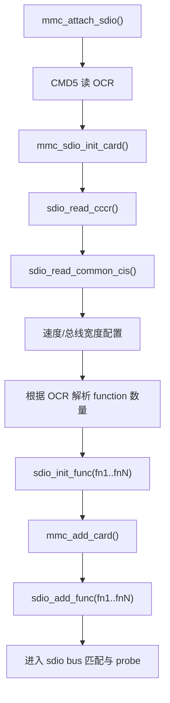

# SDIO 卡枚举与初始化

## 导读

### 本章定位

这一章讲 SDIO 卡从 host 检测到卡存在，到 MMC core 按 SDIO 路线完成整卡初始化，再到为每个 function 创建 `sdio_func` 的过程。

### 核心对象

- `struct mmc_host`
  - 触发 SDIO 枚举的控制器对象
- `struct mmc_card`
  - 枚举过程中创建并填充的整卡对象
- `struct sdio_func`
  - 每个 SDIO function 对应的设备对象
- `card->cccr / card->cis`
  - SDIO 公共能力与卡级信息

### 关键函数

- `mmc_attach_sdio()`
- `mmc_sdio_init_card()`
- `sdio_read_cccr()`
- `sdio_read_common_cis()`
- `sdio_init_func()`
- `mmc_add_card()`
- `sdio_add_func()`

### 主流程

CMD5 识别 SDIO -> 初始化整卡 -> 读取 CCCR/CIS -> 配置速度和总线宽度 -> 创建 function -> 注册 card -> 注册 function。

## 这一章按什么逻辑展开

这一章按“先整卡，后 function；先 card 级公共信息，后 function 级设备对象”的逻辑展开。

这样拆的原因是：

- SDIO 枚举不是一上来就直接进入 `sdio_func`
- 而是 MMC core 先确认整张卡的公共能力，再继续把卡拆成多个 function

所以本章后面的结构是：

1. 先看入口 `mmc_attach_sdio()`
2. 再看 `mmc_sdio_init_card()` 怎样把整张卡初始化完成
3. 然后看 `sdio_init_func()` 怎样把 card 拆成多个 `sdio_func`
4. 最后看 card 和 function 设备怎样进入 driver model

## 1. 入口函数

主入口：

- `drivers/mmc/core/sdio.c`
- `int mmc_attach_sdio(struct mmc_host *host)`

这是 MMC core 决定“当前这张卡按 SDIO 路线继续走”之后的入口。

## 2. `mmc_attach_sdio()` 做了什么
>[!INFO]
```C {31,71,86,94,13} fold:"mmc_attach_sdio"
int mmc_attach_sdio(struct mmc_host *host)
{
	int err, i, funcs;
	u32 ocr, rocr;
	struct mmc_card *card;

	WARN_ON(!host->claimed);

	err = mmc_send_io_op_cond(host, 0, &ocr);
	if (err)
		return err;

	mmc_attach_bus(host, &mmc_sdio_ops);
	if (host->ocr_avail_sdio)
		host->ocr_avail = host->ocr_avail_sdio;


	rocr = mmc_select_voltage(host, ocr);

	/*
	 * Can we support the voltage(s) of the card(s)?
	 */
	if (!rocr) {
		err = -EINVAL;
		goto err;
	}

	/*
	 * Detect and init the card.
	 */
	err = mmc_sdio_init_card(host, rocr, NULL);
	if (err)
		goto err;

	card = host->card;

	/*
	 * Enable runtime PM only if supported by host+card+board
	 */
	if (host->caps & MMC_CAP_POWER_OFF_CARD) {
		/*
		 * Do not allow runtime suspend until after SDIO function
		 * devices are added.
		 */
		pm_runtime_get_noresume(&card->dev);

		/*
		 * Let runtime PM core know our card is active
		 */
		err = pm_runtime_set_active(&card->dev);
		if (err)
			goto remove;

		/*
		 * Enable runtime PM for this card
		 */
		pm_runtime_enable(&card->dev);
	}

	/*
	 * The number of functions on the card is encoded inside
	 * the ocr.
	 */
	funcs = (ocr & 0x70000000) >> 28;
	card->sdio_funcs = 0;

	/*
	 * Initialize (but don't add) all present functions.
	 */
	for (i = 0; i < funcs; i++, card->sdio_funcs++) {
		err = sdio_init_func(host->card, i + 1);
		if (err)
			goto remove;

		/*
		 * Enable Runtime PM for this func (if supported)
		 */
		if (host->caps & MMC_CAP_POWER_OFF_CARD)
			pm_runtime_enable(&card->sdio_func[i]->dev);
	}

	/*
	 * First add the card to the driver model...
	 */
	mmc_release_host(host);
	err = mmc_add_card(host->card);
	if (err)
		goto remove_added;

	/*
	 * ...then the SDIO functions.
	 */
	for (i = 0;i < funcs;i++) {
		err = sdio_add_func(host->card->sdio_func[i]);
		if (err)
			goto remove_added;
	}

	if (host->caps & MMC_CAP_POWER_OFF_CARD)
		pm_runtime_put(&card->dev);

	mmc_claim_host(host);
	return 0;


remove:
	mmc_release_host(host);
remove_added:
	/*
	 * The devices are being deleted so it is not necessary to disable
	 * runtime PM. Similarly we also don't pm_runtime_put() the SDIO card
	 * because it needs to be active to remove any function devices that
	 * were probed, and after that it gets deleted.
	 */
	mmc_sdio_remove(host);
	mmc_claim_host(host);
err:
	mmc_detach_bus(host);

	pr_err("%s: error %d whilst initialising SDIO card\n",
		mmc_hostname(host), err);

	return err;
}
```
它的主逻辑可以概括成下面几步：

1. `mmc_send_io_op_cond()`：通过 `CMD5` 读 SDIO OCR
2. `mmc_attach_bus(host, &mmc_sdio_ops)`：把 host 绑定到 SDIO 总线逻辑
3. `mmc_select_voltage()`：选择可工作的电压
4. `mmc_sdio_init_card()`：初始化整张 SDIO 卡
5. 从 OCR 里解析 function 数量
6. 对每个 function 调 `sdio_init_func()`
7. 先 `mmc_add_card()`，再逐个 `sdio_add_func()`

有两个细节很重要：

- `mmc_card` 先创建，再创建多个 `sdio_func`
- `mmc_add_card()` 先于 `sdio_add_func()`，因为 sdio_func 是 mmc_card 的子设备，mmc_card 是父对象

## 3. `mmc_sdio_init_card()` 是整条链最关键的函数

位置：

- `drivers/mmc/core/sdio.c`

它做的是“整张卡级别”的初始化，而不是单个 function 的初始化。

>[!INFO]
```C {155} fold:"mmc_sdio_init_card"
static int mmc_sdio_init_card(struct mmc_host *host, u32 ocr,
			      struct mmc_card *oldcard)
{
	struct mmc_card *card;
	int err;
	int retries = 10;
	u32 rocr = 0;
	u32 ocr_card = ocr;

	WARN_ON(!host->claimed);

	/* to query card if 1.8V signalling is supported */
	if (mmc_host_uhs(host))
		ocr |= R4_18V_PRESENT;

try_again:
	if (!retries) {
		pr_warn("%s: Skipping voltage switch\n", mmc_hostname(host));
		ocr &= ~R4_18V_PRESENT;
	}

	/*
	 * Inform the card of the voltage
	 */
	err = mmc_send_io_op_cond(host, ocr, &rocr);
	if (err)
		return err;

	/*
	 * For SPI, enable CRC as appropriate.
	 */
	if (mmc_host_is_spi(host)) {
		err = mmc_spi_set_crc(host, use_spi_crc);
		if (err)
			return err;
	}

	/*
	 * Allocate card structure.
	 */
	card = mmc_alloc_card(host, &sdio_type);
	if (IS_ERR(card))
		return PTR_ERR(card);

	if ((rocr & R4_MEMORY_PRESENT) &&
	    mmc_sd_get_cid(host, ocr & rocr, card->raw_cid, NULL) == 0) {
		card->type = MMC_TYPE_SD_COMBO;

		if (oldcard && (oldcard->type != MMC_TYPE_SD_COMBO ||
		    memcmp(card->raw_cid, oldcard->raw_cid, sizeof(card->raw_cid)) != 0)) {
			err = -ENOENT;
			goto mismatch;
		}
	} else {
		card->type = MMC_TYPE_SDIO;

		if (oldcard && oldcard->type != MMC_TYPE_SDIO) {
			err = -ENOENT;
			goto mismatch;
		}
	}

	/*
	 * Call the optional HC's init_card function to handle quirks.
	 */
	if (host->ops->init_card)
		host->ops->init_card(host, card);

	card->ocr = ocr_card;

	/*
	 * If the host and card support UHS-I mode request the card
	 * to switch to 1.8V signaling level.  No 1.8v signalling if
	 * UHS mode is not enabled to maintain compatibility and some
	 * systems that claim 1.8v signalling in fact do not support
	 * it. Per SDIO spec v3, section 3.1.2, if the voltage is already
	 * 1.8v, the card sets S18A to 0 in the R4 response. So it will
	 * fails to check rocr & R4_18V_PRESENT,  but we still need to
	 * try to init uhs card. sdio_read_cccr will take over this task
	 * to make sure which speed mode should work.
	 */
	if (rocr & ocr & R4_18V_PRESENT) {
		err = mmc_set_uhs_voltage(host, ocr_card);
		if (err == -EAGAIN) {
			mmc_sdio_pre_init(host, ocr_card, card);
			retries--;
			goto try_again;
		} else if (err) {
			ocr &= ~R4_18V_PRESENT;
		}
	}

	/*
	 * For native busses:  set card RCA and quit open drain mode.
	 */
	if (!mmc_host_is_spi(host)) {
		err = mmc_send_relative_addr(host, &card->rca);
		if (err)
			goto remove;

		/*
		 * Update oldcard with the new RCA received from the SDIO
		 * device -- we're doing this so that it's updated in the
		 * "card" struct when oldcard overwrites that later.
		 */
		if (oldcard)
			oldcard->rca = card->rca;
	}

	/*
	 * Read CSD, before selecting the card
	 */
	if (!oldcard && card->type == MMC_TYPE_SD_COMBO) {
		err = mmc_sd_get_csd(host, card);
		if (err)
			goto remove;

		mmc_decode_cid(card);
	}

	/*
	 * Select card, as all following commands rely on that.
	 */
	if (!mmc_host_is_spi(host)) {
		err = mmc_select_card(card);
		if (err)
			goto remove;
	}

	if (card->quirks & MMC_QUIRK_NONSTD_SDIO) {
		/*
		 * This is non-standard SDIO device, meaning it doesn't
		 * have any CIA (Common I/O area) registers present.
		 * It's host's responsibility to fill cccr and cis
		 * structures in init_card().
		 */
		mmc_set_clock(host, card->cis.max_dtr);

		if (card->cccr.high_speed) {
			mmc_set_timing(card->host, MMC_TIMING_SD_HS);
		}

		if (oldcard)
			mmc_remove_card(card);
		else
			host->card = card;

		return 0;
	}

	/*
	 * Read the common registers. Note that we should try to
	 * validate whether UHS would work or not.
	 */
	err = sdio_read_cccr(card, ocr);
	if (err) {
		mmc_sdio_pre_init(host, ocr_card, card);
		if (ocr & R4_18V_PRESENT) {
			/* Retry init sequence, but without R4_18V_PRESENT. */
			retries = 0;
			goto try_again;
		}
		return err;
	}

	/*
	 * Read the common CIS tuples.
	 */
	err = sdio_read_common_cis(card);
	if (err)
		goto remove;

	if (oldcard) {
		if (card->cis.vendor == oldcard->cis.vendor &&
		    card->cis.device == oldcard->cis.device) {
			mmc_remove_card(card);
			card = oldcard;
		} else {
			err = -ENOENT;
			goto mismatch;
		}
	}

	mmc_fixup_device(card, sdio_fixup_methods);

	if (card->type == MMC_TYPE_SD_COMBO) {
		err = mmc_sd_setup_card(host, card, oldcard != NULL);
		/* handle as SDIO-only card if memory init failed */
		if (err) {
			mmc_go_idle(host);
			if (mmc_host_is_spi(host))
				/* should not fail, as it worked previously */
				mmc_spi_set_crc(host, use_spi_crc);
			card->type = MMC_TYPE_SDIO;
		} else
			card->dev.type = &sd_type;
	}

	/*
	 * If needed, disconnect card detection pull-up resistor.
	 */
	err = sdio_disable_cd(card);
	if (err)
		goto remove;

	/* Initialization sequence for UHS-I cards */
	/* Only if card supports 1.8v and UHS signaling */
	if ((ocr & R4_18V_PRESENT) && card->sw_caps.sd3_bus_mode) {
		err = mmc_sdio_init_uhs_card(card);
		if (err)
			goto remove;
	} else {
		/*
		 * Switch to high-speed (if supported).
		 */
		err = sdio_enable_hs(card);
		if (err > 0)
			mmc_set_timing(card->host, MMC_TIMING_SD_HS);
		else if (err)
			goto remove;

		/*
		 * Change to the card's maximum speed.
		 */
		mmc_set_clock(host, mmc_sdio_get_max_clock(card));

		/*
		 * Switch to wider bus (if supported).
		 */
		err = sdio_enable_4bit_bus(card);
		if (err)
			goto remove;
	}

	if (host->caps2 & MMC_CAP2_AVOID_3_3V &&
	    host->ios.signal_voltage == MMC_SIGNAL_VOLTAGE_330) {
		pr_err("%s: Host failed to negotiate down from 3.3V\n",
			mmc_hostname(host));
		err = -EINVAL;
		goto remove;
	}

	host->card = card;
	return 0;

mismatch:
	pr_debug("%s: Perhaps the card was replaced\n", mmc_hostname(host));
remove:
	if (oldcard != card)
		mmc_remove_card(card);
	return err;
}
```
### 3.1 识别卡类型

它会先通过响应内容判断：

- 纯 `SDIO` 卡
- `SD combo` 卡

如果同时带 memory 部分，就走 combo 路线；否则就是纯 SDIO。

### 3.2 host 私有初始化机会

如果 host 驱动实现了：

- `host->ops->init_card`

那么这里会给 host 一个处理硬件 quirks 的机会。

这说明：

- host driver 不是只负责“发命令”
- 它还可以在卡初始化早期插入自己的兼容处理

### 3.3 1.8V/UHS 协商

如果 host 支持 UHS，`mmc_sdio_init_card()` 会尝试：

- 查询 1.8V 能力
- 做电压切换
- 再由 `sdio_read_cccr()` 解析卡支持的总线模式

如果 1.8V 协商失败，代码会回退到非 UHS 路线继续初始化。

### 3.4 选卡与读公共信息

后面会依次做这些事：

- `mmc_send_relative_addr()`
- `mmc_select_card()`
- `sdio_read_cccr()`
- `sdio_read_common_cis()`

这里开始，卡的公共能力才逐步被填进 `mmc_card`。

### 3.5 设置速度和总线宽度

如果不是 UHS 路线，就会走：

- `sdio_enable_hs()`
- `mmc_set_clock()`
- `sdio_enable_4bit_bus()`

这一步之后，整张卡才算进入一个可正常跑数据的状态。

## 4. `sdio_read_cccr()` 到底读了什么

位置：

- `drivers/mmc/core/sdio.c`

它负责读取 SDIO 公共控制寄存器，填充：

- `card->cccr.sdio_vsn`
- `card->cccr.multi_block`
- `card->cccr.low_speed`
- `card->cccr.wide_bus`
- `card->cccr.high_power`
- `card->cccr.high_speed`
- `card->sw_caps.sd3_bus_mode`

可以把它理解成：

- 这一步告诉内核“这张 SDIO 卡到底支持什么能力”
cccr的结构在[[01-SDIO核心数据结构#1.2 `struct mmc_card`]]
## 5. `sdio_init_func()` 干了什么

位置：

- `drivers/mmc/core/sdio.c`

>[!INFO]
```C fold:"sdio_init_func"
static int sdio_init_func(struct mmc_card *card, unsigned int fn)
{
	int ret;
	struct sdio_func *func;

	if (WARN_ON(fn > SDIO_MAX_FUNCS))
		return -EINVAL;

	func = sdio_alloc_func(card);
	if (IS_ERR(func))
		return PTR_ERR(func);

	func->num = fn;

	if (!(card->quirks & MMC_QUIRK_NONSTD_SDIO)) {
		ret = sdio_read_fbr(func);
		if (ret)
			goto fail;

		ret = sdio_read_func_cis(func);
		if (ret)
			goto fail;
	} else {
		func->vendor = func->card->cis.vendor;
		func->device = func->card->cis.device;
		func->max_blksize = func->card->cis.blksize;
	}

	card->sdio_func[fn - 1] = func;

	return 0;

fail:
	/*
	 * It is okay to remove the function here even though we hold
	 * the host lock as we haven't registered the device yet.
	 */
	sdio_remove_func(func);
	return ret;
}
```
它是 function 级别的初始化。

对每个 function，它会：

1. 分配 `struct sdio_func`      [[01-SDIO核心数据结构#1.3 `struct sdio_func`]]
2. 设置 `func->num`
3. 读取 FBR，得到 function class
4. 读取 function 自己的 CIS
5. 把 `func` 填到 `card->sdio_func[fn - 1]`

注意：

- 此时 function 只是“被创建出来了”
- 还没有真正挂到 driver model

## 6. `sdio_add_func()` 才是真正把 function 暴露给驱动

`sdio_add_func()` 之后：

>[!INFO]
```C
int sdio_add_func(struct sdio_func *func)
{
	int ret;

	dev_set_name(&func->dev, "%s:%d", mmc_card_id(func->card), func->num);

	sdio_set_of_node(func);
	sdio_acpi_set_handle(func);
	device_enable_async_suspend(&func->dev);
	ret = device_add(&func->dev);
	if (ret == 0)
		sdio_func_set_present(func);

	return ret;
}
```
- `struct sdio_func` 变成一个设备
- 它会出现在 `sdio bus`
- 才有机会触发 `sdio_driver.probe()`

也就是说：

- `sdio_init_func()` 解决“对象创建”
- `sdio_add_func()` 解决“设备注册”

## 7. 把整条链串起来



这张图可以按三段来读。

### 7.1 第一段：先把整张卡站稳

对应图里的：

- `mmc_attach_sdio()`
- `CMD5 读 OCR`
- `mmc_sdio_init_card()`
- `sdio_read_cccr()`
- `sdio_read_common_cis()`
- `速度/总线宽度配置`

这一段解决的是“整张卡是什么、支持什么、现在能不能稳定工作”。

落到前面的对象上，就是：

- 创建并填充 `mmc_card`
- 把 `card->cccr`
- 把 `card->cis`
- 把速度、总线宽度、供电能力这些卡级信息先准备好

也就是说，在 `sdio_func` 真正出现之前，core 先完成的是“整卡初始化”，不是“function 驱动初始化”。

### 7.2 第二段：再把整张卡拆成多个 function

对应图里的：

- `根据 OCR 解析 function 数量`
- `sdio_init_func(fn1..fnN)`

这一段解决的是“这张卡上到底有几个可绑定驱动的功能单元”。

和前面第 `5` 节对应起来，就是：

- 从 OCR 中拿到 function 数量
- 为每个 function 创建一个 `struct sdio_func`
- 填 function 号、class、vendor、device、最大块大小等 function 级信息

所以这里的边界很明确：

- `mmc_card` 表示整张卡
- `sdio_func` 表示卡上的某一个功能单元

在这一阶段结束时：

- function 对象已经创建
- 但还没有进入 Linux driver model 进行匹配

### 7.3 第三段：最后再把 card 和 function 注册出去

对应图里的：

- `mmc_add_card()`
- `sdio_add_func(fn1..fnN)`
- `进入 sdio bus 匹配与 probe`

这一段解决的是“把前面创建好的对象真正交给驱动模型”。

这里需要和第 `6` 节一起看：

- `sdio_init_func()` 只负责对象创建
- `sdio_add_func()` 才负责把 `sdio_func` 变成可匹配的 device

而且注册顺序是固定的：

1. 先 `mmc_add_card()`
2. 再 `sdio_add_func()`
3. 然后才进入下一章的 `sdio bus match/probe`

这样安排的原因是：

- `sdio_func` 是 `mmc_card` 的子设备
- function driver 后面进入 `probe()` 时，要反向依赖 `func->card`
- 所以前面的 card 必须先稳定存在

### 7.4 把这张图和前面几节一一对应

如果只记图，容易断在“每个函数到底做了哪一层工作”。

更适合的对应关系是：

- 第 `2` 节：`mmc_attach_sdio()` 负责启动整条 SDIO 枚举链
- 第 `3` 节：`mmc_sdio_init_card()` 负责整卡初始化
- 第 `4` 节：`sdio_read_cccr()` 和 `sdio_read_common_cis()` 负责补卡级公共能力
- 第 `5` 节：`sdio_init_func()` 负责创建 function 对象
- 第 `6` 节：`sdio_add_func()` 负责把 function 注册给驱动模型
- 第 `03` 章：开始进入 `sdio bus` 匹配与 `probe()`

这样回头看，整条链实际上是：

- 先建立 `mmc_card`
- 再建立多个 `sdio_func`
- 再把这些 function 交给 `sdio bus`
- 最后才轮到具体 `sdio_driver.probe()`

## 8. 这一章最该记住的一句话

SDIO 的 function driver 不是直接面对“插卡事件”，而是面对“已经被 core 枚举完成的 `sdio_func` 设备”。

