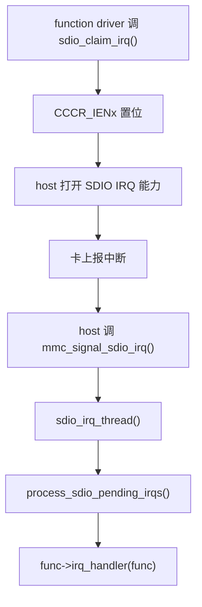

# SDIO 中断机制

## 导读

### 本章定位

这一章讲一条完整 IRQ 生命周期：SDIO function 先通过 `sdio_claim_irq()` 建立中断通路；当卡侧产生中断后，由 host/controller 感知并上报给 MMC/SDIO core；core 在线程上下文中读取 pending bit，定位到具体的 `sdio_func`，最后调用对应的 `func->irq_handler`。
整个过程可以概括为：建立通路，host 上报中断事件，core 定位 pending function，再调用对应 driver 的 `func->irq_handler`。

### 核心对象

- `struct mmc_host`
  - 感知和上报 SDIO IRQ 的 host 控制器对象
- `struct mmc_card`
  - 维护 card 级 IRQ 状态
- `struct sdio_func`
  - 保存 function 级 `irq_handler`
- `host->sdio_irq_thread`
  - SDIO IRQ 分发线程

### 关键函数

- `sdio_claim_irq()`
- `sdio_release_irq()`
- `mmc_signal_sdio_irq()`
- `sdio_irq_thread()`
- `process_sdio_pending_irqs()`
- `host->ops->enable_sdio_irq`

### 主流程

function driver 注册 IRQ -> core 打开 IENx/master interrupt -> host 感知 SDIO IRQ -> core 线程读取 pending -> 调用 `func->irq_handler`。

## 1. 这一章按什么逻辑展开

这一章不按“函数出现顺序”平铺，而是按一条完整 IRQ 生命周期来拆：

1. 先看 IRQ 通路是怎么建立起来的
2. 再看卡上有中断时，host 怎么把事件抬给 core
3. 再看 core 怎么把 pending bit 分发到具体 `func->irq_handler`
4. 最后看退出时这条通路怎么被拆掉

这样分的原因是：

- `sdio_claim_irq()` 解决“通路建立”
- `mmc_signal_sdio_irq()` 解决“host 报告有中断”
- `sdio_irq_thread()` / `process_sdio_pending_irqs()` 解决“core 分发”
- `sdio_release_irq()` 解决“通路回收”

如果只按函数名散着看，容易知道“有哪些函数”，但不知道这些函数分别处于哪一个阶段。

function driver的流程在[[03-SDIO总线匹配与probe#6. function driver 视角下的最小骨架]]
## 2. 先分两层看

SDIO 中断不要只盯 function driver 的回调，应该分成两层：

- host/controller 层：怎么感知“卡有中断”
- SDIO core 层：怎么把这件事转发到具体 `sdio_func->irq_handler`

核心文件：

- `drivers/mmc/core/sdio_irq.c`
- `include/linux/mmc/host.h`

这两层的分工对应后面的阅读顺序：

- 先看 function driver 怎么把 IRQ 注册给 core，也就是解决“通路建立”
- 再看 host 怎么把“卡有 IRQ”这件事上报给 core，解决“host 报告有中断”
- 最后看 core 怎样沿着 card 和 function 把中断分发下去，解决“core 分发”

## 3. 先建立 IRQ 通路：`sdio_claim_irq()`

这是 function driver 申请 SDIO IRQ 的入口，解决“通路建立”

它会：

1. 读取 `SDIO_CCCR_IENx`，
	- IENx 里的 bit：表示**是否允许**这个 function 产生中断，
	- INTx 里的 pending bit：表示**这个 function 现在已经有中断挂起**
2. 打开当前 function 的 interrupt enable bit
3. 打开 master interrupt enable
4. 记录 `func->irq_handler`
5. 启动 card 级别的 IRQ 管理


这一节放在前面的原因是：

- 后面的 host 上报和 core 分发，都建立在“前面已经有人调用 `sdio_claim_irq()`”这个前提上
- 如果这一步没有成功，后面的 `mmc_signal_sdio_irq()` 和 `process_sdio_pending_irqs()` 即使存在，也没有可用的 function handler 可调

一个很关键的规则在源码注释里写得很清楚：

- 当 handler 被调用时，host 已经是 claimed 状态
- 所以 handler 内部不要再重复 `sdio_claim_host()`

这也是为什么 IRQ 章节里，要把“注册通路”单独拎出来，而不是直接从 host 中断入口开始。

## 4.解决“host 报告有中断”，mmc_signal_sdio_irq()`

这一层实际不是“host 直接上报”这么简单，而是先满足两个前提：

- host 具备 SDIO IRQ 能力
  - 例如声明 `MMC_CAP_SDIO_IRQ`
- host driver 提供打开或关闭 SDIO IRQ 的控制入口
  - 也就是 `host->ops->enable_sdio_irq`

这两个前提在 [[05-SDIO中断机制#8. host 层需要提供什么]] 里会再单独收束。放在这里先说明，是因为没有这层能力，后面的 `mmc_signal_sdio_irq()` 就没有实际来源。

当 IRQ 通路已经建立以后，host driver 这边最终会调用：

- `mmc_signal_sdio_irq(host)`

或者在不走线程快速路径时：

- `sdio_signal_irq(host)`

可以把它理解成：

- host 先已经把 SDIO IRQ 检测能力打开
- host 先说一句“这张卡有 SDIO IRQ 了”
- core 再决定怎么分发

所以这一层只解决一件事：

- 把“卡上有 SDIO IRQ”这个事实，从 host/controller 层抬给 `mmc core`

更细一点看，这里其实包含两步：

1. host 能够感知 card 侧的 SDIO IRQ
   - 这是 host/controller 硬件能力和 `enable_sdio_irq()` 配合的结果
2. host 把这个 IRQ 事件上报给 core
   - 常见入口就是 `mmc_signal_sdio_irq(host)`

这里还没有开始判断到底是哪一个 function 触发了中断，具体 function 的定位要到后面的 `process_sdio_pending_irqs()` 才进行。

## 5. core 的主分发线程

关键函数：

- `sdio_irq_thread()`
```c
struct task_struct	*sdio_irq_thread;
```

它会循环做这些事：

1. claim host
   - 先独占当前 `mmc_host`，避免在处理 pending IRQ 的过程中，其他路径同时操作同一张卡
2. `process_sdio_pending_irqs()`
   - 在 host 已经被 claim 的前提下，读取 pending 状态并把中断分发到具体 `sdio_func`
3. release host
   - 本轮 pending 处理完成后释放 `mmc_host`，让普通 CMD52/CMD53、枚举或其他 card 操作重新可进入
4. 重新使能 host 的 SDIO IRQ
   - 告诉 host/controller 可以继续感知下一次 card 侧 IRQ，否则这一轮处理完以后新的中断事件可能进不来
5. 休眠等待下一次中断
   - 当前没有新的 pending 事件时，线程进入等待；下一次由 host 上报 SDIO IRQ 后，再唤醒进入下一轮循环

所以 SDIO IRQ 的真正回调执行点，很多时候是在这个线程里，而不是传统硬中断上下文，sdio的中断是线程中断

这一节放在 `mmc_signal_sdio_irq()` 后面的原因是：

- host 把事件抬给 core 之后，不是立即在硬中断里完成所有分发
- core 往往会进入 `sdio_irq_thread()` 这条线程化分发路径
- 所以后面真正找 pending function 和回调 handler 的执行上下文，通常是这个线程

## 6. `process_sdio_pending_irqs()` 干了什么

这里先区分两个容易混淆的 bit：

- `IENx` 里的 enable bit
  - 表示某个 function 的中断是否被允许上报
- `INTx` 里的 pending bit
  - 表示某个 function 当前已经有中断挂起，正在等待 core 处理

这一节处理的重点不是“开没开中断”，而是“当前到底是哪一个 function 真的有中断待处理”。

它做两件事：

### 6.1 快速路径

如果当前只有一个 function 注册了 IRQ handler，并且 host 明确报告“有 SDIO IRQ pending”，它会直接调用这个 function 的 handler。

这就是：

- `card->sdio_single_irq`

这个优化的意义是：

- 避免每次都回读 `CCCR_INTx`

### 6.2 常规路径

如果不是单 function 快速路径，就会：

1. 读取 `SDIO_CCCR_INTx`
2. 判断哪个 function 的 pending bit 被置位
3. 对每个 pending function 调对应的 `func->irq_handler(func)`

所以 `process_sdio_pending_irqs()` 这一层的职责不是“感知有中断”，而是：

- 在 core 已经确认“卡上有 SDIO IRQ”之后
- 再继续判断“究竟是哪一个 function 有 pending”
- 最后把中断精确分发给对应的 `func->irq_handler`

这样和前一节的边界就清楚了：

- `mmc_signal_sdio_irq()`：只负责把事件抬给 core
- `sdio_irq_thread()`：负责提供线程化的分发执行点
- `process_sdio_pending_irqs()`：负责真正找到 pending function 并调 handler

## 7. `sdio_release_irq()` 的退出语义

它会：

1. 清掉 `func->irq_handler`
2. 回收 card 级别 IRQ 管理引用
3. 关闭 `IENx` 对应 bit
4. 如果没有别的 function 再用 IRQ，顺便关掉 master interrupt enable

所以 `remove()` 路径忘掉它，就会被 `sdio_bus_remove()` 报警。

把这一节放在后面，是因为它和前面的 `sdio_claim_irq()` 正好组成一对：

- `sdio_claim_irq()` 建立 function IRQ 通路
- `sdio_release_irq()` 回收 function IRQ 通路

这样整章从生命周期上就闭合了。

## 8. host 层需要提供什么

如果 host 真正支持 SDIO IRQ，它通常至少要能配合这套机制：

- `MMC_CAP_SDIO_IRQ`
- `host->ops->enable_sdio_irq`

这一点在 `mmc core` 里有显式检查。

也就是说：

- function driver 看到的是 `sdio_claim_irq()`
- 但真正能不能通，底层还得 host driver 把 `enable_sdio_irq()` 这一层接住

这节放在 `claim -> signal -> thread -> process -> release` 之后，是为了把前面那条通用主线落回平台实现：

- 前面讲的是标准 Linux SDIO IRQ 主线
- 这里讲的是 host driver 至少要接住哪些框架要求

## 9. 和 HI3516CV610 的关系

HI3516CV610 这边的 host 是 `nebula,sdhci`，而 `sdhci` 框架本身就已经实现了：

- `sdhci_enable_sdio_irq()`

因此从架构上看：

- `sdhci_nebula.c` 负责适配硬件
- `sdhci.c` 负责通用 SDHCI 行为
- `sdio_irq.c` 负责把卡上的 function IRQ 分发出去

这说明 HI3516CV610 这里并不是“私有一套 SDIO IRQ 框架”，而是接在 Linux 现成的 SDHCI + SDIO IRQ 主线上。

## 10. 一张图串起来



这张图更适合按四段读：

1. `sdio_claim_irq()`
   - 建立 function IRQ 通路
2. `host 打开 SDIO IRQ 能力 -> 卡上报中断 -> mmc_signal_sdio_irq()`
   - 这一段对应第 `4` 节和第 `8` 节
   - 先由 host 具备并打开 SDIO IRQ 能力，再把 card 侧中断事件抬给 core
3. `sdio_irq_thread() -> process_sdio_pending_irqs()`
   - 在 core 内部完成线程化分发和 pending 判断
   - 这一段会读取 pending 状态，并把中断定位到具体 `sdio_func`
4. `func->irq_handler(func)`
   - 最终进入具体 function driver 的回调

这样回头再看前面各节，就能知道为什么要这样分：

- 第 `3` 节是“建立通路”
- 第 `4` 节是“上报事件”
- 第 `5-6` 节是“core 分发”
- 第 `7` 节是“退出回收”

## 11. 这一章最该记住的一句话

SDIO function 的 IRQ handler 不是“裸跑”的，它是通过 `host -> mmc core -> sdio_irq.c -> func->irq_handler` 这条链被调起来的，而且调用时 host 通常已经被 core claim 住了。

