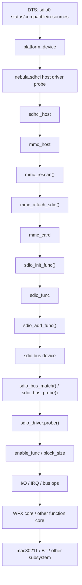

# 典型 Function 驱动例子

## 导读

### 本章定位

这一章用 `drivers/staging/wfx/bus_sdio.c` 作为 SDIO function driver 示例，把前面几章的匹配、probe、claim host、I/O、IRQ、remove 回滚流程落到一个具体驱动里。

这个例子同时是一颗 WiFi 芯片的 SDIO transport layer。本章只讲 SDIO 这一层怎样把 function、I/O、IRQ 和 lock/unlock 封装给上层 WFX core，不展开 mac80211、扫描、认证、关联、加密和网络接口创建细节。

### 核心对象

- `struct sdio_driver`
  - `wfx` SDIO 驱动注册对象
- `struct sdio_func` #sdio_func
  - probe 入口拿到的 function 设备
- `struct device_node`
  - 当前 `sdio_func` 对应的设备树 child node，后面会继续映射到 `compatible`、`reg` 和 `interrupts`
- `struct wfx_sdio_priv` #wfx_sdio_priv
  - `wfx` 的 SDIO 私有总线对象
- `struct hwbus_ops`
  - `wfx` core 面向底层总线的抽象操作表
- `struct wfx_dev`
  - `wfx` 公共核心对象，向上连接 mac80211，向下持有 `hwbus_ops`
- `struct ieee80211_hw`
  - mac80211 看到的 WiFi 硬件对象
- `wfx_sdio_hwbus_ops`
  - 把 SDIO 读写、IRQ、host lock 封装成 `wfx` core 可调用的 bus ops
- `sdio_set_drvdata() / sdio_get_drvdata()`
  - function 和驱动私有对象之间的绑定入口

### 关键函数

- `wfx_sdio_probe()`
- `wfx_sdio_remove()`
- `wfx_init_common()`
- `wfx_probe()`
- `ieee80211_alloc_hw()`
- `ieee80211_register_hw()`
- `mmc_of_find_child_device()`
- `of_match_node()`
- `irq_of_parse_and_map()`
- `sdio_enable_func()`
- `sdio_set_block_size()`
- `sdio_memcpy_fromio() / sdio_memcpy_toio()`
- `sdio_claim_irq()`
- `devm_request_threaded_irq()`

### 主流程

sdio bus 匹配 -> `wfx_sdio_probe()` -> 保存私有对象 -> enable function -> 设置 block size -> 封装 SDIO bus ops -> 创建 WFX core -> 注册 IRQ -> 接入 mac80211。

## 这一章按什么逻辑展开

这一章按“先看 driver 壳子，再按 `probe -> I/O -> IRQ -> remove` 这条实际驱动生命周期展开”的逻辑展开。

这样拆的原因是：

- 示例驱动章节的目标不是重新讲一遍框架概念
- 而是把前面枚举、probe、I/O、IRQ、回滚这些规则，按一个真实驱动的执行顺序重新落地

所以本章后面的结构是：

1. 先看为什么选这个例子
2. 再看 `sdio_driver` 壳子和 `id_table`
3. 再按 `probe()` 内部顺序展开初始化
4. 再看 I/O、IRQ、失败回滚和 `remove()` 怎样闭合
5. 最后补一层真实 WiFi 驱动边界：SDIO transport 怎样把能力交给 WFX core/mac80211

## 1. 为什么选 `wfx`

示例文件：

- `drivers/staging/wfx/bus_sdio.c`

选它的原因很简单：

- 文件短
- 结构清楚
- 把 `probe`、I/O、IRQ、block size、`drvdata` 都走了一遍

它比某些大型 WiFi 驱动更适合拿来做“第一次通读 SDIO function driver”的例子。

## 2. 它的 driver 壳子非常标准

文件末尾可以看到：

- `wfx_sdio_ids[]`
- `struct sdio_driver wfx_sdio_driver`

这正对应前面讲过的 `sdio bus` 匹配模型。

这里先区分两类对象：

- 前面章节已经讲过的通用对象
  - `struct sdio_func`：见 [[01-SDIO核心数据结构]]
  - `struct sdio_driver`：见 [[01-SDIO核心数据结构]] 和 [[03-SDIO总线匹配与probe]]
- 这一章新出现、而且后面会反复用到的私有对象
  - `struct wfx_sdio_priv`

也就是说，这一章真正需要新增展开的是把 `wfx` 自己的私有总线对象讲清楚。

### 2.1 `struct wfx_sdio_priv` 是什么

它定义在：

- `drivers/staging/wfx/bus_sdio.c`

>[!INFO]
```C
struct wfx_sdio_priv {
	struct sdio_func *func;
	struct wfx_dev *core;
	u8 buf_id_tx;
	u8 buf_id_rx;
	int of_irq;
};
```
这个结构体不是 SDIO core 的通用对象，而是 `wfx` 这个示例驱动自己的私有状态容器。

它的作用是：

- 把 `sdio_func`
- 上层 `wfx core`
- 发送/接收队列状态
- 可能存在的外部 IRQ

收拢到一个驱动私有对象里，后面 `probe()`、I/O、IRQ、remove 都围绕它展开。

### 2.2 这个私有结构里哪些字段最关键

- `struct sdio_func *func`
  - 当前 function driver 绑定到的 SDIO function
  - 后面所有 `sdio_*` API 基本都要通过它进入
- `struct wfx_dev *core`
  - 指向更上层的 `wfx` 公共核心对象，由 `wfx_init_common()` 创建
  - `bus_sdio.c` 通过它把 SDIO transport 和 WiFi core 连接起来
  - 说明这一层不是完整 WiFi 协议栈，而是把 SDIO 读写、IRQ 和锁封装给 `wfx` core 使用
- `u8 buf_id_tx`
  - 发送路径里的 queue/buffer 索引
  - 配合 `sdio_memcpy_toio()` 组织芯片私有发送窗口
- `u8 buf_id_rx`
  - 接收路径里的 queue/buffer 索引
  - 配合 `sdio_memcpy_fromio()` 组织芯片私有接收窗口
- `int of_irq`
  - 从设备树解析出来的外部 IRQ 号
  - `0` 表示没有可用的外部 IRQ，于是回退走标准 `sdio_claim_irq()` 路线
  - 非 `0` 表示当前板级给了额外 IRQ，于是走 `devm_request_threaded_irq()`

### 2.3 为什么这一章必须把它单独讲出来

因为后面很多看起来像“函数分支”的东西，其实都是围绕 `wfx_sdio_priv` 里的字段展开：

- `func`
  - 决定控制面、数据面、IRQ API 最终操作哪个 SDIO function
- `buf_id_tx / buf_id_rx`
  - 决定收发地址为什么会额外拼出 queue 偏移
- `of_irq`
  - 决定 IRQ 路径为什么分成标准 SDIO IRQ 和外部平台 IRQ 两种
- `core`
  - 决定 IRQ handler 为什么只是请求上层继续收包，而不是在这里直接做全部业务处理

### 2.4 这个例子对应的设备树节点长什么样

这一章虽然是 function driver 例子，但它并不是完全脱离设备树工作的。

从源码里已经能确认的事实有三条：

1. `wfx` 接受这两个 `compatible`
   - `silabs,wfx-sdio`
   - `silabs,wf200`
2. `wfx_sdio_probe()` 里会取：
   - `struct device_node *np = func->dev.of_node;`
3. `wfx_sdio_irq_subscribe()` 是否走外部 IRQ 路线，取决于：
   - `bus->of_irq`

按这些事实反推，最小可用的节点形态可以先理解成：

```dts
wifi@1 {
	compatible = "silabs,wfx-sdio";
	reg = <1>;
	interrupts = <...>;        /* 如果板级走外部 IRQ */
	interrupt-parent = <...>;  /* 如果平台需要显式指定 */
};
```

这里最重要的不是节点名 `wifi@1` 本身，而是下面这些字段：

- `compatible`
  - 要能被 `wfx_sdio_of_match[]` 命中
- `reg = <1>`
  - 要和当前 function 编号对应
- `interrupts`
  - 如果板级走外部 IRQ 路线，就要提供可解析的第一个 IRQ 资源

### 2.5 代码字段和设备树是怎么连起来的

这一层的连接关系不是 `wfx` 驱动自己随便定义的，而是 SDIO core 先帮它把 function 和 OF child node 对上。

这条链可以直接写成：

```text
host 的 OF 节点下面的 child node
-> mmc_of_find_child_device(host, func_num)
-> func->dev.of_node
-> wfx_sdio_probe() 里的 np
-> of_match_node()
-> irq_of_parse_and_map()
-> bus->of_irq
```

这里最关键的源码点有两处：

1. `sdio_add_func()` 里：
   - `func->dev.of_node = mmc_of_find_child_device(host, func->num);`
2. `mmc_of_find_child_device()` 里：
   - 逐个找 host 父节点下面的 child node
   - 比较的是 child node 的 `reg`
   - 谁的 `reg == func->num`，谁就会挂到这个 `sdio_func`

所以这条关系要分三步理解：

- `reg`
  - 决定这个 DT child node 属于哪个 function
- `compatible`
  - 决定 `wfx_sdio_of_match[]` 能不能匹配这个 node
- `interrupts`
  - 决定 `irq_of_parse_and_map(np, 0)` 能不能解析出 `bus->of_irq`

也就是说，前面在 `probe()` 里看到的这些字段：

- `func->num`
- `np = func->dev.of_node`
- `bus->of_irq`

其实都能回到设备树里找到对应来源：

- `func->num` <- `reg`
- `np` <- host 节点下面、且 `reg` 命中当前 function 的 child node
- `bus->of_irq` <- 这个 child node 的第一个 IRQ 资源

### 2.6 这和后面两条 IRQ 路径的关系

把设备树字段和后面的 IRQ 分支连起来看，就会更清楚：

- 如果这个 child node 没有可用 IRQ 资源
  - `bus->of_irq` 就是 `0`
  - 驱动回退走标准 `sdio_claim_irq()` 路线
- 如果这个 child node 提供了可解析的 IRQ
  - `bus->of_irq != 0`
  - 驱动就走 `devm_request_threaded_irq()` 这条外部 IRQ 路线

所以后面第 `5` 节里两种 IRQ 路径的分支，并不是凭空出现的，而是前面这个设备树节点是否提供额外 IRQ 资源的直接结果。

## 3. 它的 `probe()` 值得怎么读

主入口：

- `wfx_sdio_probe(struct sdio_func *func, const struct sdio_device_id *id)`

>[!INFO]
```C {8,31,32,33,37-41,} fold:"wfx_sdio_probe"
static int wfx_sdio_probe(struct sdio_func *func,
			  const struct sdio_device_id *id)
{
	struct device_node *np = func->dev.of_node;
	struct wfx_sdio_priv *bus;
	int ret;

	if (func->num != 1) {
		dev_err(&func->dev, "SDIO function number is %d while it should always be 1 (unsupported chip?)\n",
			func->num);
		return -ENODEV;
	}

	bus = devm_kzalloc(&func->dev, sizeof(*bus), GFP_KERNEL);
	if (!bus)
		return -ENOMEM;

	if (np) {
		if (!of_match_node(wfx_sdio_of_match, np)) {
			dev_warn(&func->dev, "no compatible device found in DT\n");
			return -ENODEV;
		}
		bus->of_irq = irq_of_parse_and_map(np, 0);
	} else {
		dev_warn(&func->dev,
			 "device is not declared in DT, features will be limited\n");
		// FIXME: ignore VID/PID and only rely on device tree
		// return -ENODEV;
	}

	bus->func = func;
	sdio_set_drvdata(func, bus);
	func->card->quirks |= MMC_QUIRK_LENIENT_FN0 |
			      MMC_QUIRK_BLKSZ_FOR_BYTE_MODE |
			      MMC_QUIRK_BROKEN_BYTE_MODE_512;

	sdio_claim_host(func);
	ret = sdio_enable_func(func);
	// Block of 64 bytes is more efficient than 512B for frame sizes < 4k
	sdio_set_block_size(func, 64);
	sdio_release_host(func);
	if (ret)
		goto err0;

	bus->core = wfx_init_common(&func->dev, &wfx_sdio_pdata,
				    &wfx_sdio_hwbus_ops, bus);
	if (!bus->core) {
		ret = -EIO;
		goto err1;
	}

	ret = wfx_probe(bus->core);
	if (ret)
		goto err1;

	return 0;

err1:
	sdio_claim_host(func);
	sdio_disable_func(func);
	sdio_release_host(func);
err0:
	return ret;
}
```

按下面顺序读：
[[06-典型Function驱动例子#3. 它的 `probe()` 值得怎么读]]
### 3.1 先检查 function 编号

它一开始就判断：

- `func->num != 1` 直接报错

这说明对这个芯片来说，驱动明确预期功能挂在 function 1。

### 3.2 分配私有结构并保存到 `drvdata`

它分配了：

- `struct wfx_sdio_priv`

然后：

- `sdio_set_drvdata(func, bus)`

这就是 function driver 的典型写法。

### 3.3 设置 quirks

它会改：

- `func->card->quirks`

这说明某些芯片的行为，确实会逼着 function driver 去给 core 打补丁式地开 quirk。

### 3.4 在 claim host 后打开 function

它走的顺序是：

1. `sdio_claim_host(func)`
2. `sdio_enable_func(func)`
3. `sdio_set_block_size(func, 64)`
4. `sdio_release_host(func)`

这正好是前面说的标准控制面初始化顺序。

### 3.5 后半段开始进入 WFX core，而不是继续停在 SDIO API

`wfx_sdio_probe()` 的前半段是典型 SDIO function driver 初始化：

```text
分配 wfx_sdio_priv      // 建立 SDIO transport 私有对象
-> sdio_set_drvdata()   // 把私有对象挂到当前 sdio_func
-> sdio_enable_func()   // 打开 SDIO function
-> sdio_set_block_size() // 设置后续 CMD53 传输块大小
```

后半段开始把 SDIO transport 交给 WFX 公共核心：

```text
wfx_init_common(&func->dev, ..., &wfx_sdio_hwbus_ops, bus) // 创建 WFX core，并传入 SDIO bus ops
-> ieee80211_alloc_hw(sizeof(struct wfx_dev), &wfx_ops)    // 分配 mac80211 认识的 WiFi 硬件对象
-> wdev->hwbus_ops = &wfx_sdio_hwbus_ops                   // WFX core 保存底层 SDIO 读写/IRQ/lock 操作表
-> wdev->hwbus_priv = bus                                  // WFX core 保存 SDIO transport 私有对象
-> wfx_probe(bus->core)                                    // 初始化芯片、固件、后台收发路径和 IRQ
-> ieee80211_register_hw(wdev->hw)                         // 向 mac80211 注册 WiFi 硬件
```

这条线说明：`bus_sdio.c` 并不是直接把 WiFi 协议全部做完，而是先把 SDIO 这条 transport 准备好，再让 WFX core 通过 `hwbus_ops` 使用它。

## 4. 它的数据收发路径怎么写

### 4.1 读数据

- `wfx_sdio_copy_from_io()`
- 内部调用 `sdio_memcpy_fromio()`
>[!INFO]
```C {15,17} fold:"wfx_sdio_copy_from_io"
static int wfx_sdio_copy_from_io(void *priv, unsigned int reg_id,
				 void *dst, size_t count)
{
	struct wfx_sdio_priv *bus = priv;
	unsigned int sdio_addr = reg_id << 2;
	int ret;

	WARN(reg_id > 7, "chip only has 7 registers");
	WARN(((uintptr_t)dst) & 3, "unaligned buffer size");
	WARN(count & 3, "unaligned buffer address");

	/* Use queue mode buffers */
	if (reg_id == WFX_REG_IN_OUT_QUEUE)
		sdio_addr |= (bus->buf_id_rx + 1) << 7;
	ret = sdio_memcpy_fromio(bus->func, dst, sdio_addr, count);
	if (!ret && reg_id == WFX_REG_IN_OUT_QUEUE)
		bus->buf_id_rx = (bus->buf_id_rx + 1) % 4;

	return ret;
}
```
### 4.2 写数据

- `wfx_sdio_copy_to_io()`
- 内部调用 `sdio_memcpy_toio()`
>[!INFO]
```C {16,18} fold:"wfx_sdio_copy_to_io"
static int wfx_sdio_copy_to_io(void *priv, unsigned int reg_id,
			       const void *src, size_t count)
{
	struct wfx_sdio_priv *bus = priv;
	unsigned int sdio_addr = reg_id << 2;
	int ret;

	WARN(reg_id > 7, "chip only has 7 registers");
	WARN(((uintptr_t)src) & 3, "unaligned buffer size");
	WARN(count & 3, "unaligned buffer address");

	/* Use queue mode buffers */
	if (reg_id == WFX_REG_IN_OUT_QUEUE)
		sdio_addr |= bus->buf_id_tx << 7;
	// FIXME: discards 'const' qualifier for src
	ret = sdio_memcpy_toio(bus->func, sdio_addr, (void *)src, count);
	if (!ret && reg_id == WFX_REG_IN_OUT_QUEUE)
		bus->buf_id_tx = (bus->buf_id_tx + 1) % 32;

	return ret;
}
```

它还额外维护了：

- `buf_id_tx`
- `buf_id_rx`

这属于芯片私有的 queue/buffer 组织方式，但底层 API 仍然是标准 SDIO I/O。

### 4.3 谁会调用这些读写函数

`wfx_sdio_copy_from_io()` 和 `wfx_sdio_copy_to_io()` 不是用户态直接调用的字符设备 `read/write`，也不是 SDIO core 自动调用的固定回调。它们被放进 `wfx_sdio_hwbus_ops`，交给 WFX core 在需要访问芯片寄存器、mailbox、queue 或 frame buffer 时调用。

这条关系可以压成：

```text
WFX core 需要访问芯片                       // 上层 WiFi core 要读写控制寄存器或收发数据
-> wdev->hwbus_ops->copy_from_io/to_io     // WFX core 通过 bus ops 调用底层 transport
-> wfx_sdio_copy_from_io/to_io             // SDIO transport 把 WFX 逻辑寄存器转换成 SDIO 地址
-> sdio_memcpy_fromio()/sdio_memcpy_toio() // 最终通过 CMD53 做批量数据传输
```

所以这一层的重点不是“给用户态提供一个读写文件”，而是“给 WFX core 提供一组不暴露 SDIO 细节的传输函数”。这也正好对应 [[04-SDIO数据通路与常用API#8. 教学型字符设备读写例子 vs 真实 function driver]] 里的边界：字符设备例子适合学习 API，真实 WiFi 驱动通常把这些 API 包进自己的 transport ops。

## 5. 它的 IRQ 路径有两个版本

这一节按“先看分支条件，再分别看两条 IRQ 路径，最后做并排对照”的逻辑展开。

这样拆的原因是：

- 这不是两个互不相干的中断实现
- 而是同一颗 SDIO 芯片在两种板级接法下的两种 IRQ 接入方式

分支点就在 `wfx_sdio_irq_subscribe()`：

- `bus->of_irq == 0`
  - 走标准 SDIO in-band IRQ
- `bus->of_irq != 0`
  - 走设备树提供的外部 IRQ

### 5.1 纯 SDIO in-band IRQ
[[05-SDIO中断机制#4.解决“host 报告有中断”，mmc_signal_sdio_irq()`]]
如果没有外部 IRQ：

- `sdio_claim_irq(bus->func, wfx_sdio_irq_handler)`

对应回调是：

- `wfx_sdio_irq_handler(struct sdio_func *func)`

这条路径的完整链路是：

```text
wfx_sdio_irq_subscribe()
-> sdio_claim_irq()
-> SDIO core 打开 IENx
-> host 感知 card 侧 SDIO IRQ
-> mmc_signal_sdio_irq()
-> sdio_irq_thread()
-> process_sdio_pending_irqs()
-> wfx_sdio_irq_handler(func)
```

这条路径的几个关键点是：

- 这是标准 SDIO IRQ 机制
  - 中断分发由 SDIO core 完成
- 回调参数是 `struct sdio_func *`
  - 说明它是 function 级中断回调
- handler 运行时 host 已经由 core claim
  - 所以 `wfx_sdio_irq_handler()` 里不需要再 `sdio_claim_host()`

这也是为什么这个 handler 很短：

- 先 `sdio_get_drvdata(func)`
- 再请求上层去做收包处理

它的重点不是在 IRQ 回调里直接搬数据，而是把“该收包了”这件事交给后续路径。

在 `wfx` 里，这个“交给后续路径”的入口就是：

```text
wfx_sdio_irq_handler(func)          // 标准 SDIO IRQ 分发到 function driver
-> sdio_get_drvdata(func)           // 取回 `wfx_sdio_priv`
-> wfx_bh_request_rx(bus->core)     // 通知 WFX core 的后台工作路径准备收包
-> queue_work(system_highpri_wq, ...) // 后续收包处理放到 workqueue，不在 IRQ handler 里展开
```

这里仍然不需要深入 WiFi 收包协议，只要记住：SDIO IRQ handler 负责把“芯片有事了”这个事件送进 WFX core，真正的 WiFi 帧处理和 mac80211 交互在更上层。

### 5.2 设备树外部 IRQ
[[07-HI3516CV610板级落地#3. `sdio0` 节点当前配置了什么]]
如果 DTS 提供了外部 IRQ：

- 用 `devm_request_threaded_irq()`
- 然后手动改 `CCCR_IENx`

对应回调是：

- `wfx_sdio_irq_handler_ext(int irq, void *priv)`

这条路径的完整链路是：

```text
DTS 解析出 bus->of_irq
-> devm_request_threaded_irq()
-> 平台 IRQ 触发
-> wfx_sdio_irq_handler_ext()
```

而在注册这条 IRQ 之后，驱动又手动做了：

- `sdio_f0_readb(..., SDIO_CCCR_IENx, ...)`
- 置 `BIT(0)` 和 `BIT(func->num)`
- `sdio_f0_writeb(..., SDIO_CCCR_IENx, ...)`

这说明虽然中断入口换成了外部平台 IRQ，但 card 内部对应 function 的中断使能仍然要打开。

这条路径的几个关键点是：

- 入口来自 Linux 通用 IRQ 子系统
  - 不再是 SDIO core 的 `sdio_irq_thread()` 分发
- 回调参数变成 `(irq, priv)`
  - 这是标准平台 IRQ handler 形式
- handler 里需要自己 `sdio_claim_host()`
  - 因为这里不是在 SDIO core 已 claim host 的上下文里

这也是 `wfx_sdio_irq_handler_ext()` 和前一个 handler 最大的区别：

- 它进入后先 `sdio_claim_host(bus->func)`
- 再请求上层做收包
- 最后 `sdio_release_host(bus->func)`

也就是说：

- 标准 SDIO IRQ 路径里，host claim 由 core 代管
- 外部 IRQ 路径里，host claim 由驱动自己负责

### 5.3 这两条路径并排看，差别到底在哪

可以直接压成下面这组对照：

- `sdio_claim_irq()`
  - 标准 SDIO in-band IRQ
  - 由 SDIO core 分发
  - 回调参数是 `struct sdio_func *`
  - handler 运行时 host 已由 core claim

- `devm_request_threaded_irq()`
  - 外部平台 IRQ
  - 由 Linux 通用 IRQ 子系统分发
  - 回调参数是 `(irq, priv)`
  - handler 里要自己 `sdio_claim_host()`

### 5.4 为什么同一个驱动要支持两种 IRQ

因为同一颗 SDIO 芯片在不同板级设计下，可能有两种接法：

1. 纯标准 SDIO IRQ
   - 不依赖额外 GPIO/平台中断线
2. 芯片额外拉出一个外部 IRQ pin
   - 板级通过 DTS 把这个 IRQ 交给平台 IRQ 子系统

所以这不是“重复实现了两套无关中断代码”，而是：

- 同一套 function driver
- 兼容两种板级中断接入方式

这样回头再看这一节，关键就不是“有两个 handler”，而是：

- 标准 SDIO IRQ 走哪条链
- 外部 IRQ 走哪条链
- 哪一条路径由 core claim host
- 哪一条路径由驱动自己 claim host

这个例子很有价值，因为它说明：

- 一些芯片既能走标准 SDIO IRQ
- 也可能结合 out-of-band 中断设计

## 6. 这个驱动能说明什么
[[04-SDIO数据通路与常用API#9. 和示例驱动的对应关系]]
### 6.1 最小可用框架

它几乎完整展示了一个 SDIO function driver 的骨架：

- `probe/remove`
- `drvdata`
- host claim/release
- function enable/disable
- block size
- IRQ
- I/O 访问

### 6.2 什么时候应该包一层总线抽象

`wfx` 没有让业务层直接到处调用 `sdio_*` API，而是封装成：

- `copy_from_io`
- `copy_to_io`
- `irq_subscribe`
- `irq_unsubscribe`
- `lock/unlock`

这对后续维护很有帮助，尤其是一个芯片同时支持 SDIO/SPI 等多种总线时。

### 6.3 这个 WiFi 驱动真正把 SDIO 用在什么位置

`wfx` 的 SDIO 文件不是完整 WiFi 子系统源码，它的角色是 transport adapter。它把 SDIO function driver 需要做的事情收在 `bus_sdio.c` 里，再通过 `struct hwbus_ops` 交给 WFX core。

源码里这层桥接关系可以写成：

```text
wfx_sdio_hwbus_ops                  // WFX core 面向底层总线的操作表
-> copy_from_io = wfx_sdio_copy_from_io // 接收/读取路径最终落到 `sdio_memcpy_fromio()`
-> copy_to_io = wfx_sdio_copy_to_io     // 发送/写入路径最终落到 `sdio_memcpy_toio()`
-> irq_subscribe = wfx_sdio_irq_subscribe // 注册标准 SDIO IRQ 或外部平台 IRQ
-> irq_unsubscribe = wfx_sdio_irq_unsubscribe // 退出时释放 IRQ 路径
-> lock = wfx_sdio_lock             // 把 `sdio_claim_host()` 包给 WFX core
-> unlock = wfx_sdio_unlock         // 把 `sdio_release_host()` 包给 WFX core
-> align_size = wfx_sdio_align_size // 把 SDIO 长度对齐规则包给 WFX core
```

进入 WiFi core 的路径则是：

```text
sdio_bus_probe()                    // SDIO bus 匹配到 `wfx_sdio_driver`
-> wfx_sdio_probe()                 // 进入 WFX 的 SDIO transport probe
-> sdio_enable_func()               // 打开当前 SDIO function
-> sdio_set_block_size()            // 设置 CMD53 批量传输块大小
-> wfx_sdio_hwbus_ops               // 把 SDIO 读写、IRQ、lock/unlock 封装成 bus ops
-> wfx_init_common()                // 创建 WFX core，并分配 `ieee80211_hw`
-> wfx_probe()                      // 初始化芯片、固件、后台收发路径和 IRQ
-> ieee80211_register_hw()          // 向 mac80211 注册 WiFi 硬件
-> mac80211 回调 WFX driver          // 后续 scan/tx/config 等 WiFi 行为由 WiFi 栈触发
-> hwbus_ops->copy_to_io/from_io    // WFX core 最终仍通过 SDIO 访问芯片
```

学 SDIO 时看到这里就够了：`wfx_sdio_probe()` 不直接讲完 WiFi 联网流程，它只把 SDIO function 封装成 WFX core 可用的 transport；真正让这个设备进入 Linux WiFi 栈的是后面的 `ieee80211_register_hw()`。

本章不展开下面这些内容：

- mac80211 如何扫描 AP
- 认证、关联、加密和漫游状态机
- `wlan0` 具体何时出现
- 用户态 `wpa_supplicant` 或网络配置流程

这些属于 WiFi 子系统学习内容，不属于 SDIO function driver 的主线。

## 7. 编写 SDIO function driver 的最小顺序

可以先照着这条顺序搭起来：

1. 建私有结构
2. `sdio_set_drvdata()`
3. claim host
4. `sdio_enable_func()`
5. `sdio_set_block_size()`
6. release host
7. 初始化芯片寄存器
8. 封装 I/O、IRQ、lock/unlock 等 bus ops
9. 注册 IRQ
10. 接入上层子系统

退出时做反向清理：

1. 注销上层子系统
2. 释放 IRQ 或取消 bus ops 中注册的中断路径
3. claim host
4. `sdio_disable_func()`
5. release host

## 8. 为什么这一章和 HI3516CV610 有关

虽然 `wfx` 不是 HI3516CV610 私有驱动，但它所在的上层框架和当前板级一致：

- 下面还是 `sdhci/nebula`
- 上面还是 `sdio core`
- function driver 看到的仍然是 `struct sdio_func` 和同一组 `sdio_*` API

因此这个例子适合用来分析后续挂在 `sdio0` 上的实际模组。

## 9. 全流程总结：从设备树到 function driver 真正工作

这一章最后必须把视角从 `wfx` 这个单个 function driver 拉回完整 SDIO 链路。

`wfx` 例子本身只展示了 `sdio_driver.probe()` 之后一个典型驱动应该怎么写，但在真实板子上，能进入这个 `probe()` 之前，前面已经走过了设备树、platform driver、host 注册、card 枚举、function 创建和总线匹配这一整段。

所以完整流程应该按下面这条主线理解：

```text
设备树启用 SDIO host                         // DTS 先决定哪套控制器作为 SDIO host 暴露给内核
-> platform bus 根据 compatible 匹配 host driver // platform 总线按 compatible 找到 host 驱动
-> host driver 初始化控制器资源                 // 处理寄存器、IRQ、clock、reset、quirk 等板级资源
-> host driver 注册 sdhci_host / mmc_host       // 把厂商控制器接到标准 SDHCI/MMC host 框架
-> MMC core 开始 rescan                         // MMC core 开始扫描 host 上挂的设备
-> MMC/SDIO core 识别 SDIO card                 // 判断当前设备走 SDIO 路线
-> SDIO core 读取 CCCR/CIS                      // 读取整卡能力和公共描述信息
-> SDIO core 为每个 function 创建 sdio_func      // 把卡上的 function 抽象成内核对象
-> SDIO core 把 sdio_func 注册到 sdio bus        // 让 function 进入 Linux driver model
-> sdio bus 按 id_table 匹配 sdio_driver         // 根据 vendor/device/class 匹配具体驱动
-> 具体 function driver probe                   // 进入芯片私有初始化入口
-> enable_func / set_block_size / 私有初始化      // 打开 function、设置块大小、初始化芯片
-> 建立 I/O 路径                                // 准备 CMD52/CMD53 读写路径
-> 建立 IRQ 路径                                // 注册标准 SDIO IRQ 或外部 IRQ
-> 封装 bus ops                                 // 把 SDIO 读写、IRQ、lock/unlock 交给芯片公共核心
-> 接入上层子系统                               // 例如 `wfx_init_common()` / `wfx_probe()` / `ieee80211_register_hw()`
```

这条主线可以分成六段看。

### 9.1 第一段：设备树先决定哪套 host 存在

设备树不是直接创建 `sdio_func`，它首先解决的是板级 host 能不能出现。

在 HI3516CV610 当前板级里，关键判断是：

- `sdio0` 是否 `status = "okay"`
- `mmc0` 是否被关闭，避免和 `sdio0` 抢同一套 `0x10030000` 控制器
- `compatible = "nebula,sdhci"` 是否能匹配到 host driver
- `reg`、`interrupts`、`clock-names`、`bus-width`、`max-frequency` 等 host 资源是否能让控制器工作

这一段的结果不是“WiFi 驱动 probe”，而是：

```text
内核知道板上启用了一套 SDIO host controller
```

如果这一段失败，后面不会有 `mmc_host`，也不会有 `mmc_card`、`sdio_func` 和 function driver probe。

更详细的 DTS 属性和 HI3516CV610 节点关系放在 [[07-HI3516CV610板级落地]] 里展开。

### 9.2 第二段：host driver 把控制器交给 MMC core

设备树节点匹配成功后，进入 HI3516CV610 的 host 适配层：

```text
compatible = "nebula,sdhci"  // DTS compatible，决定匹配哪一个 host platform driver
-> platform driver probe     // platform 总线匹配成功后，调用 `nebula,sdhci` host 驱动入口
-> sdhci_pltfm_init()        // 创建并初始化通用 `sdhci_host` 框架对象
-> sdhci_nebula_add_host()   // HI3516CV610 私有封装，把 nebula 控制器接入 SDHCI/MMC 框架
-> sdhci_add_host()          // 把 `sdhci_host` 注册进 SDHCI/MMC host 主线
-> mmc_add_host()            // 把标准 `mmc_host` 交给 MMC core，后续 rescan 才有入口
```

这一段的核心对象变化是：

```text
device_node / platform_device // DTS 节点被 platform 总线实例化后的设备对象
-> sdhci_host                 // SDHCI 通用 host 对象，承接标准 SDHCI 框架
-> mmc_host                   // MMC core 真正识别和扫描 card/function 的标准 host 对象
```

这里的关键点是：

- `nebula` 负责 SoC 私有适配
- `sdhci` 负责复用通用 SDHCI host 框架
- `mmc_host` 才是 MMC core 后续枚举 card/function 的标准入口

所以当调试发现卡完全没有枚举迹象时，不应该先看 `wfx_sdio_probe()`。
卡要进入 function driver probe，前置条件是 host 注册、card 识别、function 创建和 sdio bus 注册都已经完成；`wfx_sdio_probe()` 已经是 bus 匹配成功之后的入口，要注意对于sd卡硬件有card跟func的初始化与注册过程，card是func的父类，需要先完成才能注册func，[[02-SDIO卡枚举与初始化]]，总体就是init_card->init_func->add_card->add_func

### 9.3 第三段：MMC/SDIO core 识别整张 SDIO card

host 准备好以后，MMC core 才开始尝试识别挂在这套 host 上的设备。

SDIO 路线大致是：

```text
mmc_rescan()                    // MMC core 扫描 host，判断挂载设备类型
-> mmc_attach_sdio()            // 确认当前设备走 SDIO 路线，进入 SDIO 初始化主线
   -> mmc_sdio_init_card()      // 初始化整张 SDIO card，读取能力并准备 function 枚举
      -> sdio_read_cccr()       // 读取 CCCR，确认 SDIO 基础控制和协议能力
      -> sdio_read_common_cis() // 读取 card 级 CIS，获取整卡公共描述信息
```

这一段围绕的是 `struct mmc_card`：

- 识别这是一张 SDIO 卡
- 读取整卡级能力
- 读取 CCCR/CIS
- 确认 function 数量

这一段还没有进入具体 WiFi/BT 芯片驱动。它解决的是：

```text
这张卡是否存在，是否能按 SDIO 协议完成整卡初始化
```

如果这一段失败，表现通常是：

- `/sys/bus/sdio/devices` 没有 function 设备
- 日志停在 card/core 枚举阶段
- 具体 `sdio_driver.probe()` 不可能进入

### 9.4 第四段：SDIO core 创建并注册 function 设备

整卡初始化成功后，SDIO core 才会按 function 数量创建 `struct sdio_func`。

关键链路是：

```text
sdio_init_func()  // 为某个 function 分配并初始化 `struct sdio_func`
-> sdio_add_func() // 把 `sdio_func` 注册成 SDIO bus 上的 device
-> device_add()    // Linux driver model 通用设备注册入口
```

这一段的核心对象变化是：

```text
mmc_card           // 整张 SDIO 卡对象，保存 card 级能力和 function 数量
-> sdio_func       // 单个 SDIO function 对象，是 function driver 的核心入口
-> sdio bus device // 注册到 driver model 后暴露给 SDIO bus 匹配
```

这里要把两个动作分清：

- `sdio_init_func()`
  - 创建并初始化 `struct sdio_func`
- `sdio_add_func()`
  - 把这个 function 注册到 Linux driver model，暴露到 `sdio bus`

如果 DTS 里还写了 function child node，SDIO core 还可能通过 `mmc_of_find_child_device()` 把对应 child node 关联到 `func->dev.of_node`。

这一步解释了为什么 [[06-典型Function驱动例子#2.4 这个例子对应的设备树节点长什么样]] 里会提到 function child node：

- host 级 DTS 让 SDIO host 出现
- function child node 让具体 function driver 有机会读取自己的板级属性

但即使没有 function child node，只要 SDIO function 能被枚举出来，仍然可以通过 `sdio_device_id` 匹配普通 SDIO function driver。

### 9.5 第五段：sdio bus 匹配并进入具体 driver probe

function 设备注册到 `sdio bus` 后，才轮到这一章重点分析的 function driver。

关键链路是：

```text
sdio_bus_match()   // 用 `sdio_device_id` 判断哪个 driver 能绑定当前 function
-> sdio_bus_probe() // SDIO bus 的 probe 包装层，做总线级准备
-> wfx_sdio_probe() // `wfx` 示例驱动的芯片私有初始化入口
```

这一段要关注：

- `sdio_driver.id_table`
- vendor/device/class 是否匹配
- 模块是否加载
- `sdio_set_drvdata()` 是否保存私有结构
- `sdio_enable_func()` 是否成功
- `sdio_set_block_size()` 是否合理

从这里开始，视角才真正进入芯片私有驱动。

`wfx` 这一章讲的主要就是这一段之后的最小模型：

```text
probe             // 具体 `sdio_driver.probe()`，function driver 开始接手设备
-> 分配私有结构    // 保存芯片状态、bus ops、IRQ 信息等驱动上下文
-> 保存 drvdata   // 通过 `sdio_set_drvdata()` 把私有结构挂到 `sdio_func`
-> claim host     // 通过 `sdio_claim_host()` 独占 SDIO host 访问权
-> enable_func    // 通过 `sdio_enable_func()` 使能当前 SDIO function
-> set_block_size // 通过 `sdio_set_block_size()` 设置 CMD53 批量传输块大小
-> release host   // 通过 `sdio_release_host()` 释放 host 访问权
-> 初始化芯片      // 访问芯片寄存器、加载固件或建立私有协议状态
-> 注册 IRQ       // 注册标准 SDIO IRQ 或外部平台 IRQ
-> 封装 bus ops   // 把 SDIO 读写、IRQ 和 host lock 包成上层 core 可用的接口
-> 接入上层       // 例如 WFX core 继续 `wfx_probe()`，最后 `ieee80211_register_hw()`
```

### 9.6 第六段：I/O、IRQ 和上层业务开始工作

probe 成功不等于设备已经完全可用。probe 只是把 function driver 绑定到 function 设备，并完成基础初始化。

真正工作起来还要看两条路径。

第一条是 I/O 路径：

```text
业务层请求                                      // 上层触发寄存器访问或数据收发
-> driver 私有读写封装                           // 驱动把通用业务请求转换成底层 bus 访问
-> hwbus_ops->copy_from_io/copy_to_io            // 真实 WiFi 驱动常先经过一层 transport ops
-> sdio_claim_host()                            // 独占当前 `mmc_host`，避免并发访问总线
-> sdio_readb() / sdio_writeb()                 // 通过 CMD52 做小寄存器读写
-> sdio_memcpy_fromio() / sdio_memcpy_toio()    // 通过 CMD53 做批量数据读写
-> CMD52 / CMD53                                // 最终落到 SDIO 协议命令
-> sdio_release_host()                          // 释放 host 访问权
```

第二条是 IRQ 路径。标准 SDIO in-band IRQ 是：

```text
sdio_claim_irq()                // function driver 向 SDIO core 注册 in-band IRQ 回调
-> host 感知 SDIO IRQ            // host 控制器检测到 card 侧 SDIO 中断
-> mmc_signal_sdio_irq()         // host 通知 MMC/SDIO core 有 SDIO IRQ 待处理
-> sdio_irq_thread()             // SDIO core 的 IRQ 线程开始处理
-> process_sdio_pending_irqs()   // 检查 pending function，并分发到对应 handler
-> function driver irq handler   // 进入具体 function driver 的 IRQ 回调
```

如果板级使用外部 IRQ，则路径会变成：

```text
DTS function child node 提供 interrupts // 设备树描述额外 out-of-band 中断线
-> of_irq 解析                         // 内核把 DT 中断属性解析成 Linux IRQ
-> devm_request_threaded_irq()          // 驱动向通用 IRQ 子系统申请线程化 IRQ
-> 平台 IRQ 触发                        // GPIO/GIC 等平台中断入口触发
-> function driver 外部 IRQ handler      // 进入驱动自己的外部 IRQ 回调
-> driver 自己 claim/release host        // 外部 IRQ 不由 SDIO core 代管 host，需要驱动自己保护总线访问
```

这也是 `wfx` 例子最值得学的地方：同一个 function driver 可以同时支持标准 SDIO IRQ 和外部平台 IRQ，但两条路径里的 host claim 责任不同。

第三条是上层子系统接入路径。对 `wfx` 来说，它不是把 SDIO function 直接暴露成字符设备，而是接到 WiFi/mac80211：

```text
wfx_sdio_probe()                 // SDIO function driver 已绑定到具体 function
-> wfx_init_common()              // 创建 WFX core，并保存 `wfx_sdio_hwbus_ops`
-> ieee80211_alloc_hw()           // 分配 mac80211 认识的 `struct ieee80211_hw`
-> wfx_probe()                    // 初始化固件、后台工作路径和芯片能力
-> wdev->hwbus_ops->irq_subscribe() // WFX core 反过来通过 bus ops 注册 SDIO/外部 IRQ
-> ieee80211_register_hw()        // 向 mac80211 注册 WiFi 硬件
```

这条路径只需要理解到“SDIO transport 被交给 WiFi core 使用”。至于后续扫描、关联、发包队列和网络接口行为，属于 WiFi 子系统继续接管后的内容。

### 9.7 把全流程压成一张对象关系图



这张图里最重要的分界线是：

```text
DTS/host 层:
DTS -> platform_device -> sdhci_host -> mmc_host // 从板级描述转换成 MMC core 可扫描的 host

card/core 层:
mmc_host -> mmc_card -> sdio_func              // 从 host 扫描到整卡，再创建单个 function

bus/probe 层:
sdio_func -> sdio bus -> sdio_driver.probe()   // function 设备进入总线匹配，再进入具体驱动

function 工作层:
enable_func -> I/O -> IRQ -> bus ops -> 上层子系统 // function 被使能后建立 transport，再交给业务子系统
```

### 9.8 用这条总结反推调试顺序

遇到 SDIO 问题时，按下面顺序切层：

1. `sdio0` 是否在 DTS 中启用
2. `nebula,sdhci` host driver 是否 probe 成功
3. `mmc_host` 是否注册
4. `mmc_attach_sdio()` 是否进入，
	- 这个函数会完成枚举的整个过程，通过调用下面的5-7等函数[[02-SDIO卡枚举与初始化#2. `mmc_attach_sdio()` 做了什么，提供了一个完整的流程]]
5. `mmc_sdio_init_card()` 是否成功
	- 配置card的属性[[02-SDIO卡枚举与初始化#3. `mmc_sdio_init_card()` 是整条链最关键的函数]]
6. `sdio_init_func()` 是否创建 function
7. `sdio_add_func()` 后 `/sys/bus/sdio/devices` 是否出现设备
8. `sdio_bus_match()` 是否匹配到目标 driver
9. 具体 `sdio_driver.probe()` 是否进入
10. `sdio_enable_func()` 和 `sdio_set_block_size()` 是否成功
11. CMD52/CMD53 I/O 是否正常
12. 标准 SDIO IRQ 或外部 IRQ 是否能触发
13. driver 是否把 SDIO 能力正确封装成 bus ops 或私有 transport
14. 上层 WiFi/BT/其他子系统是否注册成功

这套顺序的价值在于：不会把所有问题都误判成 function driver 私有问题。

例如：

- 没有 `/sys/bus/sdio/devices`
  - 不应该先看 `wfx_sdio_irq_handler()`
  - 应该回到 DTS、host 和 card/core 枚举
- 有 function 设备但 `probe()` 不进
  - 不应该先看 CMD53
  - 应该看 `sdio_device_id`、模块加载和 `sdio_bus_match()`
- `probe()` 进了但读写超时
  - 不应该再纠结 DTS 是否创建 `sdio_func`
  - 应该看 `enable_func`、block size、host claim、CMD52/CMD53
- 中断不来
  - 要先判断走标准 SDIO IRQ 还是外部 IRQ
  - 再分别看 SDIO core 分发或平台 IRQ 注册

### 9.9 本章最后的结论

`wfx` 这个例子不能孤立地理解成“一个 SDIO WiFi 驱动怎么写”。它真正的价值是提供一个可复用的 function driver 模板，并把模板放回完整 SDIO 链路里：

```text
设备树决定 host 是否存在                                  // DTS 先决定 SDIO host 能不能被内核发现
-> host driver 把控制器注册成 mmc_host                    // host 驱动把硬件控制器交给 MMC core
-> MMC/SDIO core 识别 card 并创建 sdio_func               // core 负责整卡识别和 function 对象创建
-> sdio bus 匹配具体 sdio_driver                          // bus 层根据 `id_table` 找到 function driver
-> function driver probe 完成 enable、block size、I/O 和 IRQ // 具体驱动建立 SDIO function 工作条件
-> driver 把 SDIO 能力封装成 bus ops / transport             // 真实 WiFi/BT 驱动通常不会把 SDIO API 直接散落到业务层
-> 上层 core 注册到 mac80211/BT/其他子系统                    // 例如 WFX core 最后调用 `ieee80211_register_hw()`
```

学完这一章后，应该能做到：

- 看 `07` 时知道设备树和 `nebula,sdhci` 是在补 `probe()` 前面的 host 链路
- 看具体 SDIO WiFi/BT 驱动时知道它从 `sdio_func` 开始接手，并常常先做一层 transport 封装
- 遇到工程问题时能先按层级定位，而不是直接跳进某个私有寄存器
