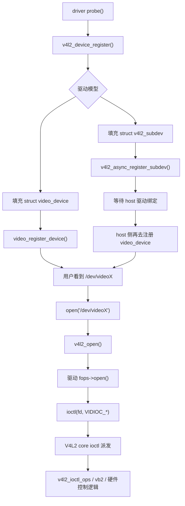

# V4L2 源码解析总览

## 学习目标

- 建立整套 V4L2 笔记的阅读地图
- 区分 `video_device`、`subdev`、`vb2`、Media Controller 各自所在层次
- 明确单节点主线与管线主线的进入顺序
- 提前收拢后续章节会反复出现的关键函数和关键对象

## 导读

### 本章定位

这一章是整套笔记的总入口，负责先搭出对象层、源码层和阅读顺序三张总图。

### 核心对象

- `video_device`
  - 对外设备节点对象
- `v4l2_subdev`
  - 管线内部功能模块对象
- `vb2_queue`
  - 缓冲队列与 streaming 框架对象
- `media_device / media_entity / media_pad / media_link`
  - Media Controller 图模型对象

### 关键函数

- `v4l2_device_register()`
- `__video_register_device()`
- `video_ioctl2()`
- `vb2_queue_init()`
- `v4l2_async_register_subdev()`
- `media_device_register()`

### 主流程

总览对象层 -> 总览源码目录 -> 总览注册期与使用期主链 -> 确定阅读顺序 -> 收束常见混淆点

## 1. 这套笔记的边界

这套笔记只分析 Linux 5.10 主线里的 **V4L2 框架本身**，不研究 HI3516CV610 的 MPP 私有媒体栈。

- 关注对象是 `drivers/media/v4l2-core/`、`drivers/media/common/videobuf2/` 以及典型主线驱动
- 不展开 HI MPP、VI/VPSS/VENC 私有接口
- 代码参考版本是 `linux-5.10.y`

换句话说，这套笔记回答的是：

1. 一个标准 V4L2 驱动在 Linux 里怎么挂到 `/dev/videoX`
2. `ioctl` 怎么从用户态一路派发到驱动回调
3. `vb2` 缓冲队列怎么组织
4. `subdev` 和异步绑定模型怎么工作

## 2. 先建立一个整体印象

V4L2 在 Linux 里通常有两类驱动对象：

- `video_device`
  直接向用户态暴露 `/dev/videoX`、`/dev/radioX`、`/dev/v4l-subdevX`
- `v4l2_subdev`
  表示 sensor、decoder、CSI bridge、ISP 子模块等内部组件

再往下看，又会分成两种典型驱动写法：

### 2.1 单节点型

驱动自己注册一个 `video_device`，自己接住 open/ioctl/streaming。

典型入口：

- `drivers/media/platform/sh_vou.c:1275` `v4l2_device_register()`
- `drivers/media/platform/sh_vou.c:1303` `vb2_queue_init()`
- `drivers/media/platform/sh_vou.c:1330` `video_register_device()`

### 2.2 管线型

sensor、bridge、CSI、capture 各自是 `subdev`，最后由某个 host/capture 驱动注册 `video_device` 对外提供 `/dev/videoX`。

典型 sensor 入口：

- `drivers/media/i2c/imx219.c:1394` `v4l2_i2c_subdev_init()`
- `drivers/media/i2c/imx219.c:1477` `v4l2_async_register_subdev_sensor_common()`

## 3. 这套笔记会围绕哪些源码文件

### 3.1 核心框架

- `include/media/v4l2-device.h`
- `include/media/v4l2-dev.h`
- `include/media/v4l2-ioctl.h`
- `include/media/v4l2-subdev.h`
- `include/media/v4l2-async.h`
- `include/media/videobuf2-core.h`
- `include/media/videobuf2-v4l2.h`

### 3.2 V4L2 core

- `drivers/media/v4l2-core/v4l2-device.c`
  `v4l2_device_register()`、`v4l2_device_register_subdev()`
- `drivers/media/v4l2-core/v4l2-dev.c`
  `__video_register_device()`、`v4l2_open()`、`v4l2_release()`
- `drivers/media/v4l2-core/v4l2-ioctl.c`
  `video_ioctl2()`、`video_usercopy()`、`__video_do_ioctl()`
- `drivers/media/v4l2-core/v4l2-subdev.c`
  `v4l2_subdev_init()`
- `drivers/media/v4l2-core/v4l2-async.c`
  `v4l2_async_register_subdev()`
- `drivers/media/v4l2-core/v4l2-fwnode.c`
  `v4l2_async_register_subdev_sensor_common()`

### 3.3 videobuf2

- `drivers/media/common/videobuf2/videobuf2-v4l2.c`
  `vb2_queue_init()`、`vb2_poll()`

### 3.4 示例驱动

- `drivers/media/platform/sh_vou.c`
  一个比较清楚的 `video_device + vb2` 输出驱动
- `drivers/media/i2c/imx219.c`
  一个比较典型的 sensor `subdev` 驱动

## 4. 主线调用链先看一遍



这条链可以分成两半来看：

- 前半段是驱动注册期
- 后半段是用户使用期

这张图只保留总览级别的关键节点。  
像 `video_usercopy()`、`__video_do_ioctl()` 这类实现细节，放在下面文字里展开更合适。

### 4.1 注册期

`A -> B`

驱动的 `probe()` 先跑起来，然后调用 `v4l2_device_register()`。  
这一步只是把一套 V4L2 容器搭起来，初始化名字、链表、锁、引用计数，还不会创建 `/dev/videoX`。

源码入口：

- `drivers/media/v4l2-core/v4l2-device.c:17`
  `v4l2_device_register()`

`B -> C`

接着驱动要决定自己属于哪种模型：

- `struct video_device`
  直接对外提供 `/dev/videoX`
- `struct v4l2_subdev`
  只作为媒体管线内部节点，例如 sensor、CSI bridge、ISP 子模块

`C -> D`

这里其实已经分成两条路径：

- 如果是 `video_device`
  就走 `video_register_device()`，最后真正注册出 `/dev/videoX`
- 如果是 `v4l2_subdev`
  就走 `v4l2_async_register_subdev()`，先进入异步匹配框架，等待 host 驱动绑定

对应源码：

- `drivers/media/v4l2-core/v4l2-dev.c:876`
  `__video_register_device()`
- `drivers/media/v4l2-core/v4l2-async.c:750`
  `v4l2_async_register_subdev()`

这里有个很重要的理解：

- `video_device` 这条路通常直接通向 `/dev/videoX`
- `subdev` 这条路通常不会直接给用户态一个 `/dev/videoX`

所以更准确的说法是：

- 原图里的 `D -> E` 只适用于 `video_device` 分支
- 原图里的 `E -> H -> I -> J -> K` 也同样只适用于已经成功打开的 `video_device` 节点
- `subdev` 分支通常要先被 host 绑定，再由 host 一侧注册出 `/dev/videoX`，之后用户态才会进入这条 open/ioctl 链

### 4.2 使用期

`D -> E -> F -> G`

用户打开 `/dev/videoX` 后，先进入 V4L2 core 的 `v4l2_open()`，它会先做公共检查：

- 设备是否还处于已注册状态
- 给 `video_device` 增加引用计数

然后才会进入驱动自己的 `fops->open()`。

对应源码：

- `drivers/media/v4l2-core/v4l2-dev.c:405`
  `v4l2_open()`

也就是说，驱动的 `open()` 并不是直接被 VFS 调用的，中间先经过了 V4L2 core。

驱动自己的 `open()` 常做的事情通常包括：

- 上电
- 初始化硬件
- 初始化 `v4l2_fh`
- 设置默认格式或状态

`J1 -> K1 -> L1`

用户发出 `VIDIOC_*` ioctl 时，如果驱动用了标准写法：

```c
.unlocked_ioctl = video_ioctl2
```

图里这里被压缩成了一个 “V4L2 core ioctl 派发” 节点。  
如果把实现细节展开，调用链通常就是：

1. `video_ioctl2()`
2. `video_usercopy()`
3. `__video_do_ioctl()`
4. 分发到对应的 `v4l2_ioctl_ops`

对应源码：

- `drivers/media/v4l2-core/v4l2-ioctl.c:3358`
  `video_ioctl2()`
- `drivers/media/v4l2-core/v4l2-ioctl.c:2941`
  `__video_do_ioctl()`

V4L2 core 在这层会统一帮驱动处理很多共性逻辑：

- 用户态参数拷贝
- 锁串行化
- `valid_ioctls` 检查
- 优先级检查
- compat 处理

所以驱动一般不需要自己写一个很大的 `switch(cmd)`。

`K -> L`

真正进入 `v4l2_ioctl_ops` 回调以后，才算落到驱动的具体业务逻辑。  
这里大体又会分成两类：

- 直接操作硬件
  例如 `QUERYCAP`、`S_FMT`
- 缓冲相关 ioctl 交给 `vb2`
  例如 `REQBUFS`、`QBUF`、`DQBUF`、`STREAMON`

所以最后一跳的“`vb2 或硬件控制逻辑`”本质上分成两类：

- 控制类 ioctl 落到驱动自己的硬件配置逻辑
- 缓冲类 ioctl 先落到 `vb2_ioctl_*`，再由 `vb2` 反向调用驱动自己的 `vb2_ops`

host 驱动内部把 sensor、CSI、ISP、video node 串起来的过程，放在具体例子章展开：

- `11-典型host驱动链路-camss.md`

### 4.3 一句话收束

这条链更准确地拆开以后，本质就是：

- `probe()` 阶段先把 V4L2 对象或 subdev 对象注册进内核
- `video_device` 分支会直接得到 `/dev/videoX`
- `subdev` 分支通常先等待 host 绑定，再由 host 一侧暴露 `/dev/videoX`
- 用户态对 `/dev/videoX` 的 open/ioctl 再由 V4L2 core 统一接住
- 最后才落到驱动自己的回调和硬件逻辑上

## 5. 阅读顺序建议

整套笔记按下面顺序展开：

### 5.1 第一段：先把单节点主线走通

这一段的目标是先把：

- `video_device`
- `open/ioctl`
- `vb2`
- 单节点 streaming 闭环

完整串起来。

建议顺序：

1. `01-V4L2核心对象与驱动模型.md`
2. `02-video_device注册与open链路.md`
3. `03-ioctl派发与v4l2_ioctl_ops.md`
4. `04-vb2缓冲队列机制.md`
5. `05-典型video节点驱动例子-sh_vou.md`

这一段读完后，单节点 `video_device` 驱动的主线应当已经完整闭合。

### 5.2 第二段：再进入媒体图和管线基础

这一段的目标是建立：

- `media_device`
- `media_entity`
- `media_pad`
- `media_link`
- `pipeline`
- `subdev`
- host 管线

这些对象和主线。

建议顺序：

6. `06-Media-Controller框架总览.md`
7. `07-entity-pad-link-pipeline主线.md`
8. `08-subdev与异步注册.md`
9. `09-典型subdev驱动例子-imx219.md`
10. `10-media-ctl背后的内核UAPI.md`
11. `11-典型host驱动链路-camss.md`

这一段的重点不是单个 `ioctl`，而是：

- 媒体图怎么建
- `subdev` 怎么挂进 host
- `/dev/mediaX` 怎么看整张图
- host 怎么把整条 pipeline 拉起来

### 5.3 第三段：统一调试和阅读方法

12. `12-V4L2调试与阅读建议.md`

这一章放在所有主线之后回看。  
因为它同时会用到：

- 单节点 `video_device`
- `vb2`
- `subdev`
- Media Controller
- host pipeline

把前面主线都读完以后，再看这篇，调试层次会更清楚。

### 5.4 第四段：实际工程问题问答

13. `13-V4L2实际工程问题问答.md`

这一章从真实工程现象反推驱动内部路径，重点回答：

- `/dev/videoX` 没有出现时先查哪条注册链
- `QUERYCAP / S_FMT / REQBUFS / QBUF / STREAMON / DQBUF` 分别落在哪一层
- sensor 已 probe 但 host 没绑定时怎么查 async
- `DQBUF` 卡住时为什么要优先看中断完成路径
- `STREAMOFF` 后再次启动失败时要看哪些状态清理

## 6. 最容易混淆的点

### 6.1 V4L2 不等于 camera sensor

V4L2 是媒体子系统的一个通用框架，既可以描述 camera capture，也可以描述 output、radio、codec、M2M 设备。

### 6.2 `subdev` 不一定直接给用户态看到

很多 `subdev` 只参与内部媒体拓扑，不直接生成 `/dev/videoX`。真正给应用访问的，往往是 capture/output/m2m 那一侧的 `video_device`。

### 6.3 `video_ioctl2()` 不是驱动私有函数

很多驱动把 `.unlocked_ioctl = video_ioctl2`，真正的业务分发靠 `struct v4l2_ioctl_ops`。

### 6.4 `vb2` 只是缓冲框架

`vb2` 负责处理 buffer 生命周期、队列、mmap/poll 等共性逻辑，但硬件何时 DMA、何时 `buf_done`，仍由驱动自己负责。

## 7. 这一套笔记的目标

这一套笔记希望回答下面这些问题：

1. `video_register_device()` 到底把什么东西注册成了 `/dev/videoX`
2. `VIDIOC_REQBUFS` / `VIDIOC_QBUF` / `VIDIOC_STREAMON` 到底怎么进驱动
3. `vb2_queue` 里哪些字段必须填，哪些字段只是增强项
4. sensor 驱动为什么经常只写 `subdev`，却不自己注册 `/dev/videoX`
5. `/dev/mediaX` 是谁注册出来的
6. `media-ctl -p` 看到的 entity/pad/link 在内核里分别对应什么
7. `MEDIA_IOC_SETUP_LINK` 为什么有时会返回 `-EBUSY`
8. 真实工程故障现象怎样反推到 V4L2 驱动层对象和函数

## 8. 回答的问题

- V4L2 框架整体分成哪几层
- 单节点模型和管线模型的主差异是什么
- `open/ioctl/vb2/subdev/media graph` 这些关键词在整套笔记里分别落到哪一章
- 后续逐章阅读时，主线推进顺序应该怎样安排
- 实际工程问题应该怎样放回正确对象层和函数层
