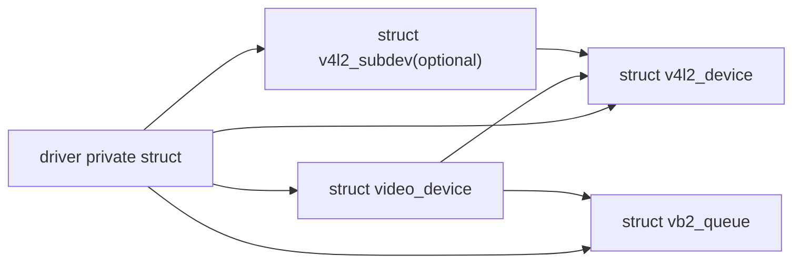

# V4L2 核心对象与驱动模型

## 导读

### 本章定位

这一章建立整套笔记的对象坐标系，重点说明 `v4l2_device`、`video_device`、`v4l2_subdev`、`vb2_queue` 四类对象分别解决什么问题，以及它们在单节点模型和管线模型中的位置。

### 核心对象

- `struct v4l2_device`
  - V4L2 侧总管对象
- `struct video_device`
  - 对外设备节点对象
- `struct v4l2_subdev`
  - 管线内部功能模块对象
- `struct vb2_queue`
  - buffer 队列与 streaming 框架对象

### 关键函数

- `v4l2_device_register()`
- `video_register_device()`
- `v4l2_subdev_init()`
- `v4l2_async_register_subdev()`
- `vb2_queue_init()`

### 主流程

对象识别 -> 对象字段 -> 对象关系图 -> 单节点/管线型建模差异 -> 阅读源码时的抓手

## 1. 先看四个最核心的数据结构

在 Linux 5.10 的 V4L2 里，最值得先看的是这四个对象：

1. `struct v4l2_device`
2. `struct video_device`
3. `struct v4l2_subdev`
4. `struct vb2_queue`

它们分别解决的问题不同：

- `v4l2_device`
  表示一整套 V4L2 设备实例，是上层容器
- `video_device`
  表示一个具体的设备节点，比如 `/dev/video0`
- `v4l2_subdev`
  表示媒体管线里的内部模块
- `vb2_queue`
  表示 buffer 队列与 streaming 框架

如果按后面章节来展开，这四个对象大致会落到：

- `v4l2_device` -> [[02-video_device注册与open链路#3. `v4l2_device_register()` 做了什么]]
- `video_device` -> [[02-video_device注册与open链路]]
- `v4l2_subdev` -> [[08-subdev与异步注册]]
- `vb2_queue` -> [[04-vb2缓冲队列机制]]

再往例子上落，可按下面这个节奏展开：

- 单节点闭环先看 [[05-典型video节点驱动例子-sh_vou]]
- 然后进入 [[06-Media-Controller框架总览]] 和 [[07-entity-pad-link-pipeline主线]]
- 再回来看 `subdev` 主线 [[08-subdev与异步注册]] 和 sensor 例子 [[09-典型subdev驱动例子-imx219]]
- 最后再看 host 管线主线 [[11-典型host驱动链路-camss]]

## 2. `struct v4l2_device`
#v4l2_device
定义位置：

- `include/media/v4l2-device.h:47`

>[!INFO]
```c
struct v4l2_device {
	struct device *dev;
	struct media_device *mdev;
	struct list_head subdevs;
	spinlock_t lock;
	char name[V4L2_DEVICE_NAME_SIZE];
	void (*notify)(struct v4l2_subdev *sd,
			unsigned int notification, void *arg);
	struct v4l2_ctrl_handler *ctrl_handler;
	struct v4l2_prio_state prio;
	struct kref ref;
	void (*release)(struct v4l2_device *v4l2_dev);
};
```

关键字段：

- `dev`
  绑定的 `struct device`
- `mdev`
  可选的 `media_device`
- #链表`list_head subdevs`
  当前挂到这个 V4L2 设备下的 subdev 链表，用于将底层的 Sensor、MIPI PHY、Image Signal Processor (ISP) 等独立的 `v4l2_subdev` 实例聚合在一起，形成一条完整的数据链路。
- `lock`
  保护 `v4l2_device` 本身
- `name`
  设备名
- `ctrl_handler`
  设备级 control handler，当应用层通过 ioctl 下发调节亮度、对比度或白平衡的指令时，该对象充当分发中心，将控制请求路由到对应的子设备上。
- `prio`
  V4L2 优先级状态
- ref
  引用计数

>[!tip]
>这些会在 `v4l2_device_register()` 里初始化，详细展开可以接着看
>`[[../../linux-5.10.y/drivers/media/v4l2-core/v4l2-device.c::v4l2_device_register()]]`
>[[02-video_device注册与open链路#3. `v4l2_device_register()` 做了什么]]


它的角色很像“总控对象”。

顺着 `v4l2_device` 往下，一般会分成两条线：

- 对外接 [[02-video_device注册与open链路]]
- 对内管 [[08-subdev与异步注册]]

如果再把 `mdev` 挂起来，就会进一步进入 [[06-Media-Controller框架总览]]。

很多驱动会把它嵌进自己的大设备结构体里，例如：

>[!INFO]
```c
struct my_dev {
    struct v4l2_device v4l2_dev;
    struct video_device vdev;
    struct vb2_queue queue;
};
```

## 3. `struct video_device`
#video_device
定义位置：

- `include/media/v4l2-dev.h:263`

  
>[!INFO]
```c fold："struct video_device"
struct video_device
{
#if defined(CONFIG_MEDIA_CONTROLLER)
	struct media_entity entity;
	struct media_intf_devnode *intf_devnode;
	struct media_pipeline pipe;
#endif
	const struct v4l2_file_operations *fops;

	u32 device_caps;

	/* sysfs */
	struct device dev;
	struct cdev *cdev;

	struct v4l2_device *v4l2_dev;
	struct device *dev_parent;

	struct v4l2_ctrl_handler *ctrl_handler;

	struct vb2_queue *queue;

	struct v4l2_prio_state *prio;

	/* device info */
	char name[32];
	enum vfl_devnode_type vfl_type;
	enum vfl_devnode_direction vfl_dir;
	int minor;
	u16 num;
	unsigned long flags;
	int index;

	/* V4L2 file handles */
	spinlock_t		fh_lock;
	struct list_head	fh_list;

	int dev_debug;

	v4l2_std_id tvnorms;

	/* callbacks */
	void (*release)(struct video_device *vdev);
	const struct v4l2_ioctl_ops *ioctl_ops;
	DECLARE_BITMAP(valid_ioctls, BASE_VIDIOC_PRIVATE);

	struct mutex *lock;
};
```

关键字段：

- `struct v4l2_file_operations *fops`
  V4L2 层文件操作集
- `struct v4l2_ioctl_ops *ioctl_ops`
  `VIDIOC_*` 的回调表
- `struct v4l2_device *v4l2_dev`
  所属的 `struct v4l2_device`
- `struct cdev *cdev`
  字符设备入口；用户 `open("/dev/videoX")` 后，VFS 最终先命中的就是这一层
- `struct device dev`
  设备模型里的 `device`；`device_register(&vdev->dev)` 之后，才会进入设备模型这一层
- `struct vb2_queue *queue`
  关联的 `vb2_queue`
- `device_caps`
  设备能力，例如 capture/output/streaming
- `mutex *lock`
  ioctl/open 等路径常用的串行化锁
- `release
  注销后的释放回调
- `CONFIG_MEDIA_CONTROLLER
  内核配置项
  会为video_device提供三个新的字段
	- media_entity entity
	- media_intf_devnode *intf_devnode
	- media_pipeline pipe

**理解重点**:

### 3.1 `video_device` 是 `/dev/videoX` 的对外封装对象

从 V4L2 抽象层看，`/dev/videoX` 对应的是 `struct video_device`。  
但落到内核实现时，要再拆成两层：

- 字符设备 `open` 入口主要靠内部的 `vdev->cdev`
- 设备模型 / sysfs / devtmpfs 这一层主要靠内部的 `vdev->dev`

所以更准确的说法不是“`video_device` 本体直接被 VFS 打开”，而是：

- `video_device` 是对外封装对象
- `cdev` 负责字符设备分发
- `dev` 负责设备模型注册

源码链接：

- `[[../../linux-5.10.y/drivers/media/v4l2-core/v4l2-dev.c::video_register_device()]]`
- `[[../../linux-5.10.y/drivers/media/v4l2-core/v4l2-dev.c::__video_register_device()]]`

对应展开见 [[02-video_device注册与open链路#4. `video_register_device()` 真正做了什么]]。

### 3.2 `fops` 和 `ioctl_ops` 不是一回事

- `fops`
  面向 `open/release/mmap/poll/read/write/ioctl`
- `ioctl_ops`
  面向每个具体的 `VIDIOC_*`

通常驱动写法是：

```c
.unlocked_ioctl = video_ioctl2
```

然后把真实的业务分发放进 `ioctl_ops`。

源码链接：

- `[[../../linux-5.10.y/drivers/media/v4l2-core/v4l2-ioctl.c::video_ioctl2()]]`

>[!TIP]
>可与 [[02-video_device注册与open链路#6. `open()` 链路怎么走]]、[[03-ioctl派发与v4l2_ioctl_ops#1. 先抓住主链路]] 对照；
>补充笔记可回看 [[v4l2驱动总结#//ioctl操作]]。
## 4. `struct v4l2_subdev`
#subdev
定义位置：

- `include/media/v4l2-subdev.h:870`
- `[[../../linux-5.10.y/include/media/v4l2-subdev.h]]`

```c fold："struct v4l2_subdev"
struct v4l2_subdev {
#if defined(CONFIG_MEDIA_CONTROLLER)
	struct media_entity entity;
#endif
	struct list_head list;
	struct module *owner;
	bool owner_v4l2_dev;
	u32 flags;
	struct v4l2_device *v4l2_dev;
	const struct v4l2_subdev_ops *ops;
	const struct v4l2_subdev_internal_ops *internal_ops;
	struct v4l2_ctrl_handler *ctrl_handler;
	char name[V4L2_SUBDEV_NAME_SIZE];
	u32 grp_id;
	void *dev_priv;
	void *host_priv;
	struct video_device *devnode;
	struct device *dev;
	struct fwnode_handle *fwnode;
	struct list_head async_list;
	struct v4l2_async_subdev *asd;
	struct v4l2_async_notifier *notifier;
	struct v4l2_async_notifier *subdev_notifier;
	struct v4l2_subdev_platform_data *pdata;
};
```

关键字段：

- `ops`
  `struct v4l2_subdev_ops`
- `internal_ops`
  内部 open/close/registered 回调
- `flags`
  例如 `V4L2_SUBDEV_FL_HAS_DEVNODE`
- `CONFIG_MEDIA_CONTROLLER
	- `entity`
	  media entity，这个在07章节将链路连接时调用
- `dev`
  绑定的底层设备
- `v4l2_dev`
  绑定后的上层 `v4l2_device`
- async_list #链表
  链表
- `notifier` / `subdev_notifier`
  异步绑定相关

**理解重点**：

### 4.1 `subdev` 是“媒体管线内部节点”

sensor、decoder、CSI-2 bridge、ISP 子模块，很多时候都做成 `subdev`。

典型 sensor `subdev` 例子见 [[09-典型subdev驱动例子-imx219]]。

### 4.2 `subdev` 不一定直接给应用访问

很多 `subdev` 只出现在媒体拓扑里，不一定对应 `/dev/videoX`。  
即使设置了 `V4L2_SUBDEV_FL_HAS_DEVNODE`，也还要有人去调用 `v4l2_device_register_subdev_nodes()` 才会创建 `/dev/v4l-subdevX`。

源码链接：

- `[[../../linux-5.10.y/drivers/media/v4l2-core/v4l2-device.c::v4l2_device_register_subdev_nodes()]]`

这一块单独展开的主章节是 [[08-subdev与异步注册#1. 为什么 V4L2 要有 `subdev`]]。

## 5. `video_device`、`subdev`、单节点/管线型、`CONFIG_MEDIA_CONTROLLER` 的关系

这一块最容易混淆，因为这里其实同时叠了三层概念：

1. `video_device` 和 `v4l2_subdev` 的对象角色
2. `单节点型` 和 `管线型` 的整体架构
3. `CONFIG_MEDIA_CONTROLLER` 开没开的编译配置

这三件事是相关的，但不是一回事。

### 5.1 `video_device` 和 `v4l2_subdev` 是对象角色区别

- `video_device`
  是用户态访问入口，通常对应 `/dev/videoX`
- `v4l2_subdev`
  是媒体内部模块抽象，通常表示 sensor、CSI、ISP、bridge 这类内部组件

所以：

- `video_device` 解决的是“用户从哪里进来”
- `v4l2_subdev` 解决的是“内部模块怎么协作”

### 5.2 单节点型和管线型是整体架构区别

`单节点型` 的典型特征是：

- 通常主要只有一个 `video_device`
- 用户主要面对一个 `/dev/videoX`
- 驱动自己直接处理 open/ioctl/vb2/中断/DMA

`管线型` 的典型特征是：

- 通常会有多个 `v4l2_subdev`
- 再加一个或多个最终对外的 `video_device`
- host 驱动负责把 sensor、CSI、ISP、DMA 等模块串起来

准确的说法是：

- 单节点型常常主要只有 `video_device`
- 管线型常常会同时出现 `v4l2_subdev` 和 `video_device`

对照例子时，单节点型可先看 [[05-典型video节点驱动例子-sh_vou]]，管线型可看 [[11-典型host驱动链路-camss]]。

### 5.3 `CONFIG_MEDIA_CONTROLLER` 决定的是“是否使用标准 MC 管线模型”

源码中可见：

- `struct video_device` 在 `CONFIG_MEDIA_CONTROLLER` 下会多出 `entity / intf_devnode / pipe`
- `struct v4l2_subdev` 在 `CONFIG_MEDIA_CONTROLLER` 下会多出 `entity`

这说明的是：

- 这两个对象是否正式接入标准 `Media Controller` 图模型

也就是是否具备下面这些标准能力：

- `media_entity`
- `pad`
- `link`
- `pipeline`
- `/dev/mediaX`
- `media-ctl`

标准 MC 管线的阅读顺序可接 [[06-Media-Controller框架总览]] 和 [[07-entity-pad-link-pipeline主线]]，再回到 [[08-subdev与异步注册]]。

### 5.4 不开 `CONFIG_MEDIA_CONTROLLER`，`subdev` 还在不在

在。  
不开 `CONFIG_MEDIA_CONTROLLER`，`v4l2_subdev` 这个对象本身不会消失，host 也仍然可以：

- 注册 subdev
- 绑定 subdev
- 通过 `v4l2_subdev_call()` 去调它

但这时有个关键差别：

- `subdev` 不再带标准 `media_entity`
- 也就没法走标准的 `media_entity_pads_init()`、`media_create_pad_link()`、`media_pipeline_start()` 这一整套 MC 机制

所以更准确的说法是：

- 不开 `CONFIG_MEDIA_CONTROLLER`，不等于内部模块关系不存在
- 但它已经不能用标准 `Media Controller` 管线模型来表达

### 5.5 想要“标准主线意义上的管线型”，基本就要开 `CONFIG_MEDIA_CONTROLLER`

标准主线意义上的“管线型”媒体管线，通常依赖：

- `entity`
- `pad`
- `link`
- `pipeline`
- `/dev/mediaX`

那基本就要开启 `CONFIG_MEDIA_CONTROLLER`。

因为没有它：

- `video_device` 没有 `entity/intf_devnode/pipe`
- `v4l2_subdev` 没有 `entity`
- 就不可能完整实现标准 MC 管线

所以这句话可以成立：

- 想要“标准 Media Controller 管线”，基本就要开启 `CONFIG_MEDIA_CONTROLLER`

但还要补一句：

- `硬件上`，设备仍然可能是多级链路
- `软件表达上`，不开 MC 时，它不能用标准主线的 `media graph` 方式完整呈现

### 5.6 最后把三件事压成一句话

- `video_device` 和 `v4l2_subdev`
  是对象角色区别
- `单节点型` 和 `管线型`
  是整体架构区别
- `CONFIG_MEDIA_CONTROLLER`
  决定的是这条链路是否通过标准的 `Media Controller` 模型来表达

## 6. `struct vb2_queue`
#vb2_queue
定义位置：

- `include/media/videobuf2-core.h:567`
- `[[../../linux-5.10.y/include/media/videobuf2-core.h]]`
>[!INFO]
```c fold："struct vb2_queue"
struct vb2_queue {
	unsigned int			type;
	unsigned int			io_modes;
	struct device			*dev;
	unsigned long			dma_attrs;
	unsigned int			bidirectional:1;
	unsigned int			fileio_read_once:1;
	unsigned int			fileio_write_immediately:1;
	unsigned int			allow_zero_bytesused:1;
	unsigned int		   quirk_poll_must_check_waiting_for_buffers:1;
	unsigned int			supports_requests:1;
	unsigned int			requires_requests:1;
	unsigned int			uses_qbuf:1;
	unsigned int			uses_requests:1;
	unsigned int			allow_cache_hints:1;

	struct mutex			*lock;
	void				*owner;

	const struct vb2_ops		*ops;
	const struct vb2_mem_ops	*mem_ops;
	const struct vb2_buf_ops	*buf_ops;

	void				*drv_priv;
	u32				subsystem_flags;
	unsigned int			buf_struct_size;
	u32				timestamp_flags;
	gfp_t				gfp_flags;
	u32				min_buffers_needed;

	struct device			*alloc_devs[VB2_MAX_PLANES];

	/* private: internal use only */
	struct mutex			mmap_lock;
	unsigned int			memory;
	enum dma_data_direction		dma_dir;
	struct vb2_buffer		*bufs[VB2_MAX_FRAME];
	unsigned int			num_buffers;

	struct list_head		queued_list;
	unsigned int			queued_count;

	atomic_t			owned_by_drv_count;
	struct list_head		done_list;
	spinlock_t			done_lock;
	wait_queue_head_t		done_wq;

	unsigned int			streaming:1;
	unsigned int			start_streaming_called:1;
	unsigned int			error:1;
	unsigned int			waiting_for_buffers:1;
	unsigned int			waiting_in_dqbuf:1;
	unsigned int			is_multiplanar:1;
	unsigned int			is_output:1;
	unsigned int			copy_timestamp:1;
	unsigned int			last_buffer_dequeued:1;

	struct vb2_fileio_data		*fileio;
	struct vb2_threadio_data	*threadio;

	char				name[32];

#ifdef CONFIG_VIDEO_ADV_DEBUG
	/*
	 * Counters for how often these queue-related ops are
	 * called. Used to check for unbalanced ops.
	 */
	u32				cnt_queue_setup;
	u32				cnt_wait_prepare;
	u32				cnt_wait_finish;
	u32				cnt_start_streaming;
	u32				cnt_stop_streaming;
#endif
};
```

关键字段：

- `type`
  buffer 类型，例如 `V4L2_BUF_TYPE_VIDEO_CAPTURE`
- `io_modes`
  支持 `MMAP`、`USERPTR`、`DMABUF`、`READ/WRITE`
- `ops`
  驱动自己的 queue 回调
- `mem_ops`
  buffer allocator 的操作集
  这一层可以结合 [[04-vb2缓冲队列机制#7. 用户态看见的 `vb2` 流程]] 一起看；补充笔记见 [[V4L2驱动学习#二、 QBUF 阶段的三层 `ops` 协同接力]]
- `drv_priv`
  指向驱动私有数据
- `buf_struct_size`
  驱动 buffer 结构大小
- `timestamp_flags`
  时间戳策略
- `min_buffers_needed`
  启动 streaming 前需要的最少 buffer 数
- `lock`
  供 V4L2 core 序列化队列 ioctl 使用

这一章只先把 `vb2_queue` 当成对象认清；真正的状态机和 `vb2_queue_init()` 细节放在 [[04-vb2缓冲队列机制]]，具体驱动落地可接 [[05-典型video节点驱动例子-sh_vou]]。

源码链接：

- `[[../../linux-5.10.y/drivers/media/common/videobuf2/videobuf2-core.c::vb2_queue_init()]]`

## 7. `v4l2_file_operations` 和 `v4l2_ioctl_ops`

定义位置：

- `include/media/v4l2-dev.h:200`
- `include/media/v4l2-ioctl.h:296`
- `[[../../linux-5.10.y/include/media/v4l2-dev.h]]`
- `[[../../linux-5.10.y/include/media/v4l2-ioctl.h]]`

两者分工要分清：

这一层最好和 [[02-video_device注册与open链路#6. `open()` 链路怎么走]]、[[03-ioctl派发与v4l2_ioctl_ops#1. 先抓住主链路]] 对照；补充笔记见 [[v4l2驱动总结#//ioctl操作]]。

### 7.1 `struct v4l2_file_operations`

负责：

- `open`
- `release`
- `read`
- `write`
- `poll`
- `mmap`
- `unlocked_ioctl`

`open/release` 对应展开见 [[02-video_device注册与open链路#6. `open()` 链路怎么走]]。

### 7.2 `struct v4l2_ioctl_ops`

负责：

- `vidioc_querycap`
- `vidioc_enum_fmt_vid_cap`
- `vidioc_g_fmt_vid_cap`
- `vidioc_s_fmt_vid_cap`
- `vidioc_reqbufs`
- `vidioc_qbuf`
- `vidioc_dqbuf`
- `vidioc_streamon`
- `vidioc_streamoff`

`VIDIOC_*` 分发对应展开见 [[03-ioctl派发与v4l2_ioctl_ops]]。

所以常见模式是：

- `fops` 只负责接入 VFS
- `ioctl_ops` 负责 V4L2 业务语义

## 8. 对象关系图



如果是单节点驱动，常见关系是：

- 一个 `v4l2_device`
- 一个 `video_device`
- 一个 `vb2_queue`

对照例子可直接看 [[05-典型video节点驱动例子-sh_vou#3. probe 主线非常标准]]。

如果是 sensor/bridge 驱动，常见关系是：

- 一个 `v4l2_subdev`
- 先通过异步注册进入 async 匹配框架
- 匹配成功后，再由 host 侧通过 `v4l2_device_register_subdev()` 挂到该 host 的 `v4l2_device`
- 这个“挂到 host 的 `v4l2_device`”在实现上通常就表现为加入 `v4l2_device->subdevs` 链表

这条线的展开可以直接看 [[08-subdev与异步注册#12. 主机侧一般怎么和 subdev 交互]]；sensor 例子看 [[09-典型subdev驱动例子-imx219#4. probe 主线怎么走]]，host 视角的完整例子放在 [[11-典型host驱动链路-camss#3.1 从 host 视角把完整时间线拉直]]。

## 9. 最关键的建模差异

### 9.1 `video_device` 面向用户态

应用程序最终打开的是这个节点。

注册、`open()`、`release()` 这条入口链可以直接跳 [[02-video_device注册与open链路]]。

### 9.2 `v4l2_subdev` 面向媒体内部协作

它更像“管线里的零件”，不是最终对外的设备节点。

对应的初始化、异步注册和 host 绑定过程放在 [[08-subdev与异步注册]]。

### 9.3 `vb2_queue` 只是缓冲运输层

它不决定格式、不决定 sensor 拓扑、不决定媒体路由，只负责 buffer 生命周期。

buffer 状态机和 streaming 细节放在 [[04-vb2缓冲队列机制]]。

## 10. 阅读源码时的抓手

阅读 V4L2 驱动时，可先问这三个问题：

1. 它有没有 `struct video_device`
   存在时，通常会直接给应用提供设备节点；下一跳通常是 [[02-video_device注册与open链路]] 和 [[05-典型video节点驱动例子-sh_vou]]
2. 它有没有 `struct v4l2_subdev`
   存在时，通常说明它是管线中的一个模块；下一跳通常是 [[08-subdev与异步注册]] 和 [[09-典型subdev驱动例子-imx219]]
3. 它有没有 `struct vb2_queue`
   存在时，通常说明它支持流式 buffer 队列；下一跳通常是 [[04-vb2缓冲队列机制]] 和 [[05-典型video节点驱动例子-sh_vou]]

单节点语境下，通常会主要在 [[02-video_device注册与open链路]]、[[03-ioctl派发与v4l2_ioctl_ops]]、[[04-vb2缓冲队列机制]]、[[05-典型video节点驱动例子-sh_vou]] 之间来回切。  
管线型语境下，则会再加上 [[06-Media-Controller框架总览]]、[[07-entity-pad-link-pipeline主线]]、[[08-subdev与异步注册]]。
