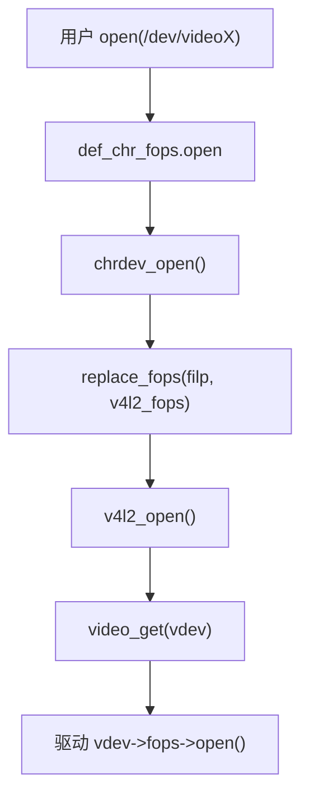

# `video_device` 注册与 open 链路

## 导读

### 本章定位

这一章聚焦单节点 `video_device` 驱动最基础的注册与打开路径，核心问题是 `/dev/videoX` 怎么出来、`open/release` 怎么经过 V4L2 core 再落到驱动。

### 核心对象

- `struct v4l2_device`
  - `video_device` 上层的 V4L2 管理对象
- `struct video_device`
  - `/dev/videoX` 的 V4L2 封装对象
- `struct cdev`
  - 字符设备入口对象
- `struct v4l2_file_operations`
  - 驱动对 `open/release/ioctl/poll/mmap` 的第二层文件操作表

### 关键函数

- `v4l2_device_register()`
- `__video_register_device()`
- `v4l2_open()`
- `v4l2_release()`
- `video_unregister_device()`

### 主流程

probe 阶段建 `v4l2_device` 和 `video_device` -> 注册 `/dev/videoX` -> `chrdev_open()` 切到 `v4l2_fops` -> `v4l2_open()` 转发到驱动 `open`

## 1. 入口先看哪里

这条链路的核心源码是：

- `drivers/media/v4l2-core/v4l2-device.c:17`
  `v4l2_device_register()`
- `drivers/media/v4l2-core/v4l2-dev.c:876`
  `__video_register_device()`
- `drivers/media/v4l2-core/v4l2-dev.c:405`
  `v4l2_open()`
- `drivers/media/v4l2-core/v4l2-dev.c:438`
  `v4l2_release()`
	[[v4l2驱动总结#驱动初始化与退出函数]]

把本章放回整套笔记里看，它其实正好位于：

- 前接 [[01-V4L2核心对象与驱动模型]]
- 后接 [[03-ioctl派发与v4l2_ioctl_ops]] 和 [[04-vb2缓冲队列机制]]
- 例子落地在 [[05-典型video节点驱动例子-sh_vou]]

## 2. 驱动侧通常怎么走

一个标准 `video_device` 驱动的 probe 流程通常长这样：
#probe流程
1. 分配驱动私有结构体
2. 调 `v4l2_device_register()`
3. 填 `struct video_device`
4. 填 `struct vb2_queue`
5. 调 `vb2_queue_init()`
6. 调 `video_register_device()`

样例参考[[v4l2驱动总结#驱动初始化与退出函数]]
也就是说，这 6 步其实分别在落地 [[01-V4L2核心对象与驱动模型#2. `struct v4l2_device`]]、[[01-V4L2核心对象与驱动模型#3. `struct video_device`]]、[[01-V4L2核心对象与驱动模型#6. `struct vb2_queue`]] 这三个核心对象。

>[!note]
>这一章主要讲的是“单个 `video_device` 怎么立起来并接住 `open/release`”。  
>host + sensor 这种更长的管线，外部 `subdev` 绑定主线见 [[08-subdev与异步注册]] 和 [[11-典型host驱动链路-camss]]。  
>也就是说，02-04 以单节点为主线，08 和 11 转入管线型模型。

在 `sh_vou.c` 里，这条链非常典型：

- `drivers/media/platform/sh_vou.c:1275`
  `v4l2_device_register(&pdev->dev, &vou_dev->v4l2_dev)`
- `drivers/media/platform/sh_vou.c:1303`
  `vb2_queue_init(q)`
- `drivers/media/platform/sh_vou.c:1330`
  `video_register_device(vdev, VFL_TYPE_VIDEO, -1)`

>[!INFO]
``` fold："dev关系图"
Linux 设备模型层
────────────────────────────────
host 设备
struct platform_device / pci_dev / ...
        |
        +-- dev  ---> struct device           <- 这就是 v4l2_device_register(dev, ...)
        
sensor 设备
struct i2c_client / spi_device / ...
        |
        +-- dev  ---> struct device           <- 这是 sensor 自己的底层设备
        
V4L2 框架层
────────────────────────────────
host private struct
    |
    +-- struct v4l2_device v4l2_dev          <- V4L2 顶层管理对象
    |
    +-- struct video_device vdev             <- V4L2 对外封装对象（内部含 `cdev` / `dev`）
    |
    +-- struct v4l2_async_notifier notifier  <- 等待匹配外部 subdev
    |
    +-- subdevs 链表
            |
            +-- sensor 的 struct v4l2_subdev sd
            +-- bridge 的 struct v4l2_subdev sd
            +-- csi/isp 等内部 subdev
            
subdev 自身
────────────────────────────────
sensor private struct
    |
    +-- struct v4l2_subdev sd
            |
            +-- sd->dev        -> sensor 自己的 struct device
            +-- sd->v4l2_dev   -> host 的 struct v4l2_device
            +-- sd->list       -> 挂到 host->v4l2_dev->subdevs

```

## 3. `v4l2_device_register()` 做了什么

源码：

- `drivers/media/v4l2-core/v4l2-device.c:17`
  `v4l2_device_register()`

>[!INFO]
```c fold："v4l2_device_register"
int v4l2_device_register(struct device *dev, struct v4l2_device *v4l2_dev)
{
	if (v4l2_dev == NULL)
		return -EINVAL;

	INIT_LIST_HEAD(&v4l2_dev->subdevs);
	spin_lock_init(&v4l2_dev->lock);
	v4l2_prio_init(&v4l2_dev->prio);
	kref_init(&v4l2_dev->ref);
	get_device(dev);
	v4l2_dev->dev = dev;
	if (dev == NULL) {
		/* If dev == NULL, then name must be filled in by the caller */
		if (WARN_ON(!v4l2_dev->name[0]))
			return -EINVAL;
		return 0;
	}

	/* Set name to driver name + device name if it is empty. */
	if (!v4l2_dev->name[0])
		snprintf(v4l2_dev->name, sizeof(v4l2_dev->name), "%s %s",
			dev->driver->name, dev_name(dev));
	if (!dev_get_drvdata(dev))
		dev_set_drvdata(dev, v4l2_dev);
	return 0;
}
```

它做的事情其实很基础，但很关键：

- 初始化 `subdevs` 链表
- 初始化自旋锁、优先级状态、引用计数
- 绑定 `v4l2_dev->dev`
- 如果 `name` 为空，就用 `driver name + device name` 生成名字
- 在必要时把 `dev->driver_data` 指向 `v4l2_device`

它**不会**直接创建 `/dev/videoX`。  
它只是把“这一整套 V4L2 设备的上层容器”先立起来。

>[!TIP]
>这里的 `dev` 是 host 自己的底层设备，不是某个 `subdev`；对象关系图可以回看 [[01-V4L2核心对象与驱动模型#8. 对象关系图]]。
>host 后续还要接 sensor 时，`v4l2_device` 这层总管立起来之后，就会进入 [[08-subdev与异步注册]] 和 [[11-典型host驱动链路-camss]] 那条线。

## 4. `video_register_device()` 真正做了什么

对外常用 API 是：

- `include/media/v4l2-dev.h:380`
  `video_register_device()`

真正的重活在：

- `drivers/media/v4l2-core/v4l2-dev.c:876`
  `__video_register_device()`

它大致分 6 步：
>[!INFO]
```c {138,143} fold："int __video_register_device(struct video_device *vdev,enum vfl_devnode_type type,int nr, int warn_if_nr_in_use,struct module *owner)"
int __video_register_device(struct video_device *vdev,
			    enum vfl_devnode_type type,
			    int nr, int warn_if_nr_in_use,
			    struct module *owner)
{
	int i = 0;
	int ret;
	int minor_offset = 0;
	int minor_cnt = VIDEO_NUM_DEVICES;
	const char *name_base;

	/* A minor value of -1 marks this video device as never
	   having been registered */
	vdev->minor = -1;

	/* the release callback MUST be present */
	if (WARN_ON(!vdev->release))
		return -EINVAL;
	/* the v4l2_dev pointer MUST be present */
	if (WARN_ON(!vdev->v4l2_dev))
		return -EINVAL;
	/* the device_caps field MUST be set for all but subdevs */
	if (WARN_ON(type != VFL_TYPE_SUBDEV && !vdev->device_caps))
		return -EINVAL;

	/* v4l2_fh support */
	spin_lock_init(&vdev->fh_lock);
	INIT_LIST_HEAD(&vdev->fh_list);

	/* Part 1: check device type */
	switch (type) {
	case VFL_TYPE_VIDEO:
		name_base = "video";
		break;
	case VFL_TYPE_VBI:
		name_base = "vbi";
		break;
	case VFL_TYPE_RADIO:
		name_base = "radio";
		break;
	case VFL_TYPE_SUBDEV:
		name_base = "v4l-subdev";
		break;
	case VFL_TYPE_SDR:
		/* Use device name 'swradio' because 'sdr' was already taken. */
		name_base = "swradio";
		break;
	case VFL_TYPE_TOUCH:
		name_base = "v4l-touch";
		break;
	default:
		pr_err("%s called with unknown type: %d\n",
		       __func__, type);
		return -EINVAL;
	}

	vdev->vfl_type = type;
	vdev->cdev = NULL;
	if (vdev->dev_parent == NULL)
		vdev->dev_parent = vdev->v4l2_dev->dev;
	if (vdev->ctrl_handler == NULL)
		vdev->ctrl_handler = vdev->v4l2_dev->ctrl_handler;
	/* If the prio state pointer is NULL, then use the v4l2_device
	   prio state. */
	if (vdev->prio == NULL)
		vdev->prio = &vdev->v4l2_dev->prio;

	/* Part 2: find a free minor, device node number and device index. */
#ifdef CONFIG_VIDEO_FIXED_MINOR_RANGES
	/* Keep the ranges for the first four types for historical
	 * reasons.
	 * Newer devices (not yet in place) should use the range
	 * of 128-191 and just pick the first free minor there
	 * (new style). */
	switch (type) {
	case VFL_TYPE_VIDEO:
		minor_offset = 0;
		minor_cnt = 64;
		break;
	case VFL_TYPE_RADIO:
		minor_offset = 64;
		minor_cnt = 64;
		break;
	case VFL_TYPE_VBI:
		minor_offset = 224;
		minor_cnt = 32;
		break;
	default:
		minor_offset = 128;
		minor_cnt = 64;
		break;
	}
#endif

	/* Pick a device node number */
	mutex_lock(&videodev_lock);
	nr = devnode_find(vdev, nr == -1 ? 0 : nr, minor_cnt);
	if (nr == minor_cnt)
		nr = devnode_find(vdev, 0, minor_cnt);
	if (nr == minor_cnt) {
		pr_err("could not get a free device node number\n");
		mutex_unlock(&videodev_lock);
		return -ENFILE;
	}
#ifdef CONFIG_VIDEO_FIXED_MINOR_RANGES
	/* 1-on-1 mapping of device node number to minor number */
	i = nr;
#else
	/* The device node number and minor numbers are independent, so
	   we just find the first free minor number. */
	for (i = 0; i < VIDEO_NUM_DEVICES; i++)
		if (video_devices[i] == NULL)
			break;
	if (i == VIDEO_NUM_DEVICES) {
		mutex_unlock(&videodev_lock);
		pr_err("could not get a free minor\n");
		return -ENFILE;
	}
#endif
	vdev->minor = i + minor_offset;
	vdev->num = nr;

	/* Should not happen since we thought this minor was free */
	if (WARN_ON(video_devices[vdev->minor])) {
		mutex_unlock(&videodev_lock);
		pr_err("video_device not empty!\n");
		return -ENFILE;
	}
	devnode_set(vdev);
	vdev->index = get_index(vdev);
	video_devices[vdev->minor] = vdev;
	mutex_unlock(&videodev_lock);

	if (vdev->ioctl_ops)
		determine_valid_ioctls(vdev);

	/* Part 3: Initialize the character device */
	vdev->cdev = cdev_alloc();
	if (vdev->cdev == NULL) {
		ret = -ENOMEM;
		goto cleanup;
	}
	vdev->cdev->ops = &v4l2_fops;
	vdev->cdev->owner = owner;
	ret = cdev_add(vdev->cdev, MKDEV(VIDEO_MAJOR, vdev->minor), 1);
	if (ret < 0) {
		pr_err("%s: cdev_add failed\n", __func__);
		kfree(vdev->cdev);
		vdev->cdev = NULL;
		goto cleanup;
	}

	/* Part 4: register the device with sysfs */
	vdev->dev.class = &video_class;
	vdev->dev.devt = MKDEV(VIDEO_MAJOR, vdev->minor);
	vdev->dev.parent = vdev->dev_parent;
	dev_set_name(&vdev->dev, "%s%d", name_base, vdev->num);
	mutex_lock(&videodev_lock);
	ret = device_register(&vdev->dev);
	if (ret < 0) {
		mutex_unlock(&videodev_lock);
		pr_err("%s: device_register failed\n", __func__);
		goto cleanup;
	}
	/* Register the release callback that will be called when the last
	   reference to the device goes away. */
	vdev->dev.release = v4l2_device_release;

	if (nr != -1 && nr != vdev->num && warn_if_nr_in_use)
		pr_warn("%s: requested %s%d, got %s\n", __func__,
			name_base, nr, video_device_node_name(vdev));

	/* Increase v4l2_device refcount */
	v4l2_device_get(vdev->v4l2_dev);

	/* Part 5: Register the entity. */
	ret = video_register_media_controller(vdev);

	/* Part 6: Activate this minor. The char device can now be used. */
	set_bit(V4L2_FL_REGISTERED, &vdev->flags);
	mutex_unlock(&videodev_lock);

	return 0;

cleanup:
	mutex_lock(&videodev_lock);
	if (vdev->cdev)
		cdev_del(vdev->cdev);
	video_devices[vdev->minor] = NULL;
	devnode_clear(vdev);
	mutex_unlock(&videodev_lock);
	/* Mark this video device as never having been registered. */
	vdev->minor = -1;
	return ret;
}
```

### 4.1 参数检查

- `release` 不能为空
- `v4l2_dev` 不能为空
- 非 `subdev` 类型时 `device_caps` 不能为空

### 4.2 选设备节点号和 minor

它会为当前 `video_device` 分配：

- `vdev->num`
  例如 `video0`、`video1` 里的编号
- `vdev->minor`
  字符设备次设备号
- `vdev->index`
  同一物理设备内部的索引
### 4.3 创建 `cdev`

通过 `cdev_alloc()` / `cdev_add()` 把字符设备入口建起来。  
后面用户 `open("/dev/videoX")` 时，VFS 先按 `major + minor` 找到的，就是这一层 `cdev`。
`vdev->cdev = cdev_alloc();`
### 4.4 注册 sysfs 设备

通过 `device_register(&vdev->dev)` 让它进入设备模型。  
`/dev/videoX` 这类设备节点表现，和这一层 `vdev->dev` 也有直接关系。

这里和很多“普通字符设备教程”看起来不太一样：

- 教程里常见的是 `class_create() + device_create()`
- `V4L2` 这里因为自己已经持有 `vdev->dev`，所以直接 `device_register(&vdev->dev)`
- 底层语义其实是同一层，都是把设备放进设备模型

### 4.5 注册媒体实体

如果启用了 media controller，会进一步把 entity 和 interface 链起来。

`/dev/mediaX` 这一层见 [[06-Media-Controller框架总览#5. `/dev/mediaX` 是怎么来的]]；`entity/pad/link/pipeline` 主线见 [[07-entity-pad-link-pipeline主线]]。

### 4.6 置位 `V4L2_FL_REGISTERED`

这几步都就位之后，`/dev/videoX` 才算完整可用：

- `cdev` 负责字符设备分发
- `vdev->dev` 负责设备模型这一层

## 5. 为什么驱动自己的 `fops` 不是直接挂到 `cdev`

这一点很容易忽略。

`__video_register_device()` 在创建字符设备时，并没有直接把驱动私有 `fops` 塞给 `cdev`，而是统一使用：

- `drivers/media/v4l2-core/v4l2-dev.c`
  `static const struct file_operations v4l2_fops`
 	`vdev->cdev->ops = &v4l2_fops`
也就是说，V4L2 core 先接住 VFS 的 `open/ioctl/poll/mmap`，再转发给驱动自己的 `struct v4l2_file_operations`。

这样做的好处是：

- core 可以统一做引用计数
- core 可以统一检查设备是否已注销
- core 可以统一做 debug、锁、兼容层处理

所以这一节最好和 [[01-V4L2核心对象与驱动模型#7. `v4l2_file_operations` 和 `v4l2_ioctl_ops`]] 一起看；补充笔记可参考 [[V4L2驱动学习#`video_register_device`]]。

## 6. `open()` 链路怎么走

链路如下：

纯通用 `cdev` 字符设备的注册和 `open` 机制，可直接对照 `fs/inode.c` 里的 `init_special_inode()` 和 `fs/char_dev.c` 里的 `chrdev_open()`。



关键源码：

- `fs/inode.c:2131`
  `init_special_inode()` 给字符设备 inode 挂上 `def_chr_fops`
- `fs/char_dev.c:373`
  `chrdev_open()`
- `drivers/media/v4l2-core/v4l2-dev.c:405`
  `v4l2_open()`
#两套fops
V4L2 这里其实有两层：
1. `struct file_operations v4l2_fops
    - 这是 Linux 原生那套
    - 真正挂在 cdev->ops 上
    - open() 之后装进 filp->f_op 的也是这套
    - 对 V4L2 来说，这套是 v4l2_fops
2. `struct v4l2_file_operations fops
    - 这是 V4L2 自己定义的那套
    - 挂在 video_device->fops 上
    - 驱动里常写的 .open = xxx、.release = xxx、.unlocked_ioctl = video_ioctl2  
        说的其实是这套


用户态 `open("/dev/videoX")` 之后，中间还要先经过一层通用字符设备入口：

1. 用户 `open("/dev/videoX")`
2. 先进入默认字符设备 `def_chr_fops.open = chrdev_open()`
3. `chrdev_open()` 用 `inode->i_rdev`，也就是 `major + minor`，去查对应的 `cdev`
4. 查到后执行 `replace_fops(filp, fops)`，这里的 `fops` 就是 `vdev->cdev->ops`
5. 对 V4L2 来说，这个 `ops` 正是在 `v4l2-dev.c` 里填进去的 `&v4l2_fops`
6. open 过程中只有一次真正的 fops 覆盖，是 chrdev_open() 把 def_chr_fops 覆盖成 v4l2_fops
7. 然后 `chrdev_open()` 会立刻继续调新的 `filp->f_op->open()`，也就是 `v4l2_open()`
8. 进入 `v4l2_open()` 后，不会再把 `filp->f_op` 改成驱动私有那套，这里做的是调用 `vdev->fops->open()`，本质是转发。
9. 所以 `open` 结束后，`filp->f_op` 仍然是 `v4l2_fops`，不是驱动自己的 `v4l2_file_operations`。
10. 后续 `ioctl/release/poll/mmap` 也都会先走 `v4l2_fops`，再由 `V4L2 core` 转发到驱动。

边界如下：

- `def_chr_fops -> chrdev_open() -> replace_fops()` 这一段，不是 V4L2 特有逻辑
- 它是 Linux 普通 `cdev` 字符设备的通用打开机制
- V4L2 只是在 `video_register_device()` 时把 `vdev->cdev->ops` 设成了 `&v4l2_fops`
- 所以后续才会从通用字符设备流程切进 V4L2 自己的 `v4l2_open()`

所以不要把这条链记成“用户一上来就直接进 `v4l2_open()`”；更准确的顺序是：

`open("/dev/videoX")` -> `chrdev_open()` -> `replace_fops()` -> `v4l2_open()` -> `vdev->fops->open()`

>[!INFO]
```c fold："int v4l2_open(struct inode *inode, struct file *filp)"
static int v4l2_open(struct inode *inode, struct file *filp)
{
	struct video_device *vdev;
	int ret = 0;

	/* Check if the video device is available */
	mutex_lock(&videodev_lock);
	vdev = video_devdata(filp);
	/* return ENODEV if the video device has already been removed. */
	if (vdev == NULL || !video_is_registered(vdev)) {
		mutex_unlock(&videodev_lock);
		return -ENODEV;
	}
	/* and increase the device refcount */
	video_get(vdev);
	mutex_unlock(&videodev_lock);
	if (vdev->fops->open) {
		if (video_is_registered(vdev))
			ret = vdev->fops->open(filp);
		else
			ret = -ENODEV;
	}

	if (vdev->dev_debug & V4L2_DEV_DEBUG_FOP)
		dprintk("%s: open (%d)\n",
			video_device_node_name(vdev), ret);
	/* decrease the refcount in case of an error */
	if (ret)
		video_put(vdev);
	return ret;
}
```

它先做两件公共工作：

1. 在全局 `videodev_lock` 下确认设备还注册着
2. 给 `video_device` 增加引用

然后才会调用驱动自己的：

- `vdev->fops->open(filp)`

因此驱动通常实现的是 `struct v4l2_file_operations.open`，而不是直接操作 Linux 原生 `struct file_operations.open`。

如果继续往后追 `VIDIOC_*` 的分发，下一跳就是 [[03-ioctl派发与v4l2_ioctl_ops#1. 先抓住主链路]]；补充笔记也可以看 [[V4L2驱动学习#三、 从 VFS 到底层驱动的完整路由链路]]，[[V4L2框架原理初识#二、流程]]
>[!tip]
>总结：
>用户 `open("/dev/videoX")` 后，并不是直接进 `v4l2_open()`。
>它会先走 `chrdev_open()`，再按 `inode->i_rdev` 找到对应的 `cdev`，把 `filp->f_op` 替换成 `v4l2_fops`，然后才进入 `v4l2_open()`，最后再落到驱动自己的 `vdev->fops->open()`。
>前半段是通用字符设备机制，后半段才是 V4L2 自己的打开链路。

## 7. `release()` 链路怎么走

对应源码：

- `drivers/media/v4l2-core/v4l2-dev.c:438`
  `v4l2_release()`
>[!INFO]
```c fold:"int v4l2_release(struct inode *inode, struct file *filp)"
static int v4l2_release(struct inode *inode, struct file *filp)
{
	struct video_device *vdev = video_devdata(filp);
	int ret = 0;

	/*
	 * We need to serialize the release() with queueing new requests.
	 * The release() may trigger the cancellation of a streaming
	 * operation, and that should not be mixed with queueing a new
	 * request at the same time.
	 */
	if (vdev->fops->release) {
		if (v4l2_device_supports_requests(vdev->v4l2_dev)) {
			mutex_lock(&vdev->v4l2_dev->mdev->req_queue_mutex);
			ret = vdev->fops->release(filp);
			mutex_unlock(&vdev->v4l2_dev->mdev->req_queue_mutex);
		} else {
			ret = vdev->fops->release(filp);
		}
	}

	if (vdev->dev_debug & V4L2_DEV_DEBUG_FOP)
		dprintk("%s: release\n",
			video_device_node_name(vdev));

	/* decrease the refcount unconditionally since the release()
	   return value is ignored. */
	video_put(vdev);
	return ret;
}
```

它会：

1. 视情况和 request API 做串行化
2. 调用驱动自己的 `vdev->fops->release()`
3. 无条件 `video_put(vdev)` 归还引用

重点是：

- 驱动的 `release()` 返回值基本不会改变最终释放动作
- 设备引用回收是在 core 里统一做的

## 8. `video_unregister_device()` 的作用

源码：

- `drivers/media/v4l2-core/v4l2-dev.c:1079` 左右

>[!INFO]
```c fold："video_unregister_device(struct video_device *vdev)"
void video_unregister_device(struct video_device *vdev)
{
	/* Check if vdev was ever registered at all */
	if (!vdev || !video_is_registered(vdev))
		return;

	mutex_lock(&videodev_lock);
	/* This must be in a critical section to prevent a race with v4l2_open.
	 * Once this bit has been cleared video_get may never be called again.
	 */
	clear_bit(V4L2_FL_REGISTERED, &vdev->flags);
	mutex_unlock(&videodev_lock);
	device_unregister(&vdev->dev);
}
```

它的核心动作是：

- 清掉 `V4L2_FL_REGISTERED`
- 调 `device_unregister(&vdev->dev)`

清掉注册位之后，新的 `open()` 会直接失败，避免用户再打开一个正在拆除的设备节点。

## 9. 结合 `sh_vou.c` 看一遍

`sh_vou.c` 很适合拿来理解这条主线。
[[05-典型video节点驱动例子-sh_vou]]

更细的源码节奏对照见 [[05-典型video节点驱动例子-sh_vou#3. probe 主线非常标准]] 和 [[05-典型video节点驱动例子-sh_vou#4. 它的 `open/release` 很值得看]]。

### 9.1 probe 时
#结构体填充流程
- 分配驱动私有结构体
- 建 `v4l2_device`
- 填 `video_device`
- 填 `struct vb2_queue`
- 调 `vb2_queue_init()`
- `video_register_device()`

也就是说，这里和前面[[#2. 驱动侧通常怎么走]]是同一条 probe 主线，只是放到 `sh_vou.c` 这个具体例子里重新过一遍。  
这一节的重点仍然是 `video_device` 注册与 open 链路；`vb2_queue_init()` 的展开细节放在 [[04-vb2缓冲队列机制#4. `vb2_queue_init()` 做了什么]] 和 [[05-典型video节点驱动例子-sh_vou]]。流程可对照 [[v4l2驱动总结#驱动初始化与退出函数]]
### 9.2 打开设备时

- `v4l2_open()` 先做公共检查
- 再进 `drivers/media/platform/sh_vou.c:1107`
  `sh_vou_open()`

`sh_vou_open()` 里做了：

- `v4l2_fh_open(file)`
- 首次打开时拉起 runtime PM
- 初始化硬件
可以看[[x-通用字符设备注册与节点暴露调用链]]
### 9.3 关闭设备时

- `v4l2_release()` 先接住
- 再进 `drivers/media/platform/sh_vou.c:1131`
  `sh_vou_release()`

最后一个 fd 关闭时：

- 关闭输出
- `pm_runtime_put()`

## 10. 这条链路最重要的理解

### 10.1 `v4l2_device_register()` 不是设备节点注册

它只是 V4L2 容器初始化。

### 10.2 `video_register_device()` 才对应 `/dev/videoX`

可拆分为三层：

- `video_device` 是 V4L2 的对外封装对象
- 真正走字符设备 `open` 分发的是 `video_device->cdev`
- 设备模型 / sysfs / 节点可见性这一层还要看 `video_device->dev`

### 10.3 open/release 先经过 V4L2 core，再落到驱动

所以排查问题时，不要只盯驱动自己的 `open()`，还要知道 core 在前面做了什么。

把这章再和 [[03-ioctl派发与v4l2_ioctl_ops]] 连起来看，`open/release/ioctl` 三条入口会更完整。

向两侧再扩一层时，这章的自然联动顺序是：[[01-V4L2核心对象与驱动模型]] -> [[02-video_device注册与open链路]] -> [[03-ioctl派发与v4l2_ioctl_ops]] / [[04-vb2缓冲队列机制]] -> [[05-典型video节点驱动例子-sh_vou]]。
