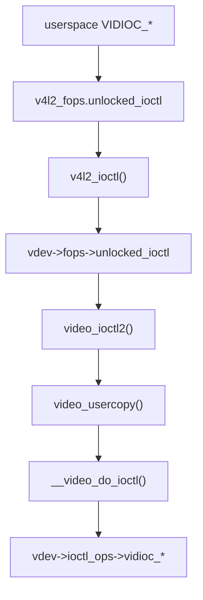

# `ioctl` 派发与 `v4l2_ioctl_ops`

## 导读

### 本章定位

这一章聚焦 `VIDIOC_*` 从用户态进入内核后的标准派发链，重点说明两层 `.unlocked_ioctl` 和一层 `v4l2_ioctl_ops` 是怎么串起来的。

### 核心对象

- `v4l2_fops`
  - 第一层 `struct file_operations`
- `video_device->fops`
  - 第二层 `struct v4l2_file_operations`
- `video_device->ioctl_ops`
  - 业务级 `struct v4l2_ioctl_ops`
- `v4l2_ioctl_info / valid_ioctls`
  - V4L2 core 的静态派发表与有效命令集合

### 关键函数

- `v4l2_ioctl()`
- `video_ioctl2()`
- `video_usercopy()`
- `__video_do_ioctl()`
- `determine_valid_ioctls()`

### 主流程

`v4l2_fops.unlocked_ioctl` -> `v4l2_ioctl()` -> `vdev->fops->unlocked_ioctl` -> `video_ioctl2()` -> `video_usercopy()` -> `__video_do_ioctl()` -> `v4l2_ioctl_ops->vidioc_*`

## 1. 先抓住主链路

V4L2 的 `ioctl` 主链路非常固定：



关键源码：

- `drivers/media/v4l2-core/v4l2-dev.c:353`
  `v4l2_ioctl()`
- `drivers/media/v4l2-core/v4l2-ioctl.c:3358`
  `video_ioctl2()`
- `drivers/media/v4l2-core/v4l2-ioctl.c:3273`
  `video_usercopy()`
- `drivers/media/v4l2-core/v4l2-ioctl.c:2941`
  `__video_do_ioctl()`

这里不是“两套 `v4l2_ioctl_ops`”，而是：

1. 一层 `v4l2_fops.unlocked_ioctl -> v4l2_ioctl()`
2. 一层 `vdev->fops->unlocked_ioctl -> video_ioctl2()`
3. 一层 `vdev->ioctl_ops->vidioc_*`

也就是说，`ioctl` 路径里同时存在：

- 一套 Linux `struct file_operations`
  - 也就是 V4L2 core 的 `v4l2_fops`
- 一套 `struct v4l2_file_operations`
  - 也就是 `video_device->fops`

真正的业务分发点落在最后一层 `v4l2_ioctl_ops`；前两层的 `.unlocked_ioctl` 主要负责把请求逐层转发过去。

---

## 2. `v4l2_ioctl()` 做什么

源码：

- `drivers/media/v4l2-core/v4l2-dev.c:353`

```C {8}
static long v4l2_ioctl(struct file *filp, unsigned int cmd, unsigned long arg)
{
	struct video_device *vdev = video_devdata(filp);
	int ret = -ENODEV;

	if (vdev->fops->unlocked_ioctl) {
		if (video_is_registered(vdev))
			ret = vdev->fops->unlocked_ioctl(filp, cmd, arg);
	} else
		ret = -ENOTTY;

	return ret;
}
```
它是第一层 `unlocked_ioctl`，也就是 VFS 层 `struct file_operations` 的统一入口，只做一层薄转发：

- 取出 `video_device`
- 确认驱动有 `fops->unlocked_ioctl`
- 设备还注册着
- 调 `vdev->fops->unlocked_ioctl`

如果 `vdev->fops->unlocked_ioctl` 设成 `video_ioctl2`，那么后续就进入 V4L2 标准派发链。[[03-ioctl派发与v4l2_ioctl_ops#3. 为什么很多驱动都写 `.unlocked_ioctl = video_ioctl2`]]

## 3. 为什么很多驱动都写 `.unlocked_ioctl = video_ioctl2`

这里的 `.unlocked_ioctl` 指的是 **`video_device->fops->unlocked_ioctl`**，不是前面那层 `v4l2_fops.unlocked_ioctl`。  
`video_ioctl2()` 是第二层 `unlocked_ioctl` 的标准派发器。

```C 
long video_ioctl2(struct file *file,
	       unsigned int cmd, unsigned long arg)
{
	return video_usercopy(file, cmd, arg, __video_do_ioctl);
}
```

^c0deb1

驱动只要：

1. 把 `.unlocked_ioctl` 指向 `video_ioctl2`
2. 实现 `struct v4l2_ioctl_ops`

就可以让 V4L2 core 自动完成：

- 用户态参数拷贝
- 32/64 位兼容处理
- 通用 debug 输出
- `valid_ioctls` 检查
- 优先级检查
- 锁串行化

所以常见驱动一般不自己手写大号 `switch(cmd)`。

## 4. `video_usercopy()` 为什么存在

源码：

- `drivers/media/v4l2-core/v4l2-ioctl.c:3273`
>[!INFO]
```c {51} fold："video_usercopy"
video_usercopy(struct file *file, unsigned int orig_cmd, unsigned long arg,
	       v4l2_kioctl func)
{
	char	sbuf[128];
	void    *mbuf = NULL, *array_buf = NULL;
	void	*parg = (void *)arg;
	long	err  = -EINVAL;
	bool	has_array_args;
	bool	always_copy = false;
	size_t  array_size = 0;
	void __user *user_ptr = NULL;
	void	**kernel_ptr = NULL;
	unsigned int cmd = video_translate_cmd(orig_cmd);
	const size_t ioc_size = _IOC_SIZE(cmd);

	/*  Copy arguments into temp kernel buffer  */
	if (_IOC_DIR(cmd) != _IOC_NONE) {
		if (ioc_size <= sizeof(sbuf)) {
			parg = sbuf;
		} else {
			/* too big to allocate from stack */
			mbuf = kvmalloc(ioc_size, GFP_KERNEL);
			if (NULL == mbuf)
				return -ENOMEM;
			parg = mbuf;
		}

		err = video_get_user((void __user *)arg, parg, orig_cmd,
				     &always_copy);
		if (err)
			goto out;
	}

	err = check_array_args(cmd, parg, &array_size, &user_ptr, &kernel_ptr);
	if (err < 0)
		goto out;
	has_array_args = err;

	if (has_array_args) {
		array_buf = kvmalloc(array_size, GFP_KERNEL);
		err = -ENOMEM;
		if (array_buf == NULL)
			goto out_array_args;
		err = -EFAULT;
		if (copy_from_user(array_buf, user_ptr, array_size))
			goto out_array_args;
		*kernel_ptr = array_buf;
	}

	/* Handles IOCTL */
	err = func(file, cmd, parg); //调实际处理函数 `__video_do_ioctl()` ………do_ioctl
	if (err == -ENOTTY || err == -ENOIOCTLCMD) {
		err = -ENOTTY;
		goto out;
	}

	if (err == 0) {
		if (cmd == VIDIOC_DQBUF)
			trace_v4l2_dqbuf(video_devdata(file)->minor, parg);
		else if (cmd == VIDIOC_QBUF)
			trace_v4l2_qbuf(video_devdata(file)->minor, parg);
	}

	if (has_array_args) {
		*kernel_ptr = (void __force *)user_ptr;
		if (copy_to_user(user_ptr, array_buf, array_size))
			err = -EFAULT;
		goto out_array_args;
	}
	/*
	 * Some ioctls can return an error, but still have valid
	 * results that must be returned.
	 */
	if (err < 0 && !always_copy)
		goto out;

out_array_args:
	if (video_put_user((void __user *)arg, parg, orig_cmd))
		err = -EFAULT;
out:
	kvfree(array_buf);
	kvfree(mbuf);
	return err;
}
```
它解决的是 **用户态参数和内核态参数搬运** 这个共性问题。

核心动作包括：

- 根据 ioctl 参数大小决定用栈 buffer 还是堆 buffer
- 从用户空间拷贝参数到内核
- 处理 array 型参数
- 调实际处理函数 `__video_do_ioctl()`   [[#^c0deb1]]
- 把结果再拷回用户空间

这一步把每个驱动都重复写的 `copy_from_user/copy_to_user` 代码统一收掉了。

## 5. `__video_do_ioctl()` 才是 V4L2 业务派发核心

源码：

- `drivers/media/v4l2-core/v4l2-ioctl.c:2941`
>[!INFO]
```c {4,7,73} fold:"__video_do_ioctl"
static long __video_do_ioctl(struct file *file,
		unsigned int cmd, void *arg)
{
	struct video_device *vfd = video_devdata(file);
	struct mutex *req_queue_lock = NULL;
	struct mutex *lock; /* ioctl serialization mutex */
	const struct v4l2_ioctl_ops *ops = vfd->ioctl_ops;
	bool write_only = false;
	struct v4l2_ioctl_info default_info;
	const struct v4l2_ioctl_info *info;
	void *fh = file->private_data;
	struct v4l2_fh *vfh = NULL;
	int dev_debug = vfd->dev_debug;
	long ret = -ENOTTY;

	if (ops == NULL) {
		pr_warn("%s: has no ioctl_ops.\n",
				video_device_node_name(vfd));
		return ret;
	}

	if (test_bit(V4L2_FL_USES_V4L2_FH, &vfd->flags))
		vfh = file->private_data;

	/*
	 * We need to serialize streamon/off with queueing new requests.
	 * These ioctls may trigger the cancellation of a streaming
	 * operation, and that should not be mixed with queueing a new
	 * request at the same time.
	 */
	if (v4l2_device_supports_requests(vfd->v4l2_dev) &&
	    (cmd == VIDIOC_STREAMON || cmd == VIDIOC_STREAMOFF)) {
		req_queue_lock = &vfd->v4l2_dev->mdev->req_queue_mutex;

		if (mutex_lock_interruptible(req_queue_lock))
			return -ERESTARTSYS;
	}

	lock = v4l2_ioctl_get_lock(vfd, vfh, cmd, arg);

	if (lock && mutex_lock_interruptible(lock)) {
		if (req_queue_lock)
			mutex_unlock(req_queue_lock);
		return -ERESTARTSYS;
	}

	if (!video_is_registered(vfd)) {
		ret = -ENODEV;
		goto unlock;
	}

	if (v4l2_is_known_ioctl(cmd)) {
		info = &v4l2_ioctls[_IOC_NR(cmd)];

		if (!test_bit(_IOC_NR(cmd), vfd->valid_ioctls) &&
		    !((info->flags & INFO_FL_CTRL) && vfh && vfh->ctrl_handler))
			goto done;

		if (vfh && (info->flags & INFO_FL_PRIO)) {
			ret = v4l2_prio_check(vfd->prio, vfh->prio);
			if (ret)
				goto done;
		}
	} else {
		default_info.ioctl = cmd;
		default_info.flags = 0;
		default_info.debug = v4l_print_default;
		info = &default_info;
	}

	write_only = _IOC_DIR(cmd) == _IOC_WRITE;
	if (info != &default_info) {
		ret = info->func(ops, file, fh, arg);
	} else if (!ops->vidioc_default) {
		ret = -ENOTTY;
	} else {
		ret = ops->vidioc_default(file, fh,
			vfh ? v4l2_prio_check(vfd->prio, vfh->prio) >= 0 : 0,
			cmd, arg);
	}

done:
	if (dev_debug & (V4L2_DEV_DEBUG_IOCTL | V4L2_DEV_DEBUG_IOCTL_ARG)) {
		if (!(dev_debug & V4L2_DEV_DEBUG_STREAMING) &&
		    (cmd == VIDIOC_QBUF || cmd == VIDIOC_DQBUF))
			goto unlock;

		v4l_printk_ioctl(video_device_node_name(vfd), cmd);
		if (ret < 0)
			pr_cont(": error %ld", ret);
		if (!(dev_debug & V4L2_DEV_DEBUG_IOCTL_ARG))
			pr_cont("\n");
		else if (_IOC_DIR(cmd) == _IOC_NONE)
			info->debug(arg, write_only);
		else {
			pr_cont(": ");
			info->debug(arg, write_only);
		}
	}

unlock:
	if (lock)
		mutex_unlock(lock);
	if (req_queue_lock)
		mutex_unlock(req_queue_lock);
	return ret;
}
```
它的思路可以概括成五步：

### 5.1 拿到 `video_device` 和 `ioctl_ops`

```c
struct video_device *vfd = video_devdata(file);
const struct v4l2_ioctl_ops *ops = vfd->ioctl_ops;
```

如果 `ioctl_ops` 都没填，那这个设备基本就没法处理标准 V4L2 ioctl。

### 5.2 选择锁

它会通过 `v4l2_ioctl_get_lock()` 找到合适的串行化锁。  
如果驱动设置了 `vdev->lock` 或 `vb2_queue->lock`，这里就会用上。

### 5.3 检查设备是否还注册着

如果设备正在注销，直接返回 `-ENODEV`。

### 5.4 检查 ioctl 是否有效

对于标准 ioctl，它会查：

- `vfd->valid_ioctls`

这个位图是在 `__video_register_device()` 里根据 `v4l2_ioctl_ops` 自动推导出来的。

### 5.5 分发到对应回调

如果是标准 ioctl，就通过 `info->func(ops, file, fh, arg)` 转到对应的 `vidioc_*` 回调。  
这些回调就是 [[03-ioctl派发与v4l2_ioctl_ops#7. `struct v4l2_ioctl_ops` 里通常放什么]] 里那一组驱动实现。
#ioctl完整调用链路
[[V4L2驱动学习#`ioctl` 调用链路]]
## 6. `valid_ioctls` 为什么很重要

`__video_register_device()` 里会调用：

- `drivers/media/v4l2-core/v4l2-dev.c`
  `determine_valid_ioctls(vdev)`
>[!INFO]
```C fold:"determine_valid_ioctls"
static void determine_valid_ioctls(struct video_device *vdev)
{
	const u32 vid_caps = V4L2_CAP_VIDEO_CAPTURE |
			     V4L2_CAP_VIDEO_CAPTURE_MPLANE |
			     V4L2_CAP_VIDEO_OUTPUT |
			     V4L2_CAP_VIDEO_OUTPUT_MPLANE |
			     V4L2_CAP_VIDEO_M2M | V4L2_CAP_VIDEO_M2M_MPLANE;
	const u32 meta_caps = V4L2_CAP_META_CAPTURE |
			      V4L2_CAP_META_OUTPUT;
	DECLARE_BITMAP(valid_ioctls, BASE_VIDIOC_PRIVATE);
	const struct v4l2_ioctl_ops *ops = vdev->ioctl_ops;
	bool is_vid = vdev->vfl_type == VFL_TYPE_VIDEO &&
		      (vdev->device_caps & vid_caps);
	bool is_vbi = vdev->vfl_type == VFL_TYPE_VBI;
	bool is_radio = vdev->vfl_type == VFL_TYPE_RADIO;
	bool is_sdr = vdev->vfl_type == VFL_TYPE_SDR;
	bool is_tch = vdev->vfl_type == VFL_TYPE_TOUCH;
	bool is_meta = vdev->vfl_type == VFL_TYPE_VIDEO &&
		       (vdev->device_caps & meta_caps);
	bool is_rx = vdev->vfl_dir != VFL_DIR_TX;
	bool is_tx = vdev->vfl_dir != VFL_DIR_RX;
	bool is_io_mc = vdev->device_caps & V4L2_CAP_IO_MC;

	bitmap_zero(valid_ioctls, BASE_VIDIOC_PRIVATE);

	/* vfl_type and vfl_dir independent ioctls */

	SET_VALID_IOCTL(ops, VIDIOC_QUERYCAP, vidioc_querycap);
	set_bit(_IOC_NR(VIDIOC_G_PRIORITY), valid_ioctls);
	set_bit(_IOC_NR(VIDIOC_S_PRIORITY), valid_ioctls);

	/* Note: the control handler can also be passed through the filehandle,
	   and that can't be tested here. If the bit for these control ioctls
	   is set, then the ioctl is valid. But if it is 0, then it can still
	   be valid if the filehandle passed the control handler. */
	if (vdev->ctrl_handler || ops->vidioc_queryctrl)
		set_bit(_IOC_NR(VIDIOC_QUERYCTRL), valid_ioctls);
	if (vdev->ctrl_handler || ops->vidioc_query_ext_ctrl)
		set_bit(_IOC_NR(VIDIOC_QUERY_EXT_CTRL), valid_ioctls);
	if (vdev->ctrl_handler || ops->vidioc_g_ctrl || ops->vidioc_g_ext_ctrls)
		set_bit(_IOC_NR(VIDIOC_G_CTRL), valid_ioctls);
	if (vdev->ctrl_handler || ops->vidioc_s_ctrl || ops->vidioc_s_ext_ctrls)
		set_bit(_IOC_NR(VIDIOC_S_CTRL), valid_ioctls);
	if (vdev->ctrl_handler || ops->vidioc_g_ext_ctrls)
		set_bit(_IOC_NR(VIDIOC_G_EXT_CTRLS), valid_ioctls);
	if (vdev->ctrl_handler || ops->vidioc_s_ext_ctrls)
		set_bit(_IOC_NR(VIDIOC_S_EXT_CTRLS), valid_ioctls);
	if (vdev->ctrl_handler || ops->vidioc_try_ext_ctrls)
		set_bit(_IOC_NR(VIDIOC_TRY_EXT_CTRLS), valid_ioctls);
	if (vdev->ctrl_handler || ops->vidioc_querymenu)
		set_bit(_IOC_NR(VIDIOC_QUERYMENU), valid_ioctls);
	if (!is_tch) {
		SET_VALID_IOCTL(ops, VIDIOC_G_FREQUENCY, vidioc_g_frequency);
		SET_VALID_IOCTL(ops, VIDIOC_S_FREQUENCY, vidioc_s_frequency);
	}
	SET_VALID_IOCTL(ops, VIDIOC_LOG_STATUS, vidioc_log_status);
#ifdef CONFIG_VIDEO_ADV_DEBUG
	set_bit(_IOC_NR(VIDIOC_DBG_G_CHIP_INFO), valid_ioctls);
	set_bit(_IOC_NR(VIDIOC_DBG_G_REGISTER), valid_ioctls);
	set_bit(_IOC_NR(VIDIOC_DBG_S_REGISTER), valid_ioctls);
#endif
	/* yes, really vidioc_subscribe_event */
	SET_VALID_IOCTL(ops, VIDIOC_DQEVENT, vidioc_subscribe_event);
	SET_VALID_IOCTL(ops, VIDIOC_SUBSCRIBE_EVENT, vidioc_subscribe_event);
	SET_VALID_IOCTL(ops, VIDIOC_UNSUBSCRIBE_EVENT, vidioc_unsubscribe_event);
	if (ops->vidioc_enum_freq_bands || ops->vidioc_g_tuner || ops->vidioc_g_modulator)
		set_bit(_IOC_NR(VIDIOC_ENUM_FREQ_BANDS), valid_ioctls);

	if (is_vid) {
		/* video specific ioctls */
		if ((is_rx && (ops->vidioc_enum_fmt_vid_cap ||
			       ops->vidioc_enum_fmt_vid_overlay)) ||
		    (is_tx && ops->vidioc_enum_fmt_vid_out))
			set_bit(_IOC_NR(VIDIOC_ENUM_FMT), valid_ioctls);
		if ((is_rx && (ops->vidioc_g_fmt_vid_cap ||
			       ops->vidioc_g_fmt_vid_cap_mplane ||
			       ops->vidioc_g_fmt_vid_overlay)) ||
		    (is_tx && (ops->vidioc_g_fmt_vid_out ||
			       ops->vidioc_g_fmt_vid_out_mplane ||
			       ops->vidioc_g_fmt_vid_out_overlay)))
			 set_bit(_IOC_NR(VIDIOC_G_FMT), valid_ioctls);
		if ((is_rx && (ops->vidioc_s_fmt_vid_cap ||
			       ops->vidioc_s_fmt_vid_cap_mplane ||
			       ops->vidioc_s_fmt_vid_overlay)) ||
		    (is_tx && (ops->vidioc_s_fmt_vid_out ||
			       ops->vidioc_s_fmt_vid_out_mplane ||
			       ops->vidioc_s_fmt_vid_out_overlay)))
			 set_bit(_IOC_NR(VIDIOC_S_FMT), valid_ioctls);
		if ((is_rx && (ops->vidioc_try_fmt_vid_cap ||
			       ops->vidioc_try_fmt_vid_cap_mplane ||
			       ops->vidioc_try_fmt_vid_overlay)) ||
		    (is_tx && (ops->vidioc_try_fmt_vid_out ||
			       ops->vidioc_try_fmt_vid_out_mplane ||
			       ops->vidioc_try_fmt_vid_out_overlay)))
			 set_bit(_IOC_NR(VIDIOC_TRY_FMT), valid_ioctls);
		SET_VALID_IOCTL(ops, VIDIOC_OVERLAY, vidioc_overlay);
		SET_VALID_IOCTL(ops, VIDIOC_G_FBUF, vidioc_g_fbuf);
		SET_VALID_IOCTL(ops, VIDIOC_S_FBUF, vidioc_s_fbuf);
		SET_VALID_IOCTL(ops, VIDIOC_G_JPEGCOMP, vidioc_g_jpegcomp);
		SET_VALID_IOCTL(ops, VIDIOC_S_JPEGCOMP, vidioc_s_jpegcomp);
		SET_VALID_IOCTL(ops, VIDIOC_G_ENC_INDEX, vidioc_g_enc_index);
		SET_VALID_IOCTL(ops, VIDIOC_ENCODER_CMD, vidioc_encoder_cmd);
		SET_VALID_IOCTL(ops, VIDIOC_TRY_ENCODER_CMD, vidioc_try_encoder_cmd);
		SET_VALID_IOCTL(ops, VIDIOC_DECODER_CMD, vidioc_decoder_cmd);
		SET_VALID_IOCTL(ops, VIDIOC_TRY_DECODER_CMD, vidioc_try_decoder_cmd);
		SET_VALID_IOCTL(ops, VIDIOC_ENUM_FRAMESIZES, vidioc_enum_framesizes);
		SET_VALID_IOCTL(ops, VIDIOC_ENUM_FRAMEINTERVALS, vidioc_enum_frameintervals);
		if (ops->vidioc_g_selection) {
			set_bit(_IOC_NR(VIDIOC_G_CROP), valid_ioctls);
			set_bit(_IOC_NR(VIDIOC_CROPCAP), valid_ioctls);
		}
		if (ops->vidioc_s_selection)
			set_bit(_IOC_NR(VIDIOC_S_CROP), valid_ioctls);
		SET_VALID_IOCTL(ops, VIDIOC_G_SELECTION, vidioc_g_selection);
		SET_VALID_IOCTL(ops, VIDIOC_S_SELECTION, vidioc_s_selection);
	}
	if (is_meta && is_rx) {
		/* metadata capture specific ioctls */
		SET_VALID_IOCTL(ops, VIDIOC_ENUM_FMT, vidioc_enum_fmt_meta_cap);
		SET_VALID_IOCTL(ops, VIDIOC_G_FMT, vidioc_g_fmt_meta_cap);
		SET_VALID_IOCTL(ops, VIDIOC_S_FMT, vidioc_s_fmt_meta_cap);
		SET_VALID_IOCTL(ops, VIDIOC_TRY_FMT, vidioc_try_fmt_meta_cap);
	} else if (is_meta && is_tx) {
		/* metadata output specific ioctls */
		SET_VALID_IOCTL(ops, VIDIOC_ENUM_FMT, vidioc_enum_fmt_meta_out);
		SET_VALID_IOCTL(ops, VIDIOC_G_FMT, vidioc_g_fmt_meta_out);
		SET_VALID_IOCTL(ops, VIDIOC_S_FMT, vidioc_s_fmt_meta_out);
		SET_VALID_IOCTL(ops, VIDIOC_TRY_FMT, vidioc_try_fmt_meta_out);
	}
	if (is_vbi) {
		/* vbi specific ioctls */
		if ((is_rx && (ops->vidioc_g_fmt_vbi_cap ||
			       ops->vidioc_g_fmt_sliced_vbi_cap)) ||
		    (is_tx && (ops->vidioc_g_fmt_vbi_out ||
			       ops->vidioc_g_fmt_sliced_vbi_out)))
			set_bit(_IOC_NR(VIDIOC_G_FMT), valid_ioctls);
		if ((is_rx && (ops->vidioc_s_fmt_vbi_cap ||
			       ops->vidioc_s_fmt_sliced_vbi_cap)) ||
		    (is_tx && (ops->vidioc_s_fmt_vbi_out ||
			       ops->vidioc_s_fmt_sliced_vbi_out)))
			set_bit(_IOC_NR(VIDIOC_S_FMT), valid_ioctls);
		if ((is_rx && (ops->vidioc_try_fmt_vbi_cap ||
			       ops->vidioc_try_fmt_sliced_vbi_cap)) ||
		    (is_tx && (ops->vidioc_try_fmt_vbi_out ||
			       ops->vidioc_try_fmt_sliced_vbi_out)))
			set_bit(_IOC_NR(VIDIOC_TRY_FMT), valid_ioctls);
		SET_VALID_IOCTL(ops, VIDIOC_G_SLICED_VBI_CAP, vidioc_g_sliced_vbi_cap);
	} else if (is_tch) {
		/* touch specific ioctls */
		SET_VALID_IOCTL(ops, VIDIOC_ENUM_FMT, vidioc_enum_fmt_vid_cap);
		SET_VALID_IOCTL(ops, VIDIOC_G_FMT, vidioc_g_fmt_vid_cap);
		SET_VALID_IOCTL(ops, VIDIOC_S_FMT, vidioc_s_fmt_vid_cap);
		SET_VALID_IOCTL(ops, VIDIOC_TRY_FMT, vidioc_try_fmt_vid_cap);
		SET_VALID_IOCTL(ops, VIDIOC_ENUM_FRAMESIZES, vidioc_enum_framesizes);
		SET_VALID_IOCTL(ops, VIDIOC_ENUM_FRAMEINTERVALS, vidioc_enum_frameintervals);
		SET_VALID_IOCTL(ops, VIDIOC_ENUMINPUT, vidioc_enum_input);
		SET_VALID_IOCTL(ops, VIDIOC_G_INPUT, vidioc_g_input);
		SET_VALID_IOCTL(ops, VIDIOC_S_INPUT, vidioc_s_input);
		SET_VALID_IOCTL(ops, VIDIOC_G_PARM, vidioc_g_parm);
		SET_VALID_IOCTL(ops, VIDIOC_S_PARM, vidioc_s_parm);
	} else if (is_sdr && is_rx) {
		/* SDR receiver specific ioctls */
		SET_VALID_IOCTL(ops, VIDIOC_ENUM_FMT, vidioc_enum_fmt_sdr_cap);
		SET_VALID_IOCTL(ops, VIDIOC_G_FMT, vidioc_g_fmt_sdr_cap);
		SET_VALID_IOCTL(ops, VIDIOC_S_FMT, vidioc_s_fmt_sdr_cap);
		SET_VALID_IOCTL(ops, VIDIOC_TRY_FMT, vidioc_try_fmt_sdr_cap);
	} else if (is_sdr && is_tx) {
		/* SDR transmitter specific ioctls */
		SET_VALID_IOCTL(ops, VIDIOC_ENUM_FMT, vidioc_enum_fmt_sdr_out);
		SET_VALID_IOCTL(ops, VIDIOC_G_FMT, vidioc_g_fmt_sdr_out);
		SET_VALID_IOCTL(ops, VIDIOC_S_FMT, vidioc_s_fmt_sdr_out);
		SET_VALID_IOCTL(ops, VIDIOC_TRY_FMT, vidioc_try_fmt_sdr_out);
	}

	if (is_vid || is_vbi || is_sdr || is_tch || is_meta) {
		/* ioctls valid for video, vbi, sdr, touch and metadata */
		SET_VALID_IOCTL(ops, VIDIOC_REQBUFS, vidioc_reqbufs);
		SET_VALID_IOCTL(ops, VIDIOC_QUERYBUF, vidioc_querybuf);
		SET_VALID_IOCTL(ops, VIDIOC_QBUF, vidioc_qbuf);
		SET_VALID_IOCTL(ops, VIDIOC_EXPBUF, vidioc_expbuf);
		SET_VALID_IOCTL(ops, VIDIOC_DQBUF, vidioc_dqbuf);
		SET_VALID_IOCTL(ops, VIDIOC_CREATE_BUFS, vidioc_create_bufs);
		SET_VALID_IOCTL(ops, VIDIOC_PREPARE_BUF, vidioc_prepare_buf);
		SET_VALID_IOCTL(ops, VIDIOC_STREAMON, vidioc_streamon);
		SET_VALID_IOCTL(ops, VIDIOC_STREAMOFF, vidioc_streamoff);
	}

	if (is_vid || is_vbi || is_meta) {
		/* ioctls valid for video, vbi and metadata */
		if (ops->vidioc_s_std)
			set_bit(_IOC_NR(VIDIOC_ENUMSTD), valid_ioctls);
		SET_VALID_IOCTL(ops, VIDIOC_S_STD, vidioc_s_std);
		SET_VALID_IOCTL(ops, VIDIOC_G_STD, vidioc_g_std);
		if (is_rx) {
			SET_VALID_IOCTL(ops, VIDIOC_QUERYSTD, vidioc_querystd);
			if (is_io_mc) {
				set_bit(_IOC_NR(VIDIOC_ENUMINPUT), valid_ioctls);
				set_bit(_IOC_NR(VIDIOC_G_INPUT), valid_ioctls);
				set_bit(_IOC_NR(VIDIOC_S_INPUT), valid_ioctls);
			} else {
				SET_VALID_IOCTL(ops, VIDIOC_ENUMINPUT, vidioc_enum_input);
				SET_VALID_IOCTL(ops, VIDIOC_G_INPUT, vidioc_g_input);
				SET_VALID_IOCTL(ops, VIDIOC_S_INPUT, vidioc_s_input);
			}
			SET_VALID_IOCTL(ops, VIDIOC_ENUMAUDIO, vidioc_enumaudio);
			SET_VALID_IOCTL(ops, VIDIOC_G_AUDIO, vidioc_g_audio);
			SET_VALID_IOCTL(ops, VIDIOC_S_AUDIO, vidioc_s_audio);
			SET_VALID_IOCTL(ops, VIDIOC_QUERY_DV_TIMINGS, vidioc_query_dv_timings);
			SET_VALID_IOCTL(ops, VIDIOC_S_EDID, vidioc_s_edid);
		}
		if (is_tx) {
			if (is_io_mc) {
				set_bit(_IOC_NR(VIDIOC_ENUMOUTPUT), valid_ioctls);
				set_bit(_IOC_NR(VIDIOC_G_OUTPUT), valid_ioctls);
				set_bit(_IOC_NR(VIDIOC_S_OUTPUT), valid_ioctls);
			} else {
				SET_VALID_IOCTL(ops, VIDIOC_ENUMOUTPUT, vidioc_enum_output);
				SET_VALID_IOCTL(ops, VIDIOC_G_OUTPUT, vidioc_g_output);
				SET_VALID_IOCTL(ops, VIDIOC_S_OUTPUT, vidioc_s_output);
			}
			SET_VALID_IOCTL(ops, VIDIOC_ENUMAUDOUT, vidioc_enumaudout);
			SET_VALID_IOCTL(ops, VIDIOC_G_AUDOUT, vidioc_g_audout);
			SET_VALID_IOCTL(ops, VIDIOC_S_AUDOUT, vidioc_s_audout);
		}
		if (ops->vidioc_g_parm || ops->vidioc_g_std)
			set_bit(_IOC_NR(VIDIOC_G_PARM), valid_ioctls);
		SET_VALID_IOCTL(ops, VIDIOC_S_PARM, vidioc_s_parm);
		SET_VALID_IOCTL(ops, VIDIOC_S_DV_TIMINGS, vidioc_s_dv_timings);
		SET_VALID_IOCTL(ops, VIDIOC_G_DV_TIMINGS, vidioc_g_dv_timings);
		SET_VALID_IOCTL(ops, VIDIOC_ENUM_DV_TIMINGS, vidioc_enum_dv_timings);
		SET_VALID_IOCTL(ops, VIDIOC_DV_TIMINGS_CAP, vidioc_dv_timings_cap);
		SET_VALID_IOCTL(ops, VIDIOC_G_EDID, vidioc_g_edid);
	}
	if (is_tx && (is_radio || is_sdr)) {
		/* radio transmitter only ioctls */
		SET_VALID_IOCTL(ops, VIDIOC_G_MODULATOR, vidioc_g_modulator);
		SET_VALID_IOCTL(ops, VIDIOC_S_MODULATOR, vidioc_s_modulator);
	}
	if (is_rx && !is_tch) {
		/* receiver only ioctls */
		SET_VALID_IOCTL(ops, VIDIOC_G_TUNER, vidioc_g_tuner);
		SET_VALID_IOCTL(ops, VIDIOC_S_TUNER, vidioc_s_tuner);
		SET_VALID_IOCTL(ops, VIDIOC_S_HW_FREQ_SEEK, vidioc_s_hw_freq_seek);
	}

	bitmap_andnot(vdev->valid_ioctls, valid_ioctls, vdev->valid_ioctls,
			BASE_VIDIOC_PRIVATE);
}
```

它根据驱动实现了哪些 `vidioc_*` 回调，自动生成有效 ioctl 位图。

这样 `__video_do_ioctl()` 就不用每次都靠大量条件判断来确认某个 ioctl 是否实现。

也就是说：

- 未实现的 `vidioc_*`
  默认就不会被当成“支持”
- 用户发进来的 ioctl
  很可能在 core 就被拒掉

## 7. `struct v4l2_ioctl_ops` 里通常放什么
#三个基本结构体 #v4l2_ioctl_ops
定义位置：

- `include/media/v4l2-ioctl.h:296`
[[v4l2驱动总结#//ioctl操作]]
常见成员：

- `vidioc_querycap`
- `vidioc_enum_fmt_vid_cap`
- `vidioc_g_fmt_vid_cap`
- `vidioc_s_fmt_vid_cap`
- `vidioc_try_fmt_vid_cap`
- `vidioc_reqbufs`
- `vidioc_querybuf`
- `vidioc_qbuf`
- `vidioc_dqbuf`
- `vidioc_prepare_buf`
- `vidioc_streamon`
- `vidioc_streamoff`

## 8. 很多缓冲相关回调其实直接复用 vb2 helper

这在主线驱动里非常常见，例如 `sh_vou.c:1173`：

```c
.vidioc_reqbufs      = vb2_ioctl_reqbufs,
.vidioc_create_bufs  = vb2_ioctl_create_bufs,
.vidioc_querybuf     = vb2_ioctl_querybuf,
.vidioc_qbuf         = vb2_ioctl_qbuf,
.vidioc_dqbuf        = vb2_ioctl_dqbuf,
.vidioc_prepare_buf  = vb2_ioctl_prepare_buf,
.vidioc_streamon     = vb2_ioctl_streamon,
.vidioc_streamoff    = vb2_ioctl_streamoff,
.vidioc_expbuf       = vb2_ioctl_expbuf,
```

这说明：

- V4L2 语义层由 `v4l2_ioctl_ops` 承接
- buffer 生命周期又进一步下沉给 `vb2`

>[!TIP] #两套fops #v4l2_ioctl_info #三个基本结构体 #总结
>总结：
>`IOCTL` 路径里不是两套 `v4l2_ioctl_ops`，而是两层 `.unlocked_ioctl` 加一层 `v4l2_ioctl_ops`。  
>第一层是 `v4l2_fops.unlocked_ioctl -> v4l2_ioctl()`；第二层是 `vdev->fops->unlocked_ioctl -> video_ioctl2()`；第三层才是 `__video_do_ioctl()` 继续借助 `valid_ioctls`、`v4l2_ioctl_info` 和 `v4l2_ioctl_ops` 完成真正的业务派发。
>
>IOCTL 路径本质上是“字符设备层一次 fops 覆盖 + V4L2 core 多层转发 + video_usercopy 处理用户态数据交换 + __video_do_ioctl() 派发到驱动 v4l2_ioctl_ops”

```c
- v4l2_ioctl()  
    第一层 `unlocked_ioctl`，从 VFS/file_operations 转发到 `vdev->fops->unlocked_ioctl`
- video_ioctl2()  
    第二层 `unlocked_ioctl`，作为 V4L2 通用 ioctl 入口，继续把流程交给 `video_usercopy()`
- video_usercopy()  
    负责 copy_from_user/copy_to_user 这一层，也负责准备 ioctl 参数缓冲
- __video_do_ioctl()  
    才是 V4L2 业务派发核心
- valid_ioctls  
    用来快速判断当前 video_device 是否支持这个 VIDIOC_*
- v4l2_ioctl_info  
    是静态 ioctl 描述表，用来建立“VIDIOC_* 编号 -> 处理信息”的映射
- v4l2_ioctl_ops  
    由驱动提供具体 vidioc_xxx 实现，最终完成业务处理
```
---

## 9. `sh_vou.c` 是怎么配合的

`sh_vou.c` 的文件操作：

- `drivers/media/platform/sh_vou.c:1198`
  `static const struct v4l2_file_operations sh_vou_fops`

关键项：

```c
.open           = sh_vou_open,
.release        = sh_vou_release,
.unlocked_ioctl = video_ioctl2,
.mmap           = vb2_fop_mmap,
.poll           = vb2_fop_poll,
.write          = vb2_fop_write,
```

然后 ioctl 回调表里再填：

- 设备能力/格式相关回调
- `vb2_ioctl_*` 这组缓冲辅助回调

这是最标准的 V4L2 写法之一。

## 10. 排查 ioctl 问题时怎么想

如果某个 `VIDIOC_*` 不工作，按下面顺序查：

1. `vdev->ioctl_ops` 有没有填
2. 对应的 `vidioc_*` 回调有没有实现
3. `valid_ioctls` 是否把它标成有效
4. `vdev->lock` 或 `queue->lock` 会不会造成阻塞
5. 这个 ioctl 是不是已经交给 `vb2_ioctl_*`，问题实际在 vb2 回调里

## 11. 最容易误解的点

### 11.1 `video_ioctl2()` 不是最终业务处理函数

它只是标准派发器。

### 11.2 不是两套 `v4l2_ioctl_ops`

真正并存的是：

- `v4l2_fops.unlocked_ioctl`
- `vdev->fops->unlocked_ioctl`
- `vdev->ioctl_ops->vidioc_*`

其中前两层负责转发，最后一层负责业务处理。

### 11.3 不是所有 `VIDIOC_*` 都要驱动手写

缓冲类 ioctl 大量可以交给 `vb2_ioctl_*`。

### 11.4 看不到驱动回调，不一定是驱动没跑

也可能是 core 在：

- 参数检查
- `valid_ioctls` 检查
- 锁等待
- 优先级检查

这几步里就提前返回了。
