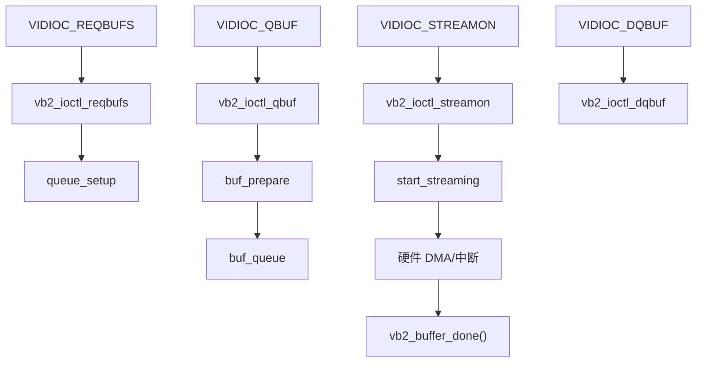

# `vb2` 缓冲队列机制

## 导读

### 本章定位

这一章聚焦 `vb2` 这套通用缓冲框架，核心问题是：缓冲类 `ioctl` 怎么从 `v4l2_ioctl_ops` 继续下沉到 `vb2_core`，最后再回调驱动自己的 `vb2_ops` 和 `mem_ops`。

### 核心对象

- `struct vb2_queue`
  - 一条实际工作的缓冲队列
- `struct vb2_ops`
  - 驱动提供给 `vb2` 的硬件相关回调表
- `struct vb2_mem_ops`
  - buffer 内存后端回调表
- `struct vb2_v4l2_buffer`
  - `vb2` 与 V4L2 buffer 语义之间的桥接对象

### 关键函数

- `vb2_queue_init()`
- `vb2_ioctl_reqbufs() / vb2_ioctl_qbuf() / vb2_ioctl_dqbuf()`
- `vb2_core_reqbufs() / vb2_core_qbuf() / vb2_core_dqbuf()`
- `vb2_buffer_done()`

### 主流程

填好 `vb2_queue` -> `vb2_queue_init()` -> `v4l2_ioctl_ops` 复用 `vb2_ioctl_*` -> `vb2_core_*` 维护状态机 -> `q->ops / q->mem_ops` 处理硬件与内存后端

## 1. `vb2` 在 V4L2 里解决什么问题

`vb2` 全名是 `videobuf2`。  
它解决的是所有视频驱动都会反复遇到的 buffer 管理共性问题：

- buffer 分配与释放
- `REQBUFS/CREATE_BUFS`
- `QUERYBUF`
- `QBUF/DQBUF`
- `MMAP`
- `POLL`
- `STREAMON/STREAMOFF`

所以它的定位不是“某个驱动的私有队列”，而是 **V4L2 的通用缓冲框架**。

## 2. 先抓核心入口

关键源码：

- `drivers/media/common/videobuf2/videobuf2-v4l2.c:935`
  `vb2_queue_init()`
- `drivers/media/common/videobuf2/videobuf2-v4l2.c:890`
  `vb2_queue_init_name()`
- `drivers/media/common/videobuf2/videobuf2-v4l2.c:963` 左右
  `vb2_poll()`

关键定义：

- `include/media/videobuf2-core.h:567`
  `struct vb2_queue`
- `include/media/videobuf2-core.h:417`
  `struct vb2_ops`
- `include/media/videobuf2-v4l2.h:44`
  `struct vb2_v4l2_buffer`

## 3. 驱动必须先把 `vb2_queue` 填起来

一个最小可工作的 `vb2_queue`，至少要关注这些字段：

- `type`
- `io_modes`
- `drv_priv`
- `ops`
- `mem_ops`
- `buf_struct_size`
- `timestamp_flags`
- `lock`
- `dev`
#结构体填充流程
`sh_vou.c` 的初始化非常典型：
[[v4l2驱动总结#驱动初始化与退出函数]]
- `drivers/media/platform/sh_vou.c:1293` 到 `1303` 左右

```c
q->type = V4L2_BUF_TYPE_VIDEO_OUTPUT;
q->io_modes = VB2_MMAP | VB2_DMABUF | VB2_WRITE;
q->drv_priv = vou_dev;
q->buf_struct_size = sizeof(struct sh_vou_buffer);
q->ops = &sh_vou_qops;
q->mem_ops = &vb2_dma_contig_memops;
q->timestamp_flags = V4L2_BUF_FLAG_TIMESTAMP_MONOTONIC;
q->min_buffers_needed = 2;
q->lock = &vou_dev->fop_lock;
q->dev = &pdev->dev;
```

## 4. `vb2_queue_init()` 做了什么

源码：

- `drivers/media/common/videobuf2/videobuf2-v4l2.c:935`

它本身只是：

>[!INFO]
```c
int vb2_queue_init(struct vb2_queue *q)
{
	return vb2_queue_init_name(q, NULL);
}
```

```C fold："vb2_queue_init_name"
int vb2_queue_init_name(struct vb2_queue *q, const char *name)
{
	/*
	 * Sanity check
	 */
	if (WARN_ON(!q)			  ||
	    WARN_ON(q->timestamp_flags &
		    ~(V4L2_BUF_FLAG_TIMESTAMP_MASK |
		      V4L2_BUF_FLAG_TSTAMP_SRC_MASK)))
		return -EINVAL;

	/* Warn that the driver should choose an appropriate timestamp type */
	WARN_ON((q->timestamp_flags & V4L2_BUF_FLAG_TIMESTAMP_MASK) ==
		V4L2_BUF_FLAG_TIMESTAMP_UNKNOWN);

	/* Warn that vb2_memory should match with v4l2_memory */
	if (WARN_ON(VB2_MEMORY_MMAP != (int)V4L2_MEMORY_MMAP)
		|| WARN_ON(VB2_MEMORY_USERPTR != (int)V4L2_MEMORY_USERPTR)
		|| WARN_ON(VB2_MEMORY_DMABUF != (int)V4L2_MEMORY_DMABUF))
		return -EINVAL;

	if (q->buf_struct_size == 0)
		q->buf_struct_size = sizeof(struct vb2_v4l2_buffer);

	q->buf_ops = &v4l2_buf_ops;
	q->is_multiplanar = V4L2_TYPE_IS_MULTIPLANAR(q->type);
	q->is_output = V4L2_TYPE_IS_OUTPUT(q->type);
	q->copy_timestamp = (q->timestamp_flags & V4L2_BUF_FLAG_TIMESTAMP_MASK)
			== V4L2_BUF_FLAG_TIMESTAMP_COPY;
	/*
	 * For compatibility with vb1: if QBUF hasn't been called yet, then
	 * return EPOLLERR as well. This only affects capture queues, output
	 * queues will always initialize waiting_for_buffers to false.
	 */
	q->quirk_poll_must_check_waiting_for_buffers = true;

	if (name)
		strscpy(q->name, name, sizeof(q->name));
	else
		q->name[0] = '\0';

	return vb2_core_queue_init(q);
}
```

真正逻辑在 `vb2_queue_init_name()`：

- 检查参数合法性
- 如果 `buf_struct_size == 0`，默认用 `sizeof(struct vb2_v4l2_buffer)`
- 绑定 `q->buf_ops = &v4l2_buf_ops`
- 计算 `is_multiplanar` / `is_output`
- 设置 poll 兼容行为
- 最后调用 `vb2_core_queue_init(q)`

理解重点：

### 4.1 `vb2-v4l2` 是 V4L2 适配层

它把通用 `vb2-core` 和 V4L2 的 buffer 语义接起来。

### 4.2 真正的 buffer 状态机还在 `vb2-core`

`vb2-v4l2` 更像胶水层。

## 5. 驱动要实现哪些 `vb2_ops`

定义位置：

- `include/media/videobuf2-core.h:417`
#vb2_ops 
```c fold："vb2_ops"
struct vb2_ops {
	int (*queue_setup)(struct vb2_queue *q,
			   unsigned int *num_buffers, unsigned int *num_planes,
			   unsigned int sizes[], struct device *alloc_devs[]);

	void (*wait_prepare)(struct vb2_queue *q);
	void (*wait_finish)(struct vb2_queue *q);

	int (*buf_out_validate)(struct vb2_buffer *vb);
	int (*buf_init)(struct vb2_buffer *vb);
	int (*buf_prepare)(struct vb2_buffer *vb);
	void (*buf_finish)(struct vb2_buffer *vb);
	void (*buf_cleanup)(struct vb2_buffer *vb);

	int (*start_streaming)(struct vb2_queue *q, unsigned int count);
	void (*stop_streaming)(struct vb2_queue *q);

	void (*buf_queue)(struct vb2_buffer *vb);

	void (*buf_request_complete)(struct vb2_buffer *vb);
};
```
不是所有回调都必须实现，但最常见的一组是：

- `queue_setup`
- `buf_prepare`
- `buf_queue`
- `start_streaming`
- `stop_streaming`
- `wait_prepare`
- `wait_finish`
[[v4l2驱动总结#//buf操作]]
`sh_vou.c` 的 `vb2_ops`：

- `drivers/media/platform/sh_vou.c:357`

```c
.queue_setup     = sh_vou_queue_setup,
.buf_prepare     = sh_vou_buf_prepare,
.buf_queue       = sh_vou_buf_queue,
.start_streaming = sh_vou_start_streaming,
.stop_streaming  = sh_vou_stop_streaming,
.wait_prepare    = vb2_ops_wait_prepare,
.wait_finish     = vb2_ops_wait_finish,
```

## 6. 这些回调各干什么

### 6.1 `queue_setup`

决定：

- plane 数量
- 每个 plane 的大小

`sh_vou_queue_setup()`：

- `drivers/media/platform/sh_vou.c:237`
>[!INFO]
```C fold:"sh_vou_queue_setup"
static int sh_vou_queue_setup(struct vb2_queue *vq,
		       unsigned int *nbuffers, unsigned int *nplanes,
		       unsigned int sizes[], struct device *alloc_devs[])
{
	struct sh_vou_device *vou_dev = vb2_get_drv_priv(vq);
	struct v4l2_pix_format *pix = &vou_dev->pix;
	int bytes_per_line = vou_fmt[vou_dev->pix_idx].bpp * pix->width / 8;

	dev_dbg(vou_dev->v4l2_dev.dev, "%s()\n", __func__);

	if (*nplanes)
		return sizes[0] < pix->height * bytes_per_line ? -EINVAL : 0;
	*nplanes = 1;
	sizes[0] = pix->height * bytes_per_line;
	return 0;
}
```
它根据当前像素格式和分辨率算出 `sizes[0]`。
具体例子可对照 [[05-典型video节点驱动例子-sh_vou#从 REQBUFS 到 sh_vou_queue_setup 的实际调用链]]。

### 6.2 `buf_prepare`

在 buffer 真正入队前做最终校验：

- 用户 buffer 是否够大
- payload 应该是多少

`sh_vou_buf_prepare()`：

- `drivers/media/platform/sh_vou.c:254`
>[!INFO]
```C fold:"sh_vou_buf_prepare"
static int sh_vou_buf_prepare(struct vb2_buffer *vb)
{
	struct sh_vou_device *vou_dev = vb2_get_drv_priv(vb->vb2_queue);
	struct v4l2_pix_format *pix = &vou_dev->pix;
	unsigned bytes_per_line = vou_fmt[vou_dev->pix_idx].bpp * pix->width / 8;
	unsigned size = pix->height * bytes_per_line;

	dev_dbg(vou_dev->v4l2_dev.dev, "%s()\n", __func__);

	if (vb2_plane_size(vb, 0) < size) {
		/* User buffer too small */
		dev_warn(vou_dev->v4l2_dev.dev, "buffer too small (%lu < %u)\n",
			 vb2_plane_size(vb, 0), size);
		return -EINVAL;
	}

	vb2_set_plane_payload(vb, 0, size);
	return 0;
}
```
### 6.3 `buf_queue`

当用户 `QBUF` 后，driver 把 buffer 放进自己的待处理链表。 #链表

`sh_vou_buf_queue()`：

- `drivers/media/platform/sh_vou.c:275` 左右
>[!INFO]
```C fold："sh_vou_buf_queue"
static void sh_vou_buf_queue(struct vb2_buffer *vb)
{
	struct vb2_v4l2_buffer *vbuf = to_vb2_v4l2_buffer(vb);
	struct sh_vou_device *vou_dev = vb2_get_drv_priv(vb->vb2_queue);
	struct sh_vou_buffer *shbuf = to_sh_vou_buffer(vbuf);
	unsigned long flags;

	spin_lock_irqsave(&vou_dev->lock, flags);
	list_add_tail(&shbuf->list, &vou_dev->buf_list);
	spin_unlock_irqrestore(&vou_dev->lock, flags);
}
```
### 6.4 `start_streaming`

当队列里 buffer 数够了，用户发 `STREAMON`，这里真正启动硬件。

典型动作：

- 通知下游/上游 `s_stream(1)`
- 配 DMA 首 buffer
- 打开中断
- 置设备运行状态

`sh_vou_start_streaming()`：

- `drivers/media/platform/sh_vou.c:287`
>[!INFO]
```c fold："sh_vou_start_streaming"
static int sh_vou_start_streaming(struct vb2_queue *vq, unsigned int count)
{
	struct sh_vou_device *vou_dev = vb2_get_drv_priv(vq);
	struct sh_vou_buffer *buf, *node;
	int ret;

	vou_dev->sequence = 0;
	ret = v4l2_device_call_until_err(&vou_dev->v4l2_dev, 0,
					 video, s_stream, 1);
	if (ret < 0 && ret != -ENOIOCTLCMD) {
		list_for_each_entry_safe(buf, node, &vou_dev->buf_list, list) {
			vb2_buffer_done(&buf->vb.vb2_buf,
					VB2_BUF_STATE_QUEUED);
			list_del(&buf->list);
		}
		vou_dev->active = NULL;
		return ret;
	}

	buf = list_entry(vou_dev->buf_list.next, struct sh_vou_buffer, list);

	vou_dev->active = buf;

	/* Start from side A: we use mirror addresses, so, set B */
	sh_vou_reg_a_write(vou_dev, VOURPR, 1);
	dev_dbg(vou_dev->v4l2_dev.dev, "%s: first buffer status 0x%x\n",
		__func__, sh_vou_reg_a_read(vou_dev, VOUSTR));
	sh_vou_schedule_next(vou_dev, &buf->vb);

	buf = list_entry(buf->list.next, struct sh_vou_buffer, list);

	/* Second buffer - initialise register side B */
	sh_vou_reg_a_write(vou_dev, VOURPR, 0);
	sh_vou_schedule_next(vou_dev, &buf->vb);

	/* Register side switching with frame VSYNC */
	sh_vou_reg_a_write(vou_dev, VOURCR, 5);

	sh_vou_stream_config(vou_dev);
	/* Enable End-of-Frame (VSYNC) interrupts */
	sh_vou_reg_a_write(vou_dev, VOUIR, 0x10004);

	/* Two buffers on the queue - activate the hardware */
	vou_dev->status = SH_VOU_RUNNING;
	sh_vou_reg_a_write(vou_dev, VOUER, 0x107);
	return 0;
}

```
### 6.5 `stop_streaming`

停止硬件，并把还没处理完的 buffer 统一退回。

`sh_vou_stop_streaming()`：

- `drivers/media/platform/sh_vou.c:335`
>[!INFO]
```C fold:"sh_vou_stop_streaming"
static void sh_vou_stop_streaming(struct vb2_queue *vq)
{
	struct sh_vou_device *vou_dev = vb2_get_drv_priv(vq);
	struct sh_vou_buffer *buf, *node;
	unsigned long flags;

	v4l2_device_call_until_err(&vou_dev->v4l2_dev, 0,
					 video, s_stream, 0);
	/* disable output */
	sh_vou_reg_a_set(vou_dev, VOUER, 0, 1);
	/* ...but the current frame will complete */
	sh_vou_reg_a_set(vou_dev, VOUIR, 0, 0x30000);
	msleep(50);
	spin_lock_irqsave(&vou_dev->lock, flags);
	list_for_each_entry_safe(buf, node, &vou_dev->buf_list, list) {
		vb2_buffer_done(&buf->vb.vb2_buf, VB2_BUF_STATE_ERROR);
		list_del(&buf->list);
	}
	vou_dev->active = NULL;
	spin_unlock_irqrestore(&vou_dev->lock, flags);
}
```
## 7. 用户态看见的 `vb2` 流程



## 8. `vb2_buffer_done()` 为什么关键

无论采集还是输出，驱动在 buffer 完成时都要把 buffer 状态回灌给 `vb2`。

常见写法：

```c
vb2_buffer_done(&buf->vb.vb2_buf, VB2_BUF_STATE_DONE);
```

或者异常场景：

```c
vb2_buffer_done(&buf->vb.vb2_buf, VB2_BUF_STATE_ERROR);
```

如果驱动漏掉这一步：

- 用户态 `DQBUF` 会一直卡着
- `poll()` 也可能始终等不到可读/可写事件

## 9. `sh_vou.c` 里 buffer 是怎么完成的

在中断里，`sh_vou` 会：

1. 取当前 active buffer
2. 填时间戳、sequence、field
3. 调 `vb2_buffer_done(..., VB2_BUF_STATE_DONE)`
4. 切到下一个 buffer

这正是流式驱动最标准的完成路径。

## 10. `vb2` 和 `v4l2_ioctl_ops` 的关系
#vb2_ops #v4l2_ioctl_ops
[[v4l2驱动总结#//buf操作]]
[[v4l2驱动总结#//ioctl操作]]
标准用户态代码流程通常是：

- `open`
- `VIDIOC_QUERYCAP`
- 枚举格式
- 设置格式
- `VIDIOC_REQBUFS`
- `VIDIOC_QUERYBUF`
- `VIDIOC_QBUF`
- `VIDIOC_STREAMON`
- 循环 `VIDIOC_DQBUF` / `VIDIOC_QBUF`
- `VIDIOC_STREAMOFF`

命令解析在[[V4L2框架原理初识#主 ioctl 包括：]]

这一整条流程里，`open` 不属于 `v4l2_ioctl_ops` 路径。  
它走的是：

```text
open
-> v4l2_fops.open
-> v4l2_open()
-> vdev->fops->open()
```

也就是说，`open` 负责建立文件句柄和驱动打开状态，但不属于后面的 `ioctl -> vidioc_xxx` 分发链。

真正进入 `v4l2_ioctl_ops` 的，是后续这些 `VIDIOC_*` 命令。  
但并不是所有 `VIDIOC_*` 都会进入 `vb2`。

### 10.1 不进入 `vb2` 的常见 ioctl

像下面这类命令，通常由驱动自己的 `v4l2_ioctl_ops` 直接处理：

- `VIDIOC_QUERYCAP`
- `VIDIOC_ENUM_FMT`
- `VIDIOC_G_FMT`
- `VIDIOC_S_FMT`
- 以及和 crop、output、selection、标准制式相关的一些 ioctl

这些 ioctl 的重点是：

- 查询设备能力
- 枚举当前驱动支持的像素格式
- 获取/设置宽高、pixelformat、bytesperline、sizeimage

它们一般不涉及 `vb2_queue`，也不需要进入 `vb2` 的 buffer 状态机。  
所以这类流程更像：

```text
VIDIOC_QUERYCAP / ENUM_FMT / G_FMT / S_FMT
-> __video_do_ioctl()
-> v4l2_ioctl_ops->vidioc_xxx
-> 驱动自己的 vidioc_xxx 实现
```

### 10.2 进入 `vb2` 的常见 ioctl

真正进入 `vb2` 的，通常是缓冲队列相关命令：

- `VIDIOC_REQBUFS`
- `VIDIOC_CREATE_BUFS`
- `VIDIOC_QUERYBUF`
- `VIDIOC_QBUF`
- `VIDIOC_DQBUF`
- `VIDIOC_STREAMON`
- `VIDIOC_STREAMOFF`
- 某些驱动还会复用 `VIDIOC_EXPBUF`

很多驱动并不自己写这些 `vidioc_xxx`，而是直接复用 `vb2` 提供的 helper：

- `vidioc_reqbufs    = vb2_ioctl_reqbufs`
- `vidioc_create_bufs = vb2_ioctl_create_bufs`
- `vidioc_querybuf   = vb2_ioctl_querybuf`
- `vidioc_qbuf       = vb2_ioctl_qbuf`
- `vidioc_dqbuf      = vb2_ioctl_dqbuf`
- `vidioc_streamon   = vb2_ioctl_streamon`
- `vidioc_streamoff  = vb2_ioctl_streamoff`
- `vidioc_expbuf     = vb2_ioctl_expbuf`

这里最容易混的点是：  
`vb2_ioctl_xxx` 不是直接越过框架去调驱动的 `vb2_ops`，中间还有一层真正关键的 `vb2_core`。

主链应该记成：

```text
VIDIOC_xxx
-> __video_do_ioctl()
-> v4l2_ioctl_ops->vidioc_xxx
-> vb2_ioctl_xxx
-> vb2_core_xxx
-> q->ops->xxx / q->mem_ops->xxx
```

也就是说：

- `v4l2_ioctl_ops` 负责把 `VIDIOC_*` 分给正确入口
- `vb2_ioctl_xxx` 负责把“缓冲队列类 ioctl”接进 `vb2`
- `vb2_core_xxx` 才是真正维护 queue 状态机的核心
- `q->ops` 和 `q->mem_ops` 负责把这套通用框架接到驱动和内存后端

### 10.3 `vb2_core` 和 `vb2_ops` 的关系

`vb2` 里最重要的不是某一个 `vb2_ioctl_xxx`，而是 `vb2_core` 这层状态机。  
因为它决定了：

- 什么时候允许重新申请 buffer
- 什么时候允许排队
- 什么时候允许启停流
- 什么时候该阻塞等待
- buffer 当前处于哪一种状态

驱动通过 `vb2_ops` 参与这套状态机，但不是所有 ioctl 都会碰到所有 `vb2_ops`。

最常见的对应关系是：

- `REQBUFS`
  - 重点碰 `queue_setup`
  - 并让 `mem_ops` 参与 buffer 背后的内存后端准备
- `QUERYBUF`
  - 重点是把已经建立好的 buffer 信息回填给用户
  - 通常主要由 `vb2` 根据现有 queue/buffer 状态回填，不一定需要驱动自己的 `q->ops` 明显出手
- `QBUF`
  - 重点碰 `buf_prepare`
  - 然后碰 `buf_queue`
- `STREAMON`
  - 重点碰 `start_streaming`
- `DQBUF`
  - 如果当前没有完成的 buffer，会进入等待路径
  - 这时会用到 `wait_prepare` / `wait_finish`
  - 真正让 buffer 变成“可出队”的关键，仍然是驱动完成路径里对 `vb2_buffer_done()` 的调用
- `STREAMOFF`
  - 重点碰 `stop_streaming`

所以不能把它理解成“`vb2_ioctl_xxx` 直接调用 `vb2_ops` 表里的函数”，更准确的说法是：

- `vb2_ioctl_xxx` 进入 `vb2_core`
- `vb2_core` 按当前命令和当前 queue 状态，决定下一步要不要调用 `q->ops` 或 `q->mem_ops`
- 驱动只在需要自己参与的节点上，通过 `vb2_ops` 接住这套状态机

### 10.4 放回标准用户态流程里看

把这条关系放回常见的用户态使用顺序里，整条线可以压成：

```text
open
-> 不走 v4l2_ioctl_ops

QUERYCAP / ENUM_FMT / G_FMT / S_FMT
-> 走 v4l2_ioctl_ops
-> 一般由驱动自己的 vidioc_xxx 处理
-> 通常不进入 vb2

REQBUFS / QUERYBUF / QBUF / DQBUF / STREAMON / STREAMOFF
-> 走 v4l2_ioctl_ops
-> 很多驱动这里直接复用 vb2_ioctl_xxx
-> vb2_ioctl_xxx 再进入 vb2_core
-> vb2_core 按需调用 q->ops 和 q->mem_ops
-> 完成 buffer 规格协商、内存后端管理、入队出队、流启停
```

这条链在 `sh_vou` 里的实际落点，可对照：

- [[05-典型video节点驱动例子-sh_vou#从 REQBUFS 到 sh_vou_queue_setup 的实际调用链]]
- [[05-典型video节点驱动例子-sh_vou#从 QBUF 到 sh_vou_buf_queue 的实际调用链]]
- [[05-典型video节点驱动例子-sh_vou#从 STREAMON 到 sh_vou_start_streaming 的实际调用链]]
- [[05-典型video节点驱动例子-sh_vou#从 DQBUF 到 vb2_buffer_done 的实际调用链]]
- [[05-典型video节点驱动例子-sh_vou#从 STREAMOFF 到 sh_vou_stop_streaming 的实际调用链]]

[[03-ioctl派发与v4l2_ioctl_ops#8. 很多缓冲相关回调其实直接复用 vb2 helper]]


## 11. 最常见的坑

### 11.1 `queue_setup()` 算错 buffer size

会导致：

- `REQBUFS` 成功
- `QBUF`/`PREPARE_BUF` 报错

### 11.2 `start_streaming()` 失败后没有把 buffer 退回

主线里标准做法是把队列里暂存 buffer 用 `VB2_BUF_STATE_QUEUED` 或 `ERROR` 退回，不然用户态会悬挂。

### 11.3 `stop_streaming()` 没清空驱动私有链表

会留下脏状态，下一次 `STREAMON` 很容易炸。

### 11.4 中断完成后没调用 `vb2_buffer_done()`

这是最容易把 `DQBUF` 卡死的点。

## 12. 一句话总结

`vb2` 的本质就是：

- core 统一管理 buffer 生命周期
- 驱动只负责格式相关校验、硬件提交、完成回报

这三层关系分清以后，绝大多数 V4L2 streaming 驱动都能顺着读下来。
