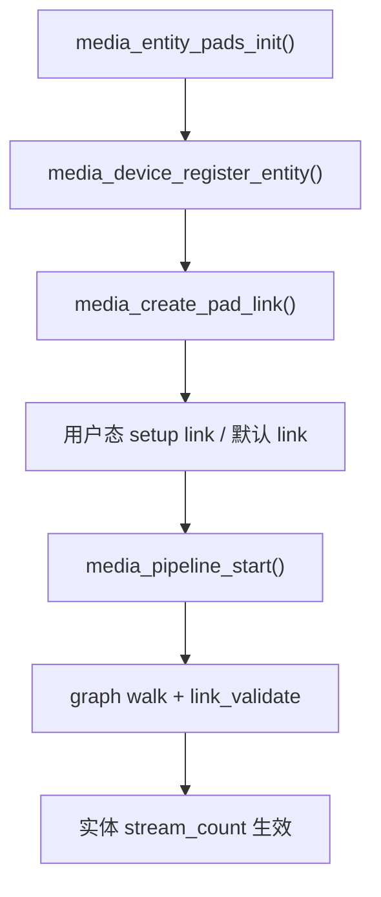

# `entity / pad / link / pipeline` 主线

## 导读

### 本章定位

这一章聚焦 Media Controller 图模型最核心的对象和流程，重点说明一个管线型驱动怎样把 `entity`、`pad`、`link` 建起来，再把这些已启用的 link 组织成一条真正可运行的 pipeline。

### 核心对象

- `struct media_entity`
  - 图节点对象
- `struct media_pad`
  - 节点端口对象
- `struct media_link`
  - pad-to-pad 连接对象
- `struct media_pipeline`
  - 当前活动 pipeline 的运行时对象

### 关键函数

- `media_entity_pads_init()`
- `media_device_register_entity()`
- `media_create_pad_link()`
- `__media_entity_setup_link()`
- `media_pipeline_start() / media_pipeline_stop()`

### 主流程

建 entity -> 建 pad -> 建 link -> 切换 link 状态 -> graph walk -> `media_pipeline_start()` -> `link_validate` -> `media_pipeline_stop()`

## 1. 先抓四个关键词

Media Controller 这层最重要的四个概念是：

1. `entity`
2. `pad`
3. `link`
4. `pipeline`

它们分别回答的是：

- `entity`
  图里的一个节点
- `pad`
  节点上的输入/输出端口
- `link`
  两个 pad 之间的连接
- `pipeline`
  当前一次 streaming 涉及到的一整条已启用路径

## 2. `media_entity_pads_init()`
media_pad的定义可以看[[06-Media-Controller框架总览#9. Media Controller 的核心对象]]
源码：

- `drivers/media/mc/mc-entity.c:197`

>[!INFO]
```C fold:"media_entity_pads_init"
int media_entity_pads_init(struct media_entity *entity, u16 num_pads,
			   struct media_pad *pads)
{
	struct media_device *mdev = entity->graph_obj.mdev;
	unsigned int i;

	if (num_pads >= MEDIA_ENTITY_MAX_PADS)
		return -E2BIG;

	//填充entity的pad及其个数
	entity->num_pads = num_pads;
	entity->pads = pads;

	if (mdev)
		mutex_lock(&mdev->graph_mutex);

	//把entity跟pad绑定起来，并根据num_pads给每个pad一个编号
	for (i = 0; i < num_pads; i++) {
		pads[i].entity = entity;
		pads[i].index = i;
		if (mdev)
			media_gobj_create(mdev, MEDIA_GRAPH_PAD,
					&entity->pads[i].graph_obj);
	}

	if (mdev)
		mutex_unlock(&mdev->graph_mutex);

	return 0;
}
```
这个函数做的事情很直白：

- 记录 `entity->num_pads`
- 记录 `entity->pads`
- 为每个 pad 回填：
  - `pad->entity`
  - `pad->index`
- 如果 entity 已经属于某个 `mdev`，还会为 pad 创建 graph object

这一步的意义是：

**把pad编个序号放回去，把entity跟pad绑定起来，并根据num_pads给每个pad一个编号，把一个 entity 的输入输出端正式建模出来。**

## 3. `media_device_register_entity()`

源码：

- `drivers/media/mc/mc-device.c:616`

>[!INFO]
```C fold:"media_device_register_entity"
int __must_check media_device_register_entity(struct media_device *mdev,
					      struct media_entity *entity)
{
	struct media_entity_notify *notify, *next;
	unsigned int i;
	int ret;

	if (entity->function == MEDIA_ENT_F_V4L2_SUBDEV_UNKNOWN ||
	    entity->function == MEDIA_ENT_F_UNKNOWN)
		dev_warn(mdev->dev,
			 "Entity type for entity %s was not initialized!\n",
			 entity->name);

	/* Warn if we apparently re-register an entity */
	WARN_ON(entity->graph_obj.mdev != NULL);
	entity->graph_obj.mdev = mdev;
	INIT_LIST_HEAD(&entity->links);
	entity->num_links = 0;
	entity->num_backlinks = 0;

	ret = ida_alloc_min(&mdev->entity_internal_idx, 1, GFP_KERNEL);
	if (ret < 0)
		return ret;
	entity->internal_idx = ret;

	mutex_lock(&mdev->graph_mutex);
	mdev->entity_internal_idx_max =
		max(mdev->entity_internal_idx_max, entity->internal_idx);

	/* Initialize media_gobj embedded at the entity */
	media_gobj_create(mdev, MEDIA_GRAPH_ENTITY, &entity->graph_obj);

	/* Initialize objects at the pads */
	for (i = 0; i < entity->num_pads; i++)
		media_gobj_create(mdev, MEDIA_GRAPH_PAD,
			       &entity->pads[i].graph_obj);

	/* invoke entity_notify callbacks */
	list_for_each_entry_safe(notify, next, &mdev->entity_notify, list)
		notify->notify(entity, notify->notify_data);

	if (mdev->entity_internal_idx_max
	    >= mdev->pm_count_walk.ent_enum.idx_max) {
		struct media_graph new = { .top = 0 };

		/*
		 * Initialise the new graph walk before cleaning up
		 * the old one in order not to spoil the graph walk
		 * object of the media device if graph walk init fails.
		 */
		ret = media_graph_walk_init(&new, mdev);
		if (ret) {
			__media_device_unregister_entity(entity);
			mutex_unlock(&mdev->graph_mutex);
			return ret;
		}
		media_graph_walk_cleanup(&mdev->pm_count_walk);
		mdev->pm_count_walk = new;
	}
	mutex_unlock(&mdev->graph_mutex);

	return 0;
}
```

它把一个 entity 注册进 `media_device`，关键动作包括：

- 绑定 `entity->graph_obj.mdev`
- 初始化 entity 的 link 链表
- 分配内部索引 `internal_idx`
- 为 entity 自己创建 graph object
- 为 pads 创建 graph object
- 触发 `entity_notify`

这一层之后，entity 才真正成为媒体图的一部分。

这一步的意义是：
**就是注册graph object，graph object可以让entity视为媒体图的一个对象，通过上一步的pad_init，entity跟pad是绑在一起的，

media_device的定义可以看[[06-Media-Controller框架总览#9. Media Controller 的核心对象]]
media_device有struct media_pad* pads；struct list_head links；这两个结构体

## 4. `media_create_pad_link()`

源码：

- `drivers/media/mc/mc-entity.c:659`

>[!INFO]
```C {16,31,43} fold:"media_create_pad_link"
int media_create_pad_link(struct media_entity *source, u16 source_pad,
			 struct media_entity *sink, u16 sink_pad, u32 flags)
{
	struct media_link *link;
	struct media_link *backlink;

	if (WARN_ON(!source || !sink) ||
	    WARN_ON(source_pad >= source->num_pads) ||
	    WARN_ON(sink_pad >= sink->num_pads))
		return -EINVAL;
	if (WARN_ON(!(source->pads[source_pad].flags & MEDIA_PAD_FL_SOURCE)))
		return -EINVAL;
	if (WARN_ON(!(sink->pads[sink_pad].flags & MEDIA_PAD_FL_SINK)))
		return -EINVAL;

	link = media_add_link(&source->links);
	if (link == NULL)
		return -ENOMEM;
	
	//从 source entity 里取出第 source_pad 个 pad
	//从 sink entity 里取出第 sink_pad 个 pad
	//然后让这条 media_link 指向这两个具体 pad
	link->source = &source->pads[source_pad];
	link->sink = &sink->pads[sink_pad];
	link->flags = flags & ~MEDIA_LNK_FL_INTERFACE_LINK;

	/* Initialize graph object embedded at the new link */
	media_gobj_create(source->graph_obj.mdev, MEDIA_GRAPH_LINK,
			&link->graph_obj);

	/* Create the backlink. Backlinks are used to help graph traversal and
	 * are not reported to userspace.
	 */
	backlink = media_add_link(&sink->links);
	if (backlink == NULL) {
		__media_entity_remove_link(source, link);
		return -ENOMEM;
	}

	backlink->source = &source->pads[source_pad];
	backlink->sink = &sink->pads[sink_pad];
	backlink->flags = flags;
	backlink->is_backlink = true;

	/* Initialize graph object embedded at the new link */
	media_gobj_create(sink->graph_obj.mdev, MEDIA_GRAPH_LINK,
			&backlink->graph_obj);

	link->reverse = backlink;
	backlink->reverse = link;

	sink->num_backlinks++;
	sink->num_links++;
	source->num_links++;

	return 0;
}
```
这是搭媒体图最常见的函数。

它会做：

1. 检查 source/sink pad 合法性
2. 在 source 侧创建正向 link
3. 在 sink 侧创建 backlink
4. 建 graph object
5. 更新 `num_links` / `num_backlinks`

这里有个关键理解：

### 4.1 用户态看到的是“正向 link”

source pad -> sink pad

### 4.2 内核内部还会有 backlink

backlink 主要为了图遍历方便，通常不会直接暴露给用户态。

## 5. link flags 的意义

UAPI 定义：

- `include/uapi/linux/media.h:221`
  `MEDIA_LNK_FL_ENABLED`
- `include/uapi/linux/media.h:222`
  `MEDIA_LNK_FL_IMMUTABLE`

最常用的含义是：

- `ENABLED`
  这条 link 当前启用，可以参与数据流
- `IMMUTABLE`
  这条 link 的启用状态运行时不可改

很多 sensor 到 CSI 的固定连接会被设成：

- `MEDIA_LNK_FL_IMMUTABLE | MEDIA_LNK_FL_ENABLED`

## 6. `__media_entity_setup_link()`

源码：

- `drivers/media/mc/mc-entity.c:830`

>[!INFO]
```C fold:"__media_entity_setup_link"
int __media_entity_setup_link(struct media_link *link, u32 flags)
{
	const u32 mask = MEDIA_LNK_FL_ENABLED;
	struct media_device *mdev;
	struct media_entity *source, *sink;
	int ret = -EBUSY;

	if (link == NULL)
		return -EINVAL;

	/* The non-modifiable link flags must not be modified. */
	if ((link->flags & ~mask) != (flags & ~mask))
		return -EINVAL;

	if (link->flags & MEDIA_LNK_FL_IMMUTABLE)
		return link->flags == flags ? 0 : -EINVAL;

	if (link->flags == flags)
		return 0;

	source = link->source->entity;
	sink = link->sink->entity;

	if (!(link->flags & MEDIA_LNK_FL_DYNAMIC) &&
	    (source->stream_count || sink->stream_count))
		return -EBUSY;

	mdev = source->graph_obj.mdev;

	if (mdev->ops && mdev->ops->link_notify) {
		ret = mdev->ops->link_notify(link, flags,
					     MEDIA_DEV_NOTIFY_PRE_LINK_CH);
		if (ret < 0)
			return ret;
	}

	ret = __media_entity_setup_link_notify(link, flags);

	if (mdev->ops && mdev->ops->link_notify)
		mdev->ops->link_notify(link, flags,
				       MEDIA_DEV_NOTIFY_POST_LINK_CH);

	return ret;
}
```
当用户态通过 `MEDIA_IOC_SETUP_LINK` 试图改 link 状态时，最终会走到这里。

这一层只解决一个问题：

- **单条 link 现在能不能改**

它还不负责判断“整条 pipeline 能不能跑”；那是后面 `media_pipeline_start()` 的事情。

它会做几类关键检查：

### 6.1 非可修改 flag 不能变

除了 `MEDIA_LNK_FL_ENABLED` 之外，别的关键属性不能乱改。

### 6.2 immutable link 不能切换

如果 link 带 `MEDIA_LNK_FL_IMMUTABLE`，那就只能保持当前状态。

### 6.3 非 dynamic link 在 streaming 中不能改

如果 source 或 sink 已经 `stream_count > 0`，而 link 不是 dynamic 的，就会返回 `-EBUSY`。

这里最关键的不是“pipeline 可不可用”，而是：

- source entity 当前是否已经在一条活动 pipeline 里
- sink entity 当前是否已经在一条活动 pipeline 里

`stream_count > 0` 的含义是：

- 这个 entity 已经被某条正在运行的 pipeline 占用

所以这一句的实际意思是：

- **非 dynamic link 在活动 pipeline 运行期间不能改**

这正是很多 `media-ctl --links` 改链路时报 `busy` 的根本原因。

### 6.4 调 `link_notify` 和实体回调

它会：

- 调 `mdev->ops->link_notify()` 的 pre/post 回调
- 调 source entity 和 sink entity 的 `link_setup`

所以 link 状态变更不是简单改个位图，而是会通知整条链上的对象。

## 7. `media_graph_walk_*()` 是怎么遍历图的

源码：

- `drivers/media/mc/mc-entity.c:277`
  `media_graph_walk_init()`
- `drivers/media/mc/mc-entity.c:294`
  `media_graph_walk_start()`
- `drivers/media/mc/mc-entity.c:345`
  `media_graph_walk_next()`

它内部使用的是 **深度优先遍历**。

这一层开始，关注点已经不再是“改单条 link”，而是：

- 以某个 entity 为起点
- 当前有哪些 **enabled link**
- 沿这些 link 能走到哪些 entity

关键特点：

- 只会沿着 `ENABLED` link 走
- 已经访问过的 entity 不会重复进入
- backlink 让反向遍历也更容易

所以 `graph walk` 的意义是：

- 把“若干离散的 entity/link”变成“当前真正连通的一条图路径”

这套遍历逻辑是 pipeline 管理的底座。

## 8. `media_pipeline_start()`

源码：

- `drivers/media/mc/mc-entity.c:532`
  `media_pipeline_start()`
- `drivers/media/mc/mc-entity.c:407`
  `__media_pipeline_start()`

>[!INFO]
```C {11,16,18,22,68} fold:"__media_pipeline_start"
__must_check int __media_pipeline_start(struct media_entity *entity,
					struct media_pipeline *pipe)
{
	struct media_device *mdev = entity->graph_obj.mdev;
	struct media_graph *graph = &pipe->graph;
	struct media_entity *entity_err = entity;
	struct media_link *link;
	int ret;

	if (!pipe->streaming_count++) {
		ret = media_graph_walk_init(&pipe->graph, mdev);
		if (ret)
			goto error_graph_walk_start;
	}

	media_graph_walk_start(&pipe->graph, entity);

	while ((entity = media_graph_walk_next(graph))) {
		DECLARE_BITMAP(active, MEDIA_ENTITY_MAX_PADS);
		DECLARE_BITMAP(has_no_links, MEDIA_ENTITY_MAX_PADS);

		entity->stream_count++;

		if (entity->pipe && entity->pipe != pipe) {
			pr_err("Pipe active for %s. Can't start for %s\n",
				entity->name,
				entity_err->name);
			ret = -EBUSY;
			goto error;
		}

		entity->pipe = pipe;

		/* Already streaming --- no need to check. */
		if (entity->stream_count > 1)
			continue;

		if (!entity->ops || !entity->ops->link_validate)
			continue;

		bitmap_zero(active, entity->num_pads);
		bitmap_fill(has_no_links, entity->num_pads);

		list_for_each_entry(link, &entity->links, list) {
			struct media_pad *pad = link->sink->entity == entity
						? link->sink : link->source;

			/* Mark that a pad is connected by a link. */
			bitmap_clear(has_no_links, pad->index, 1);

			/*
			 * Pads that either do not need to connect or
			 * are connected through an enabled link are
			 * fine.
			 */
			if (!(pad->flags & MEDIA_PAD_FL_MUST_CONNECT) ||
			    link->flags & MEDIA_LNK_FL_ENABLED)
				bitmap_set(active, pad->index, 1);

			/*
			 * Link validation will only take place for
			 * sink ends of the link that are enabled.
			 */
			if (link->sink != pad ||
			    !(link->flags & MEDIA_LNK_FL_ENABLED))
				continue;

			ret = entity->ops->link_validate(link);
			if (ret < 0 && ret != -ENOIOCTLCMD) {
				dev_dbg(entity->graph_obj.mdev->dev,
					"link validation failed for '%s':%u -> '%s':%u, error %d\n",
					link->source->entity->name,
					link->source->index,
					entity->name, link->sink->index, ret);
				goto error;
			}
		}

		/* Either no links or validated links are fine. */
		bitmap_or(active, active, has_no_links, entity->num_pads);

		if (!bitmap_full(active, entity->num_pads)) {
			ret = -ENOLINK;
			dev_dbg(entity->graph_obj.mdev->dev,
				"'%s':%u must be connected by an enabled link\n",
				entity->name,
				(unsigned)find_first_zero_bit(
					active, entity->num_pads));
			goto error;
		}
	}

	return 0;

error:
	/*
	 * Link validation on graph failed. We revert what we did and
	 * return the error.
	 */
	media_graph_walk_start(graph, entity_err);

	while ((entity_err = media_graph_walk_next(graph))) {
		/* Sanity check for negative stream_count */
		if (!WARN_ON_ONCE(entity_err->stream_count <= 0)) {
			entity_err->stream_count--;
			if (entity_err->stream_count == 0)
				entity_err->pipe = NULL;
		}

		/*
		 * We haven't increased stream_count further than this
		 * so we quit here.
		 */
		if (entity_err == entity)
			break;
	}

error_graph_walk_start:
	if (!--pipe->streaming_count)
		media_graph_walk_cleanup(graph);

	return ret;
}
```

它的核心思路是：

1. 从某个起点 entity 开始 graph walk
2. 遍历所有沿 enabled link 可达的 entity
3. 每个 entity 的 `stream_count++`
4. 做 link validation
5. 确保 `MUST_CONNECT` pad 都被 enabled link 连上

这里才是“当前 pipeline 是否可运行”的真正检查点。

可以直接把它理解成：

- `setup_link()`
  - 修改单条 link 的启停状态
- `graph_walk`
  - 找出当前 enabled link 组成的连通路径
- `media_pipeline_start()`
  - 把这条路径正式标记成活动 pipeline，并检查它能不能跑

`stream_count++` 的意义也在这里：

- 一旦某个 entity 被纳入活动 pipeline
- 它的 `stream_count` 就会增加
- 后面再去改经过它的非 dynamic link，就可能在 `setup_link()` 里收到 `-EBUSY`

如果中途失败，就把已经加上的 `stream_count` 再回滚。

### 8.1 link 建好不等于可以起流

`media_create_pad_link()` 和 `MEDIA_IOC_SETUP_LINK` 只回答了两件事：

- 这两个 pad 之间是否存在连接对象
- 这条连接当前是否处于 `ENABLED`

但真正起流前，还缺一层很关键的工作：

- 每一级 `subdev` 的 pad format 是否已经设置好
- 每一跳 `source pad -> sink pad` 的格式是否匹配
- 模块内部如果会变换格式，变换前后是否合理

所以：

- `link` 建好
  - 说明图已经连起来
- `format` 协商完成
  - 说明图上每一跳传什么数据已经明确
- `media_pipeline_start()` 成功
  - 才说明这条图路径能真正用于 streaming

### 8.2 建图后的 format 设置主线

在管线型驱动里，真正协商的通常不是 `/dev/videoX` 上的最终像素格式，而是每个 `subdev` 的 **pad format**。

最常见的相关回调是：

- `enum_mbus_code`
  - 这个 pad 支持哪些总线格式
- `enum_frame_size`
  - 这个 pad 支持哪些尺寸
- `get_fmt`
  - 这个 pad 当前的 format 是什么
- `set_fmt`
  - 把这个 pad 的 format 设成什么
- `get_selection / set_selection`
  - crop / compose 这类区域配置

这条链通常按“逐跳”来理解：

```text
sensor source pad
    -> csi sink pad
    -> csi source pad
    -> isp sink pad
    -> isp source pad
    -> video node
```

每一跳都要问两个问题：

1. 上游 `source pad` 输出什么格式
2. 下游 `sink pad` 能不能接住这个格式

对直通型模块，常见情况是：

- sink pad format 和 source pad format 一致

对变换型模块，常见情况是：

- sink/source 可以不一致
- 但这种不一致必须符合模块能力

### 8.3 `TRY` 和 `ACTIVE` 要分开看

`subdev` pad format 经常有两套状态：

- `TRY`
  - 临时试配的格式
- `ACTIVE`
  - 真正用于硬件运行的格式

最容易混的点是：

- `TRY` 看起来已经对了
- 但驱动没有把 `ACTIVE` 正确更新
- 最后真正 `STREAMON` 用的仍然是旧格式

所以排查“协商是否正确”时，至少要分清：

- 当前看到的是试配格式
- 还是已经生效的运行格式

### 8.4 起流前通常怎么检查 format

最稳的方式不是只看头尾，而是逐跳看每一段 link：

1. `source entity` 的 source pad 当前输出什么
2. `sink entity` 的 sink pad 当前期待什么
3. 这两个 pad 是不是应该完全相同
4. 如果允许转换，转换是不是模块设计里支持的

除了 `mbus code / width / height`，还常常要连带看：

- crop / compose
- field
- colorspace 相关属性
- lane / 时钟 / link frequency
- sensor mode

表面看起来像“format 不对”的问题，很多时候其实是：

- crop 改了但 pad format 没同步
- sensor mode 切了但 source pad 没更新
- lane / 时钟配置和当前 format 不匹配

## 9. `link_validate` 为什么重要

在 `__media_pipeline_start()` 里，对每个 entity 会检查：

- 如果它实现了 `entity->ops->link_validate`
- 那么对 enabled 的 sink 端 link 调用校验

这通常用于确保：

- source pad format 和 sink pad format 匹配
- 分辨率、总线格式、lane 配置等没有冲突

这里要特别区分：

- `set_fmt()`
  - 属于协商过程
- `link_validate`
  - 属于启动前验收

也就是说，`link_validate` 通常不是重新协商格式，而是在问：

- 前面已经设置好的这组 pad format
- 对当前这条 enabled link 来说
- 现在到底能不能合法起流

所以：

- `media_pipeline_start()` 不只是“打个 streaming 标记”
- 它还承担了“启动前拓扑合法性检查”

这一节和前面几节连起来，完整关系就是：

1. `media_create_pad_link()`
   - 把 pad-to-pad 的连接对象建出来
2. `__media_entity_setup_link()`
   - 决定某条 link 当前是否启用，以及能不能修改
3. `media_graph_walk_*()`
   - 沿 enabled link 遍历当前图路径
4. `media_pipeline_start()`
   - 把这条路径变成活动 pipeline
5. `link_validate`
   - 检查这条 pipeline 上的格式和连接是否合法

所以“link 建好了”不等于“pipeline 一定可运行”。  
link 只是连接对象；真正把一组 enabled link 变成可运行 pipeline，并做合法性检查，是 `media_pipeline_start()` 和 `link_validate` 这一层完成的。

## 10. `media_pipeline_stop()`

源码：

- `drivers/media/mc/mc-entity.c:575` 左右

它和 start 相反：

1. 再次做 graph walk
2. 给所有参与 pipeline 的 entity `stream_count--`
3. 归零时清 `entity->pipe`
4. 最后清理 graph walk 资源

这就是为什么 pipeline 的 start/stop 必须成对出现。

## 11. 一个最典型的 host 驱动落地方式

像 `camss.c`、`xilinx-vipp.c` 这类 host 驱动，一般都会：

1. 初始化各 subdev/video entity 的 pads
2. 逐条 `media_create_pad_link()`
3. 注册 subdev 节点
4. 最后 `media_device_register()`

例如：

- `drivers/media/platform/qcom/camss/camss.c:777`
  sensor -> csiphy 建 link
- `drivers/media/platform/qcom/camss/camss.c:789`
  `v4l2_device_register_subdev_nodes()`
- `drivers/media/platform/qcom/camss/camss.c:793`
  `media_device_register()`

## 12. 一张图把流程串起来



## 13. 最容易踩的坑

### 13.1 pad 方向填反

source/sink pad 一旦建错，后面 link 创建就会直接失败。

### 13.2 只建 entity，不建 pad

这样媒体图里就只有“节点”，没有“端口”，等于拓扑不完整。

### 13.3 link 已启用但 format 不匹配

`media_pipeline_start()` 时会在 `link_validate` 阶段爆掉。

### 13.4 正在 streaming 时试图切换非 dynamic link

这类场景通常会收到 `-EBUSY`。

## 14. 一句话总结

Media Controller 的本质不是“多几个结构体”，而是把媒体设备从“单节点思维”提升成了“图结构思维”。  
按 `entity -> pad -> link -> pipeline` 这条主线看源码时，复杂 camera host 驱动会清楚很多。
