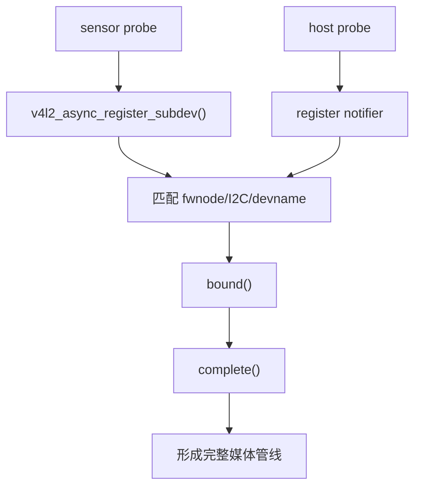

# `subdev` 与异步注册

## 导读

### 本章定位

这一章聚焦 `subdev` 对象本身，以及 `async notifier` 怎样把外部 sensor/bridge 和 host 匹配到一起。前一章的 `entity/pad/link` 负责建图，本章的重点是“先找到模块，再挂进 host 管理”。

### 核心对象

- `struct v4l2_subdev`
  - 管线内部功能模块对象
- `struct v4l2_async_subdev`
  - async 框架里的匹配描述对象
- `struct v4l2_async_notifier`
  - host 侧等待并绑定外部 subdev 的对象
- `sd.entity / media_pad`
  - `subdev` 进入 Media Controller 图模型时依赖的对象

### 关键函数

- `v4l2_subdev_init()`
- `v4l2_i2c_subdev_init()`
- `v4l2_async_register_subdev()`
- `v4l2_async_register_subdev_sensor_common()`
- `v4l2_device_register_subdev()`

### 主流程

初始化 `subdev` -> 初始化 `entity/pad` -> async 注册 -> host notifier 等待 -> 匹配成功 -> 挂到 `v4l2_dev->subdevs` -> 后续由 host 建图

## 1. 为什么 V4L2 要有 `subdev`

如果一个媒体设备只有一个简单 `/dev/videoX` 节点，那只靠 `video_device` 就够了。  
但真实相机链路往往是：

- sensor
- MIPI CSI-2 接收器
- ISP
- scaler
- capture DMA

这些模块经常不是一个驱动就能包完，所以 V4L2 引入了 `subdev` 模型。
#subdev

它的目标是：

- 把“媒体管线内部零件”抽象出来
- 让 host 驱动和 sensor/bridge 驱动解耦
- 允许异步绑定，而不是强依赖 probe 顺序

前面的 `01-04` 和 [[05-典型video节点驱动例子-sh_vou]]，主要是在单节点 `video_device` 语境下讲主线。  
进入这一章以后，开始正式切到：

- Media Controller
- `subdev`
- 异步绑定

这一侧的管线型模型。  
单节点主线可回看 [[02-video_device注册与open链路#2. 驱动侧通常怎么走]]。  
本章放在 [[06-Media-Controller框架总览]] 和 [[07-entity-pad-link-pipeline主线]] 之后。
因为 `subdev` 放到复杂管线里理解时，通常要先知道：

- `media_device`
- `media_entity`
- `media_pad`
- `media_link`

这些对象在 [[07-entity-pad-link-pipeline主线]] 里介绍。

### 1.1 本章核心对象

先把这一章真正依赖的三个对象分开：

- `struct v4l2_subdev`
  - 真正的模块对象
  - 关键看 `ops / internal_ops / flags / name / v4l2_dev / host_priv / entity`
- `struct v4l2_async_subdev`
  - async 匹配描述对象
  - 关键看“匹配谁”的那组 match 信息，例如 fwnode 匹配键
- `struct v4l2_async_notifier`
  - host 侧管理等待列表和完成回调的对象
  - 关键看“等谁”“匹配成功后做什么”

这一章和上一章的联动点在于：

- `v4l2_subdev`
  - 解决模块对象和 host 归属关系
- `sd.entity / pad`
  - 解决这个模块进入媒体图以后怎么表示和怎么连线

### 1.2 三个对象的职责分工

这一章最容易混的地方，不是函数调用本身，而是三个对象各自站在哪一层：

- `v4l2_subdev`
  - 真正的模块对象
  - 代表 sensor / bridge / CSI / ISP 这类管线内部模块
  - 最终会挂到某个 `v4l2_device->subdevs`
- `v4l2_async_subdev`
  - 匹配描述对象
  - 不代表一个真正工作的模块，而是代表“host 现在等的是谁”
  - 它通常挂在某个 notifier 下面，保存 fwnode / I2C / devname 这类匹配键
- `v4l2_async_notifier`
  - host 侧匹配管理对象
  - 负责维护等待项、调用 `bound()`、在全部匹配完成后调用 `complete()`

可以先把三者关系压成下面这条线：

```text
host 先准备 notifier
-> notifier 里挂多个 async_subdev 匹配描述
-> subdev 驱动把真正的 sd 注册进 async 框架
-> 框架拿 sd 去和 notifier 里的 async_subdev 做匹配
-> 匹配成功后再把 sd 挂进 host 的 v4l2_dev->subdevs
```

### 1.3 `v4l2_subdev` 在异步路径里重点看哪些成员

这一章不需要把 `struct v4l2_subdev` 所有字段再展开一遍，但异步路径里有几项需要特别记住：

- `ops`
  - 模块本身的操作集
- `dev`
  - 对应的底层设备，常见就是 `&client->dev`
- `fwnode`
  - async 匹配时常用的设备描述入口
- `v4l2_dev`
  - 当前归属的 host，初始化时为空，匹配成功后才指向目标 `v4l2_device`
- `list`
  - 挂到 `v4l2_dev->subdevs` 的链表节点
- `async_list`
  - async 框架内部等待和流转用的链表节点
- `asd`
  - 当前匹配到的那个 `v4l2_async_subdev`
- `subdev_notifier`
  - 当本身还要继续管理下级 subdev 时使用
- `entity`
  - 进入 Media Controller 图模型时对应的 entity

这里可以先把两条链表关系分开：

- `list`
  - 说明这个 `subdev` 已经正式归某个 host 管理
- `async_list`
  - 说明这个 `subdev` 还在 async 框架里等待匹配或流转

### 1.4 `v4l2_async_subdev` 在异步路径里重点看哪些成员

`v4l2_async_subdev` 的定位不是“模块对象”，而是“匹配模板”。

这一章理解它，重点只需要抓住三类信息：

- 匹配类型
  - 例如按 fwnode、I2C、devname 这类方式匹配
- 匹配键
  - 例如 `match.fwnode`
  - 这决定 notifier 在等谁
- 链表归属
  - 它本身挂在 notifier 的等待集合里
  - 匹配成功后，`sd->asd` 会反向指到它

所以 `async_subdev` 回答的问题是：

- host 现在在等哪一个外部模块
- 用什么键去认这个模块

而不回答：

- 这个模块本身的寄存器、格式、streaming 怎么做

那些仍然属于 `v4l2_subdev` 自己。

### 1.5 `v4l2_async_notifier` 在异步路径里重点看哪些成员

`v4l2_async_notifier` 是 host 侧真正的“协调者”。

这一章理解它，重点抓住下面几项就够用：

- 等待集合
  - host 当前期待绑定的 `async_subdev` 集合
- `bound()`
  - 某个 `subdev` 匹配成功后立即回调
- `complete()`
  - 当前 notifier 下的等待项全部匹配完成后回调
- `unbind()`
  - 解绑和清理时回调
- 归属关系
  - 它最终会挂到某个 `v4l2_device`

所以 notifier 回答的问题是：

- host 在等谁
- 谁先到达时先记下来
- 全部到齐后什么时候进入建图阶段

## 2. `v4l2_subdev_init()`

源码：

- `drivers/media/v4l2-core/v4l2-subdev.c:868`

>[!INFO]
```C fold:"v4l2_subdev_init"
void v4l2_subdev_init(struct v4l2_subdev *sd, const struct v4l2_subdev_ops *ops)
{
	INIT_LIST_HEAD(&sd->list);
	BUG_ON(!ops);
	sd->ops = ops;
	sd->v4l2_dev = NULL;
	sd->flags = 0;
	sd->name[0] = '\0';
	sd->grp_id = 0;
	sd->dev_priv = NULL;
	sd->host_priv = NULL;
#if defined(CONFIG_MEDIA_CONTROLLER)
	sd->entity.name = sd->name;
	sd->entity.obj_type = MEDIA_ENTITY_TYPE_V4L2_SUBDEV;
	sd->entity.function = MEDIA_ENT_F_V4L2_SUBDEV_UNKNOWN;
#endif
}
```

它做的事情很朴素：

- 初始化链表头`struct list_head list`，
- 绑定 `ops`
- 清空 `v4l2_dev`，- 表示该 subdev 当前尚未归属任何 host，但`v4l2_dev`本身是还在的
- 清 flags/name/priv
- 初始化 media entity 的默认属性

可以把它理解成：

**把一个普通结构体，初始化成 V4L2 subdev 对象。**
#subdev
[[01-V4L2核心对象与驱动模型#4. `struct v4l2_subdev`]]
#结构体填充流程 
[[v4l2驱动总结#驱动初始化与退出函数]]
## 3. `v4l2_i2c_subdev_init()` 的角色

很多 sensor 是 I2C 设备，所以驱动 probe 时常见这句：

- `drivers/media/i2c/imx219.c:1394`
  `v4l2_i2c_subdev_init(&imx219->sd, client, &imx219_subdev_ops)`

```c
void v4l2_i2c_subdev_init(struct v4l2_subdev *sd, struct i2c_client *client,
			  const struct v4l2_subdev_ops *ops)
{
	v4l2_subdev_init(sd, ops);
	sd->flags |= V4L2_SUBDEV_FL_IS_I2C;
	/* the owner is the same as the i2c_client's driver owner */
	sd->owner = client->dev.driver->owner;
	sd->dev = &client->dev;
	/* i2c_client and v4l2_subdev point to one another */
	v4l2_set_subdevdata(sd, client);
	i2c_set_clientdata(client, sd);
	v4l2_i2c_subdev_set_name(sd, client, NULL, NULL);
}
```
这一步一般会同时做：

- `v4l2_subdev_init()`
- 绑定 `sd->dev`
- 绑定 `i2c_client`
- 设置名字和 owner

所以对 sensor 驱动来说，它通常是最常见的 subdev 初始化入口。

## 4. `struct v4l2_subdev_ops`

定义位置：

- `include/media/v4l2-subdev.h:749`
>[!INFOG]
```c
struct v4l2_subdev_ops {
	const struct v4l2_subdev_core_ops	*core;
	const struct v4l2_subdev_tuner_ops	*tuner;
	const struct v4l2_subdev_audio_ops	*audio;
	const struct v4l2_subdev_video_ops	*video;
	const struct v4l2_subdev_vbi_ops	*vbi;
	const struct v4l2_subdev_ir_ops		*ir;
	const struct v4l2_subdev_sensor_ops	*sensor;
	const struct v4l2_subdev_pad_ops	*pad;
};
```

这是 `subdev` 的回调表，总体按功能分组：

- `core`
- `tuner`
- `audio`
- `video`
- `vbi`
- `ir`
- `sensor`
- `pad`

对 camera sensor 来说，最常用的是：

- `core`
- `video`
- `pad`

比如 `imx219.c:1211`：

```c
static const struct v4l2_subdev_ops imx219_subdev_ops = {
    .core  = &imx219_core_ops,
    .video = &imx219_video_ops,
    .pad   = &imx219_pad_ops,
};
```

## 5. 为什么 sensor 驱动特别重视 `pad ops`

因为 sensor 往往不直接面向应用层 `VIDIOC_S_FMT`，而是通过媒体管线协商：

- 总线格式 `mbus code`
- 帧尺寸
- crop / selection
- sink/source pad format

所以 `pad ops` 往往比传统 `video ioctl ops` 更重要。

`imx219_pad_ops`：

- `drivers/media/i2c/imx219.c:1203` 左右
-
```c
static const struct v4l2_subdev_pad_ops imx219_pad_ops = {
	.enum_mbus_code = imx219_enum_mbus_code,
	.get_fmt = imx219_get_pad_format,
	.set_fmt = imx219_set_pad_format,
	.get_selection = imx219_get_selection,
	.enum_frame_size = imx219_enum_frame_size,
};
```

关键成员：

- `enum_mbus_code`
- `get_fmt`
- `set_fmt`
- `get_selection`
- `enum_frame_size`

## 6. `media_entity_pads_init()` 的意义

对于参与媒体拓扑的 subdev，通常会看到：

```c
media_entity_pads_init(&sd->entity, npads, pads);
```
比如 `imx219.c:1471` 附近。

>[!INFO]
```c fold："media_entity_pads_init"
int media_entity_pads_init(struct media_entity *entity, u16 num_pads,
			   struct media_pad *pads)
{
	struct media_device *mdev = entity->graph_obj.mdev;
	unsigned int i;

	if (num_pads >= MEDIA_ENTITY_MAX_PADS)
		return -E2BIG;

	entity->num_pads = num_pads;
	entity->pads = pads;

	if (mdev)
		mutex_lock(&mdev->graph_mutex);

	for (i = 0; i < num_pads; i++) {
		pads[i].entity = entity;
		pads[i].index = i;
		if (mdev)
			media_gobj_create(mdev, MEDIA_GRAPH_PAD,
					&entity->pads[i].graph_obj);
	}

	if (mdev)
		mutex_unlock(&mdev->graph_mutex);

	return 0;
}
```

它的作用是：

- 告诉 media framework 这个 subdev 有几个 pad
- 每个 pad 是 `SOURCE` 还是 `SINK`
- 后续媒体链路如何连接

如果没有 pad/entity，很多媒体管线信息就没法建立起来。

## 7. 为什么需要异步注册

在真实系统里：

- sensor 可能先 probe
- CSI host 可能后 probe
- 也可能反过来

如果强依赖 probe 顺序，驱动就会很脆弱。  
所以 V4L2 用 notifier 机制做异步匹配。

### 7.1 host 侧 notifier 一般先做什么

异步模型不是只在 sensor 侧调用一个 `v4l2_async_register_subdev()` 就结束。  
真正完整的异步模型有两条线同时进行：

- `subdev` 侧
  - 初始化 `sd`
  - 注册 `sd`
- host 侧
  - 初始化 notifier
  - 往 notifier 里加入等待项
  - 注册 notifier

host 侧最常见的三步是：

1. `v4l2_async_notifier_init()`
   - 把 notifier 初始化成可用对象
2. `v4l2_async_notifier_add_fwnode_subdev()` 或解析 DT helper
   - 往 notifier 里加入一个或多个等待项
   - 这些等待项本质上就是 `v4l2_async_subdev`
3. `v4l2_async_notifier_register()`
   - 把 notifier 正式交给 async 框架

到这里，host 侧才算真正进入“等待外部 subdev 到来”的状态。

### 7.2 这一章真正的两条并行主线

把 `subdev` 和 notifier 放到同一张时间线上，更容易看清后面的匹配点：

```text
subdev 侧:
初始化 sd
-> 初始化 entity/pad
-> v4l2_async_register_subdev(sd)

host 侧:
初始化 notifier
-> 添加 async_subdev 等待项
-> v4l2_async_notifier_register()

匹配点:
find_match()
-> match_notify()
-> bound()
-> try_complete()
-> complete()
```

## 8. `v4l2_async_register_subdev()`

源码：

- `drivers/media/v4l2-core/v4l2-async.c:750`

>[[!info]]
```C fold:"v4l2_async_register_subdev"
int v4l2_async_register_subdev(struct v4l2_subdev *sd)
{
	struct v4l2_async_notifier *subdev_notifier;
	struct v4l2_async_notifier *notifier;
	int ret;

	/*
	 * No reference taken. The reference is held by the device
	 * (struct v4l2_subdev.dev), and async sub-device does not
	 * exist independently of the device at any point of time.
	 */
	if (!sd->fwnode && sd->dev)
		sd->fwnode = dev_fwnode(sd->dev);

	mutex_lock(&list_lock);

	INIT_LIST_HEAD(&sd->async_list);

	list_for_each_entry(notifier, &notifier_list, list) {
		struct v4l2_device *v4l2_dev =
			v4l2_async_notifier_find_v4l2_dev(notifier);
		struct v4l2_async_subdev *asd;

		if (!v4l2_dev)
			continue;

		asd = v4l2_async_find_match(notifier, sd);
		if (!asd)
			continue;

		ret = v4l2_async_match_notify(notifier, v4l2_dev, sd, asd);
		if (ret)
			goto err_unbind;

		ret = v4l2_async_notifier_try_complete(notifier);
		if (ret)
			goto err_unbind;

		goto out_unlock;
	}

	/* None matched, wait for hot-plugging */
	list_add(&sd->async_list, &subdev_list);

out_unlock:
	mutex_unlock(&list_lock);

	return 0;

err_unbind:
	/*
	 * Complete failed. Unbind the sub-devices bound through registering
	 * this async sub-device.
	 */
	subdev_notifier = v4l2_async_find_subdev_notifier(sd);
	if (subdev_notifier)
		v4l2_async_notifier_unbind_all_subdevs(subdev_notifier);

	if (sd->asd)
		v4l2_async_notifier_call_unbind(notifier, sd, sd->asd);
	v4l2_async_cleanup(sd);

	mutex_unlock(&list_lock);

	return ret;
}
```
它的大致逻辑是：

1. 如果 `sd->dev` 存在，补上 `sd->fwnode`
2. 遍历当前系统中已经注册的 notifier
3. 查找有没有能匹配这个 subdev 的等待项
4. 匹配到了就调用 `bound/complete`
5. 如果暂时没人匹配，就把 subdev 挂到等待`subdevice_list`链表里

也就是说，这一步不是“简单登记一下”，而是：

- 尝试立即绑定
- 绑定不了就排队等待

常见链表[[v4l2驱动总结#核心队列（链表）的**总结日志**]]

### 8.1 `v4l2_async_subdev` 在这里怎么参与匹配

`v4l2_async_register_subdev(sd)` 这一条路径里，真正被拿来做比较的是：

- 当前到达的 `sd`
- notifier 里提前挂好的 `asd`

匹配点就是：

- `v4l2_async_find_match(notifier, sd)`

这一句的含义不是：

- 再创建一个新的 `async_subdev`

而是：

- 在 host 现有 notifier 的等待项里，找有没有哪个 `asd` 能和当前 `sd` 对上

如果匹配成功，就得到：

- 这个真实到达的模块是 `sd`
- host 原先等待它的模板是 `asd`

后面框架会把这组关系记下来，于是：

- `sd->asd`
  - 可以反向指到这次匹配到的 `asd`

这样 `subdev` 和“等待模板”之间就建立了关联。

### 8.2 `v4l2_async_notifier` 在这里做什么

在 `v4l2_async_register_subdev(sd)` 这条路径里，notifier 主要承担三件事：

1. 提供等待集合
   - 让框架知道 host 正在等哪些 `asd`
2. 提供回调入口
   - 匹配成功后要调哪个 `bound()`
   - 全部匹配完成后要调哪个 `complete()`
3. 提供归属上下文
   - 让框架知道匹配成功后该把 `sd` 挂到哪个 `v4l2_device`

所以 `notifier` 在这一章里的作用，不是“又一个等待链表”，而是：

- host 侧的匹配管理器

### 8.3 匹配成功后真正发生了什么

这一段是最容易被一笔带过的地方。

`v4l2_async_match_notify()` 做的不是单纯“通知一下 host”，而是先把管理关系补齐，再回调 host：

1. `v4l2_device_register_subdev(v4l2_dev, sd)`
   - 先把 `sd` 正式挂进 host 的 `v4l2_dev->subdevs`
2. 记录 `sd <-> asd` 的匹配关系
3. 调 notifier 的 `bound()`
4. 再尝试 `v4l2_async_notifier_try_complete()`
5. 如果当前 notifier 下所有等待项都匹配完成，再调 `complete()`

所以这里的顺序要特别记住：

- 不是先 `bound()` 再注册 `subdev`
- 而是先把 `sd` 纳入 host 管理，再进入 `bound()/complete()`

### 8.4 这一章里三者到底怎么协作

把 `subdev`、`async_subdev`、`notifier` 再压成一句最核心的话：

- `subdev`
  - 真正到达系统里的模块对象
- `async_subdev`
  - host 预先声明的匹配模板
- `notifier`
  - 维护模板、发起匹配、触发 `bound/complete` 的 host 管理器

三者一起工作，才形成这一章的完整异步模型。

## 9. `v4l2_async_register_subdev_sensor_common()`

源码：

- `drivers/media/v4l2-core/v4l2-fwnode.c:1340`
>[!INFO]
```c {20,24,33} fold:"v4l2_async_register_subdev_sensor_common"
int v4l2_async_register_subdev_sensor_common(struct v4l2_subdev *sd)
{
	struct v4l2_async_notifier *notifier;
	int ret;

	if (WARN_ON(!sd->dev))
		return -ENODEV;

	notifier = kzalloc(sizeof(*notifier), GFP_KERNEL);
	if (!notifier)
		return -ENOMEM;

	v4l2_async_notifier_init(notifier);

	ret = v4l2_async_notifier_parse_fwnode_sensor_common(sd->dev,
							     notifier);
	if (ret < 0)
		goto out_cleanup;

	ret = v4l2_async_subdev_notifier_register(sd, notifier); //链接-常见链表的notifier_list链表的入队函数
	if (ret < 0)
		goto out_cleanup;

	ret = v4l2_async_register_subdev(sd); //链接-常见链表的subdevice_list链表的入队函数
	if (ret < 0)
		goto out_unregister;

	sd->subdev_notifier = notifier;

	return 0;

out_unregister:
	v4l2_async_notifier_unregister(notifier); //链接-常见链表的subdevice_list链表的出队函数

out_cleanup:
	v4l2_async_notifier_cleanup(notifier);
	kfree(notifier);

	return ret;
}
```

这个 helper 很适合 camera sensor，用途是：

1. 分配 notifier
2. 从 fwnode / device tree 解析 sensor 常见连接信息
3. 注册 subdev notifier
4. 最后再调用 `v4l2_async_register_subdev(sd)`

所以 `imx219.c:1477` 直接调用它，能省掉一大段样板代码。


## 10. `imx219.c` 的 subdev 初始化流程
>[!TIP]
>总结：


>[!INFO]
```C {11,14,73,79,78,80,83,88} fold:"imx219_probe"
static int imx219_probe(struct i2c_client *client)
{
	struct device *dev = &client->dev;
	struct imx219 *imx219;
	int ret;

	imx219 = devm_kzalloc(&client->dev, sizeof(*imx219), GFP_KERNEL);
	if (!imx219)
		return -ENOMEM;

	v4l2_i2c_subdev_init(&imx219->sd, client, &imx219_subdev_ops);

	/* Check the hardware configuration in device tree */
	if (imx219_check_hwcfg(dev))
		return -EINVAL;

	/* Get system clock (xclk) */
	imx219->xclk = devm_clk_get(dev, NULL);
	if (IS_ERR(imx219->xclk)) {
		dev_err(dev, "failed to get xclk\n");
		return PTR_ERR(imx219->xclk);
	}

	imx219->xclk_freq = clk_get_rate(imx219->xclk);
	if (imx219->xclk_freq != IMX219_XCLK_FREQ) {
		dev_err(dev, "xclk frequency not supported: %d Hz\n",
			imx219->xclk_freq);
		return -EINVAL;
	}

	ret = imx219_get_regulators(imx219);
	if (ret) {
		dev_err(dev, "failed to get regulators\n");
		return ret;
	}

	/* Request optional enable pin */
	imx219->reset_gpio = devm_gpiod_get_optional(dev, "reset",
						     GPIOD_OUT_HIGH);

	/*
	 * The sensor must be powered for imx219_identify_module()
	 * to be able to read the CHIP_ID register
	 */
	ret = imx219_power_on(dev);
	if (ret)
		return ret;

	ret = imx219_identify_module(imx219);
	if (ret)
		goto error_power_off;

	/* Set default mode to max resolution */
	imx219->mode = &supported_modes[0];

	/* sensor doesn't enter LP-11 state upon power up until and unless
	 * streaming is started, so upon power up switch the modes to:
	 * streaming -> standby
	 */
	ret = imx219_write_reg(imx219, IMX219_REG_MODE_SELECT,
			       IMX219_REG_VALUE_08BIT, IMX219_MODE_STREAMING);
	if (ret < 0)
		goto error_power_off;
	usleep_range(100, 110);

	/* put sensor back to standby mode */
	ret = imx219_write_reg(imx219, IMX219_REG_MODE_SELECT,
			       IMX219_REG_VALUE_08BIT, IMX219_MODE_STANDBY);
	if (ret < 0)
		goto error_power_off;
	usleep_range(100, 110);

	ret = imx219_init_controls(imx219);
	if (ret)
		goto error_power_off;

	/* Initialize subdev */
	imx219->sd.internal_ops = &imx219_internal_ops;
	imx219->sd.flags |= V4L2_SUBDEV_FL_HAS_DEVNODE;
	imx219->sd.entity.function = MEDIA_ENT_F_CAM_SENSOR;

	/* Initialize source pad */
	imx219->pad.flags = MEDIA_PAD_FL_SOURCE;

	/* Initialize default format */
	imx219_set_default_format(imx219);

	ret = media_entity_pads_init(&imx219->sd.entity, 1, &imx219->pad);
	if (ret) {
		dev_err(dev, "failed to init entity pads: %d\n", ret);
		goto error_handler_free;
	}

	ret = v4l2_async_register_subdev_sensor_common(&imx219->sd);
	if (ret < 0) {
		dev_err(dev, "failed to register sensor sub-device: %d\n", ret);
		goto error_media_entity;
	}

	/* Enable runtime PM and turn off the device */
	pm_runtime_set_active(dev);
	pm_runtime_enable(dev);
	pm_runtime_idle(dev);

	return 0;

error_media_entity:
	media_entity_cleanup(&imx219->sd.entity);

error_handler_free:
	imx219_free_controls(imx219);

error_power_off:
	imx219_power_off(dev);

	return ret;
}
```

它非常值得当模板看：

1. `v4l2_i2c_subdev_init()`，主要是调用v4l2_i2c_subdev_init，多了一个i2c的绑定  #L11
2. 检查硬件配置 `imx219_check_hwcfg()` #L14
3. 上电、读 chip id
4. 初始化 controls   #L73
5. 设 `sd.internal_ops` #L78
6. 设 `sd.flags |= V4L2_SUBDEV_FL_HAS_DEVNODE` #L79
7. 设 `sd.entity.function = MEDIA_ENT_F_CAM_SENSOR` #L80
8. 设 source pad #L83
9. `media_entity_pads_init()` #L88
10. `v4l2_async_register_subdev_sensor_common()`

这条链说明：

- sensor 先把自己建模成一个可被绑定的 subdev
- 真正什么时候接到 host 上，由异步匹配决定
## 11. `subdev` 什么时候会变成 `/dev/v4l-subdevX`

这点很容易误解。

不是设置了：

```c
sd.flags |= V4L2_SUBDEV_FL_HAS_DEVNODE;
```

就会立刻出现设备节点。

还需要某个上层调用：

- `drivers/media/v4l2-core/v4l2-device.c:189`
  `__v4l2_device_register_subdev_nodes()`

或者它的封装 API。

这个函数会为带 `V4L2_SUBDEV_FL_HAS_DEVNODE` 的 subdev 分配一个 `video_device`，再调用 `__video_register_device(..., VFL_TYPE_SUBDEV, ...)`。

## 12. 主机侧一般怎么和 subdev 交互

常见方式有两种：

### 12.1 注册时绑定

host 通过 notifier 的 `bound()` 回调拿到 subdev 指针。

### 12.2 运行时调用

host 用：

```c
v4l2_subdev_call(sd, video, s_stream, 1);
```

或者：

```c
v4l2_device_call_until_err(&v4l2_dev, 0, video, s_stream, 1);
```

去通知整个管线开始或停止流。

## 13. 异步模型的核心价值



它把“谁先 probe”这个问题从驱动逻辑里拿掉了。

## 14. 最容易出问题的地方

### 14.1 DT/fwnode 信息不一致

匹配条件不对时，subdev 会一直留在等待链表里。

### 14.2 pad/entity 没初始化完整

后面媒体链路创建和格式协商会很别扭。

### 14.3 以为 sensor 自己会注册 `/dev/videoX`

大多数 sensor 驱动不会这么做，它通常只注册 `subdev`。

## 15. 一句话总结

`subdev` 负责描述媒体管线里的组件，`async notifier` 负责把这些组件在运行时拼起来。  
这也是为什么 camera 类 V4L2 驱动看起来总比普通字符设备驱动更“分层”。
