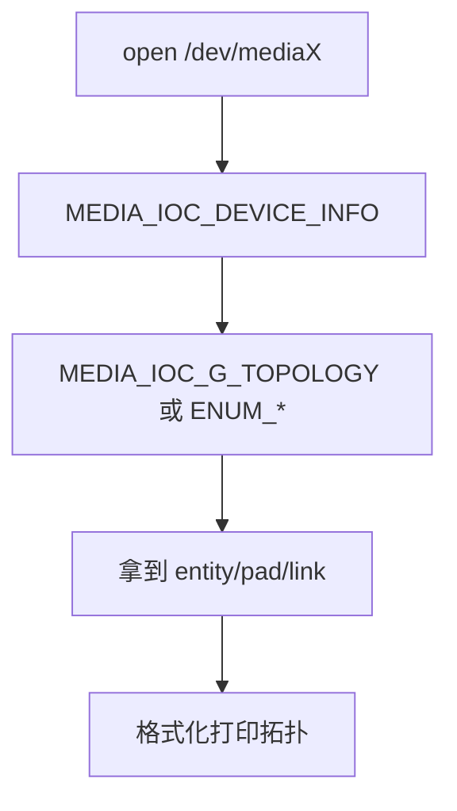
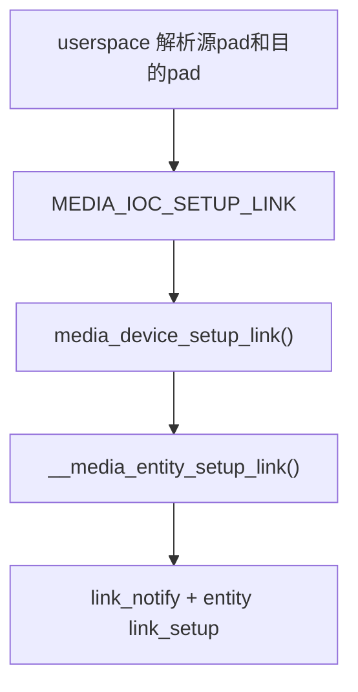

# `media-ctl` 背后的内核 UAPI

## 导读

### 本章定位

这一章聚焦 `/dev/mediaX` 这套 UAPI，核心问题是：`media-ctl` 看到的设备信息、拓扑、link 状态，在内核里分别落到哪些 ioctl、哪些数据结构、哪些处理函数。

### 核心对象

- `struct media_devnode`
  - `/dev/mediaX` 对应的字符设备节点对象
- `struct media_ioctl_info`
  - media ioctl 的静态派发表，跟ioctl一样都有一个静态表
- `struct media_link_desc / media_links_enum`
  - link 枚举与 link 设置相关的 UAPI 对象
- `struct media_v2_topology`
  - 整张媒体图拓扑的用户态视图

### 关键函数

- `media_device_ioctl()`
- `media_device_get_info()`
- `media_device_enum_entities()`
- `media_device_enum_links()`
- `media_device_setup_link()`
- `media_device_get_topology()`

### 主流程

用户态 `media-ctl` 发起 ioctl -> `/dev/mediaX` 进入 `media_device_ioctl()` -> 根据 `cmd` 查 `media_ioctl_info` -> 调具体处理函数 -> 返回设备信息、link 信息或整张拓扑图

## 1. 先把关系说清

`media-ctl` 是用户态工具，不在 Linux 内核树里。  
所以这里不解析它自己的 userspace 源码，而是解析：

- `media-ctl` 最终是通过哪些内核 ioctl 和 `/dev/mediaX` 交互的
- 每个常见命令在内核里大概落到哪里

核心 UAPI 定义在：

- `include/uapi/linux/media.h`

核心 ioctl 处理在：

- `drivers/media/mc/mc-device.c:438`
  `media_device_ioctl()`

## 2. `/dev/mediaX` 的 ioctl 派发表

在 `mc-device.c` 里，media device 的 ioctl 处理方式很像 V4L2 的 `video_ioctl2()`，也是一个统一派发表。

关键表项在：

- `drivers/media/mc/mc-device.c:418` 左右
  `static const struct media_ioctl_info ioctl_info[]`

对应关系大致是：

- `MEDIA_IOC_DEVICE_INFO`
  -> `media_device_get_info()`
- `MEDIA_IOC_ENUM_ENTITIES`
  -> `media_device_enum_entities()`
- `MEDIA_IOC_ENUM_LINKS`
  -> `media_device_enum_links()`
- `MEDIA_IOC_SETUP_LINK`
  -> `media_device_setup_link()`
- `MEDIA_IOC_G_TOPOLOGY`
  -> `media_device_get_topology()`

## 3. `media_device_ioctl()` 做了什么

源码：

- `drivers/media/mc/mc-device.c:438`

它的逻辑和 V4L2 那边很像：

1. 根据 `cmd` 找到 `ioctl_info`
2. 分配临时参数 buffer
3. 从用户态拷参
4. 必要时加 `graph_mutex`
5. 调具体处理函数
6. 把结果拷回用户态

这也是为什么 `media-ctl` 只是个工具壳，真正的图数据都在内核里。

## 4. `MEDIA_IOC_DEVICE_INFO`

UAPI 定义：

- `include/uapi/linux/media.h:372`

内核处理函数：

- `drivers/media/mc/mc-device.c:47`
  `media_device_get_info()`

它会返回：

- `driver`
- `model`
- `serial`
- `bus_info`
- `media_version`
- `driver_version`
- `hw_revision`

这基本对应 `media-ctl -p` 顶部那几行设备信息。

## 5. `MEDIA_IOC_ENUM_ENTITIES`

UAPI 定义：

- `include/uapi/linux/media.h:373`

内核处理函数：

- `drivers/media/mc/mc-device.c:84`
  `media_device_enum_entities()`

它做的事是：

1. 按 entity id 找到实体
2. 回填 `media_entity_desc`
3. 返回 name/function/flags/pads/links 等信息

这是老式“按实体逐个枚举”的接口。

## 6. `MEDIA_IOC_ENUM_LINKS`

UAPI 定义：

- `include/uapi/linux/media.h:374` 左右

内核处理函数：

- `drivers/media/mc/mc-device.c:134`
  `media_device_enum_links()`

它会针对某个 entity：

- 枚举它的 pads
- 枚举它发出的正向 links

注意：

- backlink 不会返回给用户态
- 用户态看到的依然是 source -> sink 的正常链路

## 7. `MEDIA_IOC_SETUP_LINK`

UAPI 定义：

- `include/uapi/linux/media.h:375`

内核处理函数：

- `drivers/media/mc/mc-device.c:197`
  `media_device_setup_link()`

它会：

1. 找 source entity、sink entity
2. 检查 pad index
3. 用 `media_entity_find_link()` 找到 link
4. 调 `__media_entity_setup_link(link, flags)`

所以用户态改 link，本质上是在改内核里的 `media_link.flags`。

## 8. `MEDIA_IOC_G_TOPOLOGY`

UAPI 定义：

- `include/uapi/linux/media.h:376`

内核处理函数：

- `drivers/media/mc/mc-device.c:227`
  `media_device_get_topology()`

这是新版更重要的接口。  
它一次性返回：

- entities
- interfaces
- pads
- links
- `topology_version`

相比老式 `ENUM_ENTITIES/ENUM_LINKS`，它更适合高效拿整张媒体图。

所以现在很多用户态工具更依赖 `G_TOPOLOGY` 这一路。

## 9. `media-ctl -p` 在内核里大概对应什么

虽然不同版本工具实现细节会变，但大方向通常是：

也就是说，`-p` 的本质是“读图”，不是“改图”。

## 10. `media-ctl --links` 在内核里大概对应什么

如果用户态要改链路启用状态，大方向通常是：

如果返回失败，常见原因包括：

- entity/pad 不存在
- link 不存在
- immutable link 不能改
- 正在 streaming，非 dynamic link 不能改

## 11. 为什么有时 `media-ctl` 改链路会失败

根因基本都能在 `__media_entity_setup_link()` 里找到：

- `flags` 非法
- immutable link
- 正在 stream 中
- 驱动自己的 `link_setup()` 回调拒绝
- `mdev->ops->link_notify()` 拒绝

这意味着：

- 不是工具自己“改失败”
- 而是内核媒体图明确不允许这么改

## 12. `/dev/mediaX` 和 `/dev/videoX` 的职责区别

### 12.1 `/dev/mediaX`

负责：

- 设备信息
- 拓扑信息
- link 配置

### 12.2 `/dev/videoX`

负责：

- `VIDIOC_*`
- 格式设置
- buffer streaming

把这两层分清以后，很多调试路径会清楚很多。

## 13. 一个很典型的调试顺序

如果 camera 图像不出来，推荐先这么看：

1. `media-ctl -p`
   看拓扑是否完整
2. 看 link 是否启用
3. 看 subdev format 是否协商正确
4. 再看 `/dev/videoX` 上的 `v4l2-ctl --stream-*`

也就是说，先确认图，再确认流。

## 14. 这篇最核心的直觉

`media-ctl` 看到的每一行拓扑描述，在内核里几乎都能落到：

- `media_device`
- `media_entity`
- `media_pad`
- `media_link`
- `MEDIA_IOC_*`

这就是它和纯 V4L2 视频节点调试最大的区别。
