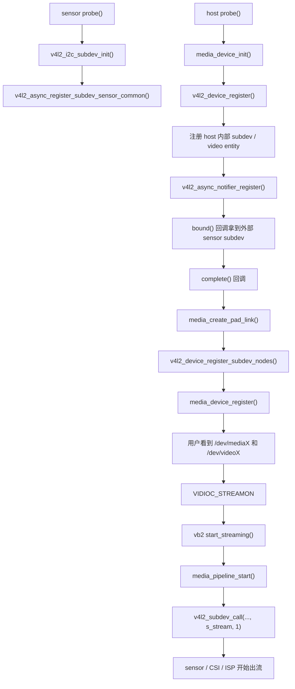

# 典型 host 驱动链路：以 `camss` 为例

## 导读

### 本章定位

这一章用 `camss` 把前面的 Media Controller、`subdev`、async 绑定、pipeline 启动这些主线全部落到一个完整 host 驱动里，重点是看 host 怎样把外部 sensor、内部模块和最终 `video_device` 串成一条可运行路径。

### 核心对象

- `struct device`
  - host 的底层真实设备对象
- `struct v4l2_device`
  - host 的 V4L2 管理对象
- `struct media_device`
  - host 对应的媒体图容器
- `struct v4l2_async_notifier`
  - 外部 sensor 绑定入口

### 关键函数

- `media_device_init()`
- `v4l2_device_register()`
- `v4l2_async_notifier_register()`
- notifier `bound()` / `complete()`
- `media_create_pad_link()`
- `media_pipeline_start()`

### 主流程

host probe 搭壳子 -> notifier 等待外部 subdev -> `bound()` 记关系 -> `complete()` 建图 -> `STREAMON` 时拉起 pipeline 和 `s_stream`

## 1. 为什么 host 细节不适合放在总览里

总览页主要回答：

- V4L2 大体分几层
- `video_device` 和 `subdev` 有什么区别
- open/ioctl/streaming 的主线是什么

但 host 驱动内部链路通常会同时跨越：

- `v4l2_device`
- `v4l2_async_notifier`
- `media_device`
- `media_create_pad_link`
- `media_pipeline_start`
- `v4l2_subdev_call(..., s_stream, 1)`

这已经不是“总览级别”的内容了，单独用具体主线 host 驱动展开。
前置章节如下：

- [[06-Media-Controller框架总览]]
- [[07-entity-pad-link-pipeline主线]]
- [[08-subdev与异步注册]]
- [[09-典型subdev驱动例子-imx219]]
- [[10-media-ctl背后的内核UAPI]]

这里选用的例子是：

- `drivers/media/platform/qcom/camss/camss.c`
- `drivers/media/platform/qcom/camss/camss-video.c`

辅助参考：

- `drivers/media/platform/xilinx/xilinx-vipp.c`

## 2. host 驱动到底负责什么

站在系统结构上看，sensor 驱动只负责把自己作为一个 `subdev` 暴露出来。  
真正把外部 sensor、内部 CSI/ISP、DMA video node 串成一条可工作的采集路径的，是 host 驱动。

它通常要完成三件事：

1. 把自己内部模块建模成 entity/subdev/video node
2. 等外部 sensor 异步绑定成功
3. 在 `STREAMON` 时拉起整条 pipeline

## 3. 先看整条链



这条链最值得拆成三段来看：

- 绑定前
- 绑定完成
- 真正起流

### 3.1 从 host 视角把完整时间线拉直

1. `camss_probe()` 先拿到底层 `&pdev->dev`，保存为 `camss->dev`。这里的 `dev` 是 host 自己的 Linux 设备，不是外部 sensor。
2. `camss_of_parse_ports()` 遍历 host 自己 DT 里的 endpoint。
3. 在这一步里，一方面用 `of_graph_get_remote_port_parent()` 加 `v4l2_async_notifier_add_fwnode_subdev()` 把“等待哪个外部 sensor”写进 notifier；另一方面用 `camss_of_parse_endpoint_node()` 解析本地 endpoint，把 `csiphy_id`、`clock_lane`、`data_lanes`、`lane_polarities` 等 CSI-2 连接参数写进 `camss_async_subdev`。
4. `camss_init_subdevices()` 初始化 host 内部的 `csiphy / csid / ispif / vfe` 等模块对象。
5. `media_device_init()` 和 `v4l2_device_register()` 把 host 顶层容器搭起来。这里的 `v4l2_device_register()` 只是把 `camss->dev` 和 `camss->v4l2_dev` 关联起来，不是创建 `/dev/videoX`。
6. `camss_register_entities()` 注册 host 内部 entity/subdev/video node，并先建立内部链路：`csiphy -> csid -> ispif -> vfe`。
7. `v4l2_async_notifier_register()` 之后，host 开始等待外部 sensor subdev 到来。
8. 外部 sensor（例如 `imx219`）在自己的 `probe()` 里做 `v4l2_i2c_subdev_init()`，然后 `v4l2_async_register_subdev_sensor_common()`，进入 async 匹配流程。
9. 匹配成功后，async 框架会先调用 `v4l2_device_register_subdev(&camss->v4l2_dev, sd)`，也就是先把 sensor 纳入 host 管理；实现上表现为加入 `camss->v4l2_dev->subdevs` 链表。
10. `bound()` 阶段只记关系：根据 `csiphy_id` 找到目标 `csiphy`，把 `csiphy->cfg.csi2` 和 `subdev->host_priv` 补好。
11. `complete()` 阶段才真正建图：从 `v4l2_dev->subdevs` 找外部 sensor，建 `sensor -> csiphy` 的 pad link，再调用 `v4l2_device_register_subdev_nodes()` 和 `media_device_register()`。
12. 到这时 `/dev/mediaX` 才能看到完整拓扑，而更早注册出来的 `/dev/videoX` 这时才终于拥有完整的上游路径。
13. 用户态发出 `VIDIOC_STREAMON` 后，`camss-video.c` 的 `start_streaming()` 才会先 `media_pipeline_start()`，再沿着媒体图逐级 `v4l2_subdev_call(..., s_stream, 1)`，整条采集链真正开始出流。

### 3.2 理论上的全流程闭环

前面 `01-10` 如果已经串起来，这里可以把整套流程压成一条“从注册到传输再到回收”的理论主线：

#### 第一段：模块先各自注册

1. sensor 驱动先完成：
   - `v4l2_i2c_subdev_init()`
   - controls 初始化
   - `sd.entity` / `pad` 初始化
   - `v4l2_async_register_subdev_sensor_common()`
2. host 驱动先完成：
   - `media_device_init()`
   - `v4l2_device_register()`
   - 内部 `subdev / entity / video_device / vb2_queue` 初始化
   - host 内部固定链路建立
   - `v4l2_async_notifier_register()`  //

这一阶段结束时：

- sensor 已经是一个可匹配的 `subdev`
- host 已经把自己的壳子和内部骨架搭起来
- 但外部 sensor 还没真正接进 host 的图里

#### 第二段：async 匹配把外部模块挂进 host

3. async 框架按 fwnode / endpoint 信息匹配 host 和 sensor
4. 匹配成功后，先做 `v4l2_device_register_subdev(v4l2_dev, sd)`
5. 这时 sensor 进入 `v4l2_dev->subdevs`
6. `bound()` 只记录：
   - 这颗 sensor 接哪一路 host 输入
   - 这一路的 lane / 时钟 / bus 配置
7. `complete()` 才真正做：
   - `media_create_pad_link()`
   - `v4l2_device_register_subdev_nodes()`
   - `media_device_register()`

这一阶段结束时：

- 管理关系已经建立
- 拓扑关系也已经建立
- `/dev/mediaX` 可以看到完整图
- `/dev/videoX` 也终于拥有完整上游链路

#### 第三段：用户态先配置图和格式

8. 用户态通常会先通过 `/dev/mediaX` 做拓扑检查
   - 看 entity / pad / link 是否完整
   - 看哪些 link 已经 `ENABLED`
9. 用户态如果需要切换链路，会做 `MEDIA_IOC_SETUP_LINK`
10. 用户态或 host 驱动还会逐级做 format 协商：
   - `set_fmt / get_fmt`
   - `enum_mbus_code / enum_frame_size`
   - 必要时带上 crop / compose / selection

这一阶段真正确认的是：

- 哪条路径参与采集
- 每一级 `source pad -> sink pad` 传什么格式
- 这些格式在模块内部是否合理

#### 第四段：用户态配置视频节点并准备 buffer

11. 应用打开 `/dev/videoX`
12. `open` 路径经过：
   - `v4l2_fops.open`
   - `v4l2_open()`
   - `vdev->fops->open`
13. 用户态在 `/dev/videoX` 上做：
   - `QUERYCAP`
   - `ENUM_FMT / G_FMT / S_FMT`
14. 然后开始 buffer 路径：
   - `REQBUFS`
   - `QUERYBUF`
   - `QBUF`

这一阶段结束时：

- video node 的用户态配置已经完成
- `vb2_queue` 已经建立
- 一批 buffer 已经进入队列，等待真正起流

#### 第五段：`STREAMON` 真正把整条链拉起来

15. 用户态发出 `VIDIOC_STREAMON`
16. 路径先进入：
   - `v4l2_ioctl()`
   - `video_ioctl2()`
   - `v4l2_ioctl_ops->vidioc_streamon`
   - `vb2_ioctl_streamon`
   - `vb2_core_streamon`
17. 然后到驱动自己的 `start_streaming()`
18. `start_streaming()` 里通常会先调 `media_pipeline_start()`
19. `media_pipeline_start()` 会做：
   - graph walk
   - `stream_count++`
   - `link_validate`
   - `MUST_CONNECT` 检查
20. 这一步成功后，host 才会沿媒体图逐级：
   - `v4l2_subdev_call(..., s_stream, 1)`

这一阶段结束时：

- sensor 开始出流
- CSI / ISP / DMA 开始工作
- 整条 pipeline 进入活动状态

#### 第六段：数据真正传到用户态

21. 数据路径开始实际流动：

```text
sensor
  -> csiphy / csi
  -> isp / scaler / vfe
  -> DMA
  -> vb2 buffer
```

22. 硬件处理完成后，驱动中断里会：
   - 取出当前 active buffer
   - 写入 sequence / timestamp
   - `vb2_buffer_done()`
23. 用户态 `DQBUF` 才能真正拿到已经完成的一帧
24. 后续进入循环：
   - `DQBUF`
   - 处理数据
   - `QBUF`
   - 下一帧继续

这一阶段就是最终的视频传输过程：

- 上游模块连续出流
- host 负责搬运到内存
- 应用通过 `DQBUF/QBUF` 循环收发 buffer

#### 第七段：`STREAMOFF` 和收尾

25. 用户态发出 `VIDIOC_STREAMOFF`
26. 路径进入：
   - `vb2_core_streamoff`
   - 驱动自己的 `stop_streaming()`
27. host 再沿图逐级：
   - `v4l2_subdev_call(..., s_stream, 0)`
28. 停止 DMA / CSI / sensor
29. 归还仍在驱动手里的 buffer
30. `media_pipeline_stop()` 让相关 entity 的 `stream_count--`

到这里，完整闭环结束。

#### 一句话收束

前面各章合起来，理论上的整条主线就是：

```text
subdev 注册
-> host 注册
-> async 匹配
-> pad/link 建图
-> format 协商
-> video node 配置
-> REQBUFS/QBUF
-> STREAMON
-> media_pipeline_start
-> s_stream(1)
-> DMA / IRQ / vb2_buffer_done
-> DQBUF/QBUF 循环
-> STREAMOFF
-> pipeline_stop
```


## 4. 第一段：绑定前，host 先把自己的壳子搭起来

host 驱动在 `probe()` 里，通常会先做这些事情：

- `media_device_init()`
- `v4l2_device_register()`
- 注册自己内部的 subdev、DMA video entity、pads、links 的基础对象
- `v4l2_async_notifier_register()`

在 `camss.c` 里可以看到：

- `drivers/media/platform/qcom/camss/camss.c:882`
  `media_device_init(&camss->media_dev)`
- `drivers/media/platform/qcom/camss/camss.c:885`
  `v4l2_device_register(camss->dev, &camss->v4l2_dev)`
- `drivers/media/platform/qcom/camss/camss.c:898`
  `v4l2_async_notifier_register(&camss->v4l2_dev, &camss->notifier)`

这时候 host 自己的框架已经起来了，但还没和外部 sensor 拼成完整采集链。

### 4.1 这一阶段的重点理解

host 并不是“等 sensor 来了再开始初始化自己”，而是：

- 先把自己的框架、媒体图容器、内部节点都准备好
- 然后把自己挂到 async notifier 上等待外部 subdev

这样外部 sensor 什么时候 probe 成功，host 都能接住。

## 5. 第二段：`bound()` 只记关系，`complete()` 才真正建图

当外部 sensor subdev 到位后，async notifier 一般会走两步。

### 5.1 `bound()`

在 `camss.c` 里：

- `drivers/media/platform/qcom/camss/camss.c:736`
  `camss_subdev_notifier_bound()`

它做的事情比较轻：

- 在进入 `bound()` 之前，async 框架已经先通过 `v4l2_device_register_subdev()` 把外部 sensor 注册到 host 的 `v4l2_device`，实现上表现为加入 `v4l2_dev->subdevs` 链表
- 从 `asd` 里拿到 sensor 所属接口信息
- 找到对应的 `csiphy`
- 把 `subdev->host_priv` 指向 host 内部对象

也就是说，`bound()` 更多是在说：

- “这个外部 sensor 归属当前 host”
- “它应该接到 host 的哪个输入口上”

它通常不会在这里立刻注册 `/dev/videoX`，也不会马上把整张媒体图宣布完成。
换句话说，真正的“纳入 host 管理”其实发生在 `bound()` 之前，而 `bound()` 更像是在补齐 host 私有连线关系。

### 5.2 `complete()`

在 `camss.c` 里：

- `drivers/media/platform/qcom/camss/camss.c:752`
  `camss_subdev_notifier_complete()`

这一步才表示：

- 这次等待的 subdev 都到齐了
- 可以正式把媒体图拼完整

它的关键动作是：

1. 枚举 `v4l2_dev->subdevs`
2. 找出外部 sensor 的 source pad
3. 用 `media_create_pad_link()` 把 sensor 接到 host 内部输入端
4. `v4l2_device_register_subdev_nodes()`
5. `media_device_register()`

对应位置：

- `drivers/media/platform/qcom/camss/camss.c:777`
  `media_create_pad_link(sensor, i, input, MSM_CSIPHY_PAD_SINK, ...)`
- `drivers/media/platform/qcom/camss/camss.c:789`
  `v4l2_device_register_subdev_nodes(&camss->v4l2_dev)`
- `drivers/media/platform/qcom/camss/camss.c:793`
  `media_device_register(&camss->media_dev)`

### 5.3 这一阶段的重点理解

host 驱动不是“拿到 sensor 就马上有一条能工作的图像链”。  
更准确的顺序是：

1. 先绑定关系
2. 再创建 link
3. 再暴露 `/dev/mediaX`
4. 最后才轮到真正 streaming

## 6. 第三段：`STREAMON` 以后才轮到 pipeline 和 `s_stream`

就算 `/dev/videoX` 和 `/dev/mediaX` 都已经能看到了，也不代表 sensor 已经开始出图。

真正进入数据面的关键时刻，是 `VIDIOC_STREAMON`。

在 `camss-video.c` 里，可以看到这两个很关键的点：

- `drivers/media/platform/qcom/camss/camss-video.c:445`
  `media_pipeline_start(&vdev->entity, &video->pipe)`
- `drivers/media/platform/qcom/camss/camss-video.c:466`
  `v4l2_subdev_call(subdev, video, s_stream, 1)`

这说明 host 驱动在 `start_streaming()` 阶段至少要做两件大事。

### 6.1 `media_pipeline_start()`

这一步的作用不是“启动 DMA”，而是：

- 以当前 video entity 为起点
- 沿 enabled links 遍历整条媒体图
- 检查 link 是否合法
- 给整条路径上的 entity 增加 `stream_count`

也就是说，它是在确认：

- 当前拓扑是闭合且可工作的
- 当前配置允许真正开始流动数据

### 6.2 `v4l2_subdev_call(..., s_stream, 1)`

这一步才是在告诉链路上的 subdev：

- sensor，开始出流
- CSI/ISP，开始接流
- 整条采集链进入工作状态

也就是说，host 驱动承担的是“统一拉起整条管线”，而不是只管自己这一个 video node。

## 7. host 驱动内部链路为什么比 sensor 驱动复杂

sensor 驱动通常只负责：

- 自己的寄存器
- 自己的格式
- 自己的 controls
- 自己的 `s_stream`

而 host 驱动要同时承担：

- 媒体图构建
- 外部 subdev 匹配
- 内部模块组织
- video node 暴露
- pipeline 检查
- streaming 拉起

所以 host 驱动经常横跨：

- V4L2 core
- async notifier
- Media Controller
- vb2

## 8. 用 `xilinx-vipp.c` 对照会更清楚

`xilinx-vipp.c` 也走的是相似思路：

- `drivers/media/platform/xilinx/xilinx-vipp.c:570`
  `media_device_init(&xdev->media_dev)`
- `drivers/media/platform/xilinx/xilinx-vipp.c:573`
  `v4l2_device_register(xdev->dev, &xdev->v4l2_dev)`
- `drivers/media/platform/xilinx/xilinx-vipp.c:535`
  `v4l2_async_notifier_register(&xdev->v4l2_dev, &xdev->notifier)`
- `drivers/media/platform/xilinx/xilinx-vipp.c:306`
  `v4l2_device_register_subdev_nodes(&xdev->v4l2_dev)`
- `drivers/media/platform/xilinx/xilinx-vipp.c:310`
  `media_device_register(&xdev->media_dev)`

它和 `camss` 的差别主要在硬件拓扑细节上，但整体组织思路是一致的。

## 9. 读 host 驱动时的抓手

顺着源码阅读时，可按下面顺序展开：

1. `probe()` 里先看 `media_device_init()`、`v4l2_device_register()`
2. 找 `v4l2_async_notifier_register()`
3. 找 notifier 的 `bound()` 和 `complete()`
4. 找 `media_create_pad_link()`
5. 找 `v4l2_device_register_subdev_nodes()` 和 `media_device_register()`
6. 再找 video 节点 `start_streaming()`
7. 最后看 `media_pipeline_start()` 和 `v4l2_subdev_call(..., s_stream, 1)`

## 10. 一句话总结

host 驱动真正做的不是“注册一个视频节点”，而是：

- 把外部 sensor 和内部 CSI/ISP/DMA 组织成一张媒体图
- 在图准备完整后对外暴露节点
- 在 `STREAMON` 时拉起整条 pipeline

这也是为什么 host 驱动通常是整条 camera 链里最复杂的一层。
