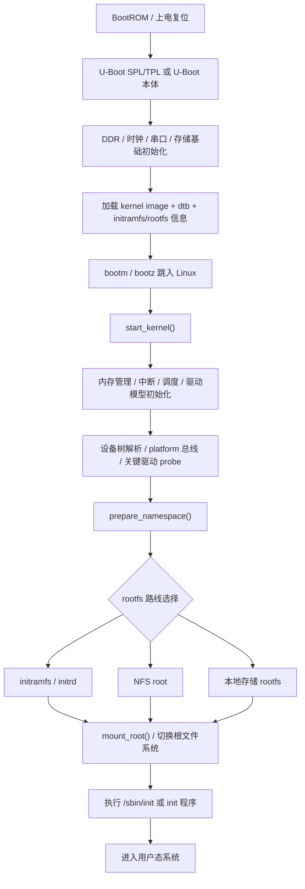

# 内核移植学习项目总览

## 学习目标

- 建立 `U-Boot -> Linux 内核 -> 根文件系统 -> 用户态` 的完整启动链
- 区分“能启动”和“能稳定工作”之间的层次差异
- 建立一套适合板级 Bring-up 的阅读顺序和调试顺序
- 为后续具体板子的移植、裁剪、联调预留稳定框架
- 用达标检查清单判断是否已经能独立定位启动链问题

## 导读

### 本章定位

这一章是“内核移植学习项目”的总入口，负责先把启动链、对象层、源码层、交接物和阅读顺序搭起来。

### 核心对象

- `U-Boot`
  - 第一阶段引导程序，负责硬件早期初始化、加载内核和设备树
- `zImage / Image / uImage`
  - Linux 内核镜像形式
- `dtb`
  - 板级硬件描述
- `rootfs`
  - 根文件系统内容与挂载入口
- `bootargs`
  - 把控制台、根文件系统、内存布局等信息交给内核

### 关键函数

- `board_init_f()` / `board_init_r()`
- `bootm` / `bootz`
- `start_kernel()`
- `rest_init()`
- `kernel_init()`
- `prepare_namespace()`
- `mount_root()`

### 主流程

上电复位 -> `U-Boot` 初始化 -> 加载内核/设备树 -> 跳入内核入口 -> 内核初始化驱动与内存 -> 按 rootfs 路线挂载根文件系统 -> 启动 `init`

## 1. 这一套学习项目解决什么问题

这套笔记不只关心“编出来能不能跑”，而是关心：

1. 板子为什么能从 BootROM 走到 `U-Boot`
2. `U-Boot` 为什么能把内核和 `dtb` 正确交给 Linux
3. 内核为什么能从解压、建内存、建驱动模型一路走到 `init`
4. 根文件系统为什么能被正确挂载并进入用户态
5. 如果中间某一层失败，应该沿哪条链往回追

## 2. 新人先读：最小概念词典

这一节先把后面反复出现的词讲成“人话”。读后面章节前，先把这些词建立成脑内地图，不需要一次背熟，但至少要知道它们属于哪一层。

| 概念 | 先这样理解 | 属于哪一层 |
| --- | --- | --- |
| BootROM | 芯片内部固化的一小段启动代码，上电后最先运行，负责找启动介质并加载下一段程序 | SoC 固化启动 |
| SPL / TPL | 比完整 U-Boot 更小的早期引导程序，常用来初始化 DDR，再加载完整 U-Boot | U-Boot 早期 |
| U-Boot | Linux 之前运行的引导程序，负责早期硬件初始化、加载内核和传启动参数 | Bootloader |
| SRAM | 芯片内部很小但上电即可用的内存，早期代码常先在这里运行 | 早期硬件 |
| DDR | 板上的大容量内存，初始化成功后 U-Boot 和 Linux 才能稳定运行 | 早期硬件 |
| image / zImage / uImage | Linux 内核镜像的不同形式，可以先粗略理解成“要被启动的内核文件” | U-Boot -> Linux |
| dtb | Device Tree Blob，设备树编译后的二进制文件，用来告诉 Linux 板上有哪些硬件 | U-Boot -> Linux |
| bootargs | U-Boot 传给 Linux 的启动参数字符串，例如控制台、rootfs 位置、init 路径 | U-Boot -> Linux |
| rootfs | 根文件系统，Linux 进入用户态后看到的 `/` 目录内容 | Linux -> 用户态 |
| initramfs / initrd | 放在内存里的临时或早期根文件系统，常用于调试或早期启动 | rootfs |
| NFS root | rootfs 放在 PC/NFS 服务器上，板子启动后通过网络挂载 | rootfs |
| 本地存储 rootfs | rootfs 放在 eMMC、SD、NAND、SPI flash 等板载介质上 | rootfs |
| init | 第一个用户态进程，常见路径是 `/sbin/init`，BusyBox 系统里也可能由 BusyBox 提供 | 用户态 |
| driver model | Linux 管理 device、driver、bus 的通用模型，决定设备和驱动如何匹配 | Linux 内核 |
| platform device / platform driver | Linux 里描述板载设备和对应驱动的一种常见模型，很多 DTS 节点会变成 platform device | Linux 内核 |
| probe | device 和 driver 匹配成功后，内核调用驱动的初始化入口 | 驱动模型 |
| initcall | 内核启动时按等级自动调用的一批初始化函数，很多内建驱动通过它注册 | Linux 内核 |
| VFS | Virtual Filesystem，Linux 统一管理文件系统挂载和访问的抽象层 | rootfs |
| MTD / UBI / UBIFS | 常见 flash 存储相关层次，NAND/NOR 场景下 rootfs 经常会碰到 | 存储/rootfs |

新人读这套项目时，先抓住一条主线：`U-Boot` 负责把 Linux 需要的东西准备好，Linux 负责把硬件和驱动模型建起来，`rootfs` 负责让系统进入用户态。

## 3. 先看完整启动链

这张图不能只按“启动顺序”读，还要按“交接物”读：上一层准备什么，下一层在哪里消费它，失败时日志会停在哪一段。

## 4. 各层交接物

| 阶段 | 上一层交给下一层什么 | 下一层如何消费 | 常见失败信号 |
| --- | --- | --- | --- |
| `BootROM -> U-Boot` | 启动介质、片上 SRAM、初始执行入口 | `U-Boot` 开始最早硬件初始化 | 串口完全无输出、板子无明显启动迹象 |
| `U-Boot -> Linux` | kernel image、`dtb`、可选 initramfs、`bootargs` | Linux 入口解析启动参数和设备树，建立内存与驱动模型 | 跳内核后无输出、解压失败、早期 panic |
| `Linux -> rootfs` | `root=`、`rootfstype=`、`nfsroot=`、`rdinit=`、存储/网络驱动、块设备或 initramfs | `prepare_namespace()` / `mount_root()` 按 initramfs、NFS root 或本地存储路线找到并挂载根文件系统 | `VFS: Cannot open root device`、等待 root 设备、NFS mount 失败 |
| `rootfs -> 用户态` | `/sbin/init` 或 `init=` 指定程序、动态库、设备节点 | `run_init_process()` 执行第一个用户态进程 | `No init found`、动态库缺失、shell 起不来 |

后续每章都按这个口径展开：先说本层入口从哪里来，再说它消费什么资源，最后说它把什么交给下一层。

## 5. 阅读顺序

1. [[01-U-Boot启动与移植主线]]
2. [[02-Linux内核启动与移植主线]]
3. [[03-根文件系统构建与启动参数]]
4. [[04-板级Bring-up与启动链路联调]]
5. [[05-内核移植调试与工程问题问答]]
6. [[06-内核移植学习达标检查清单]]

其中 [[06-内核移植学习达标检查清单]] 既是学习目标，也是复盘标准。每学完一章，都应该回到第 `06` 章确认对应问题能不能独立回答。

## 6. 整个项目的学习节奏

### 6.1 第一段：先把启动链拉直

- `01-U-Boot启动与移植主线`
- `02-Linux内核启动与移植主线`
- `03-根文件系统构建与启动参数`

这一段先解决：

- 每一层负责什么
- 每一层把什么交给下一层
- 关键镜像、关键参数、关键入口函数分别是什么

### 6.2 第二段：再看板级联调

- `04-板级Bring-up与启动链路联调`

这一段重点解决：

- 一块新板子怎样从串口、DDR、时钟、存储一步步点亮
- `U-Boot`、内核、根文件系统的联调顺序应该怎样安排

### 6.3 第三段：最后回到工程问题问答

- `05-内核移植调试与工程问题问答`
- `06-内核移植学习达标检查清单`

这一段把常见故障现象重新按工程排查角度收束，并给出学完后的自检标准。

## 7. 按最新学习架构复盘时要问什么

每一章看完后，都按下面问题复盘：

- 当前入口是谁触发的，上游链路从哪里来
- 当前阶段消费了哪些交接物，例如 image、`dtb`、`bootargs`、rootfs、`init`
- 关键字段或参数从哪里来，后续被谁消费
- 如果涉及设备树，属性最终映射到哪个 Linux 对象、资源或驱动 probe
- 如果涉及存储或 rootfs，块设备、文件系统类型和 `init` 路径在哪里被解析
- 如果涉及中断、时钟、复位、串口、DDR，要能说明它们属于哪一层的 bring-up 基础资源
- 失败时能否先判断停在 `U-Boot`、Linux 早期、驱动 probe、rootfs 挂载，还是用户态启动

## 8. 最容易混淆的点

### 8.1 `U-Boot` 能启动，不等于内核一定能启动

`U-Boot` 主要保证：

- 串口可见
- DDR 可用
- 存储可读
- 内核镜像和 `dtb` 能被加载

但内核启动以后还要重新建立：

- 内存管理
- 中断体系
- 驱动模型
- 根文件系统挂载路径

### 8.2 内核起来，不等于系统已经可用

内核看到 `start_kernel()` 之后一路输出，只说明内核主线在跑。  
真正进入用户态，还取决于：

- `bootargs`
- 根文件系统位置
- `init` 程序
- 动态库和设备节点

### 8.3 根文件系统能挂载，不等于业务驱动已经正常

系统进入 shell 以后，仍然可能存在：

- 存储驱动未稳定
- 网络驱动未正常
- 时钟电源有问题
- 中断或 DMA 不工作

## 9. 这套笔记回答的问题

- `U-Boot`、内核、根文件系统三层各自解决什么问题
- 镜像、设备树、启动参数分别在哪一层发挥作用
- 新板 Bring-up 时，调试顺序应该怎样安排
- 看到串口卡死、内核 panic、根文件系统挂载失败时，应该先往哪一层回退
- 学完整套项目后，怎样判断自己已经具备独立移植和排查启动链问题的能力
