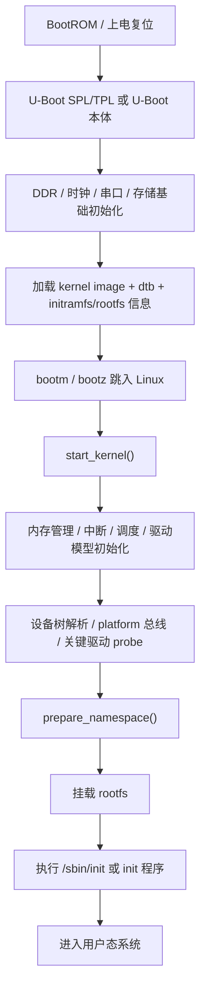

# 内核移植学习项目总览

## 学习目标

- 建立 `U-Boot -> Linux 内核 -> 根文件系统 -> 用户态` 的完整启动链
- 区分“能启动”和“能稳定工作”之间的层次差异
- 建立一套适合板级 Bring-up 的阅读顺序和调试顺序
- 为后续具体板子的移植、裁剪、联调预留稳定框架

## 导读

### 本章定位

这一章是“内核移植学习项目”的总入口，负责先把启动链、对象层、源码层和阅读顺序搭起来。

### 核心对象

- `U-Boot`
  - 第一阶段引导程序，负责硬件早期初始化、加载内核和设备树
- `zImage / Image / uImage`
  - Linux 内核镜像形式
- `dtb`
  - 板级硬件描述
- `rootfs`
  - 根文件系统内容与挂载入口
- `bootargs`
  - 把控制台、根文件系统、内存布局等信息交给内核

### 关键函数

- `board_init_f()` / `board_init_r()`
- `bootm` / `bootz`
- `start_kernel()`
- `rest_init()`
- `kernel_init()`
- `prepare_namespace()`
- `mount_root()`

### 主流程

上电复位 -> `U-Boot` 初始化 -> 加载内核/设备树 -> 跳入内核入口 -> 内核初始化驱动与内存 -> 挂载根文件系统 -> 启动 `init`

## 1. 这一套学习项目解决什么问题

这套笔记不只关心“编出来能不能跑”，而是关心：

1. 板子为什么能从 BootROM 走到 `U-Boot`
2. `U-Boot` 为什么能把内核和 `dtb` 正确交给 Linux
3. 内核为什么能从解压、建内存、建驱动模型一路走到 `init`
4. 根文件系统为什么能被正确挂载并进入用户态
5. 如果中间某一层失败，应该沿哪条链往回追

## 2. 先看完整启动链

## 3. 阅读顺序

1. [[01-U-Boot启动与移植主线]]
2. [[02-Linux内核启动与移植主线]]
3. [[03-根文件系统构建与启动参数]]
4. [[04-板级Bring-up与启动链路联调]]
5. [[05-内核移植调试与工程问题问答]]

## 4. 整个项目的学习节奏

### 4.1 第一段：先把启动链拉直

- `01-U-Boot启动与移植主线`
- `02-Linux内核启动与移植主线`
- `03-根文件系统构建与启动参数`

这一段先解决：

- 每一层负责什么
- 每一层把什么交给下一层
- 关键镜像、关键参数、关键入口函数分别是什么

### 4.2 第二段：再看板级联调

- `04-板级Bring-up与启动链路联调`

这一段重点解决：

- 一块新板子怎样从串口、DDR、时钟、存储一步步点亮
- `U-Boot`、内核、根文件系统的联调顺序应该怎样安排

### 4.3 第三段：最后回到工程问题问答

- `05-内核移植调试与工程问题问答`

这一章把常见故障现象重新按工程排查角度收束。

## 5. 最容易混淆的点

### 5.1 `U-Boot` 能启动，不等于内核一定能启动

`U-Boot` 主要保证：

- 串口可见
- DDR 可用
- 存储可读
- 内核镜像和 `dtb` 能被加载

但内核启动以后还要重新建立：

- 内存管理
- 中断体系
- 驱动模型
- 根文件系统挂载路径

### 5.2 内核起来，不等于系统已经可用

内核看到 `start_kernel()` 之后一路输出，只说明内核主线在跑。  
真正进入用户态，还取决于：

- `bootargs`
- 根文件系统位置
- `init` 程序
- 动态库和设备节点

### 5.3 根文件系统能挂载，不等于业务驱动已经正常

系统进入 shell 以后，仍然可能存在：

- 存储驱动未稳定
- 网络驱动未正常
- 时钟电源有问题
- 中断或 DMA 不工作

## 6. 这套笔记回答的问题

- `U-Boot`、内核、根文件系统三层各自解决什么问题
- 镜像、设备树、启动参数分别在哪一层发挥作用
- 新板 Bring-up 时，调试顺序应该怎样安排
- 看到串口卡死、内核 panic、根文件系统挂载失败时，应该先往哪一层回退
