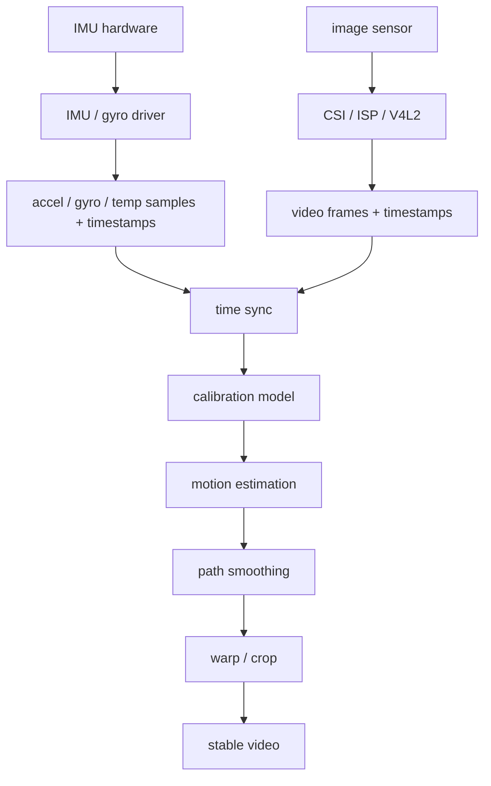

# 陀螺仪防抖总览

## 学习目标

- 建立陀螺仪视频防抖的完整分层模型
- 区分 gyro 采集链路、video 采集链路、时间同步、标定、防抖算法和实时落地各自职责
- 能从工程现象反推问题落在传感器、时间戳、坐标系、算法、画面变换还是性能链路
- 为后续阅读真实驱动、ISP/V4L2 代码、EIS 算法代码建立项目地图

## 导读

### 本章定位

这一章是陀螺仪防抖项目的总入口。本项目不是单纯算法学习，也不是单纯驱动学习，而是一个跨层工程项目：

```text
IMU/陀螺仪驱动 / IIO 或 input  // 提供 accel/gyro/temp 采样和时间戳
-> 视频采集 / V4L2 / ISP       // 提供视频帧和帧时间戳
-> 时间同步与标定              // 把 gyro 样本和 video frame 对齐到同一个时空模型
-> 防抖算法                    // 根据相机运动生成平滑轨迹和补偿变换
-> 画面 warp / crop / 输出      // 把补偿应用到视频帧并输出稳定画面
```


```
venc ->venc_mp4  -  ->venc_rtsp_mp4 -> venc_rtsp_mp4_gyro -> 
     |->venc_rtsp |                 |-> venc_rtsp_mp4 v2
     |->mpu6050_i2c_test 
     
```
### 核心对象

- `IMU sample`
  - 一次传感器采样包，可能同时包含 `accel`、`gyro`、`temp` 和 timestamp
- `accel sample`
  - 加速度采样，静止时主要用来判断重力方向、安装方向和加速度 scale 是否合理
- `gyro sample`
  - 陀螺仪一次角速度采样，通常包含 `gx/gy/gz` 和 timestamp
- `temperature sample`
  - 温度采样，用来观察 gyro 零偏是否随温度变化
- `gyro bias`
  - 陀螺仪零偏，决定积分是否会持续漂移
- `video frame`
  - 一帧图像数据，必须能关联准确曝光时间
- `frame timestamp`
  - 帧曝光或 buffer 完成时间戳，是和 gyro 对齐的关键
- `camera intrinsic`
  - 相机内参，包含焦距、主点和畸变参数
- `gyro-camera extrinsic`
  - 陀螺仪坐标系到相机坐标系的旋转关系
- `stabilization transform`
  - 防抖算法输出的图像补偿变换

### 关键函数

当前尚未绑定具体源码，因此先按入口类型记录：

- gyro 驱动注册入口：`iio_device_register()` / `input_register_device()`
- gyro 数据入口：IIO buffer、trigger、FIFO IRQ、`read_raw()`、`read()`、`ioctl()`
- 视频入口：`VIDIOC_STREAMON`、`vb2_qbuf()`、`vb2_dqbuf()`、sensor/CSI/ISP frame done
- 时间戳入口：gyro sample timestamp、V4L2 buffer timestamp、SOF/EOF timestamp
- 防抖算法入口：gyro integration、path smoothing、warp/crop generation

### 主流程

```text
IMU 采样                          // 读取 accel/gyro/temp，最好带硬件或统一时钟时间戳
-> 数据分流                         // accel 用于姿态/安装检查，gyro 用于积分，temp 用于温漂观察
-> gyro 校准                       // 去零偏、比例误差、轴向误差
-> 视频帧采集                      // 获取每帧图像和帧时间戳
-> 时间同步                        // 把 gyro sample 和 video frame 对齐到同一时间轴
-> 坐标系统一                      // 把 gyro 坐标系转换到 camera 坐标系
-> 角速度积分                      // 将角速度积分成相机姿态变化
-> 轨迹平滑                        // 生成更平滑的目标相机运动
-> 图像补偿                        // 根据原始运动和目标运动生成 warp
-> 裁剪输出                        // 用 crop margin 隐藏边缘空洞并输出稳定视频
```

## 推荐源码入口

### 陀螺仪采集侧

- `drivers/iio/imu/`
- `drivers/iio/gyro/`
- `drivers/input/`
- `include/linux/iio/`

### 视频采集侧

- `drivers/media/`
- `drivers/media/platform/`
- `drivers/media/i2c/`
- `drivers/media/v4l2-core/`
- `include/media/`

### 用户态和实验侧

- V4L2 采集工具：`v4l2-ctl`、自写 `VIDIOC_*` 程序
- IIO 调试入口：`/sys/bus/iio/devices/`、`iio_info`、IIO buffer
- 离线实验：Python、OpenCV、NumPy、gyro CSV、视频文件

## 阅读顺序

1. [[01-陀螺仪防抖核心对象]]
2. [[02-陀螺仪数据采集链路]]
3. [[03-视频采集与V4L2链路]]
4. [[04-时间戳同步机制]]
5. [[05-标定：内参、外参、零偏与坐标系]]
6. [[06-防抖算法主流程]]
7. [[07-离线OpenCV实验]]
8. [[08-嵌入式实时落地]]
9. [[09-陀螺仪防抖工程问题问答]]
10. [[10-陀螺仪防抖学习达标检查清单]]
11. [[11-MPU6050实机调试问题与解决思路]]

## 最重要的一条主线

```text
IMU driver probe                  // IMU/陀螺仪驱动绑定硬件，准备采样
-> accel/gyro/temp channels        // 明确加速度、角速度、温度三类通道
-> gyro FIFO / trigger / IRQ       // 按固定频率获取角速度样本
-> gyro sample timestamp           // 每个样本必须带时间信息
-> video sensor / ISP streamon     // 视频链路开始输出帧
-> frame timestamp                 // 每帧必须知道曝光或采集时间
-> time alignment                  // 找到 gyro 与 video 的时间对应关系
-> calibration                     // 去零偏并统一 gyro/camera 坐标系
-> integrate gyro                  // 角速度积分得到相机姿态变化
-> smooth path                     // 从原始抖动轨迹生成目标平滑轨迹
-> warp frame                      // 对图像做反向补偿
-> crop and output                 // 裁剪边缘后输出稳定视频
```

## 对象关系总图



这张图要表达的是：陀螺仪防抖不是“gyro 数据一来就直接旋转画面”，更不是把 `accel/gyro/temp` 三类数据混着用。`gyro` 是旋转补偿主输入，`accel` 帮助检查姿态和安装方向，`temp` 帮助解释零偏温漂；最终仍然要经过时间同步和坐标系标定，才能把传感器运动正确映射到图像补偿。

## 生命周期总览

```text
init                              // 初始化 gyro、video、算法上下文
-> calibrate                      // 建立零偏、坐标系、时间延迟和相机参数
-> stream start                   // gyro 和 video 同时进入工作状态
-> collect samples and frames      // 持续采集 gyro 样本和视频帧
-> stabilize each frame            // 为每帧计算补偿并输出
-> stream stop                    // 停止采集，释放 buffer、IRQ、线程和上下文
```

## 这套笔记回答的问题

- 为什么防抖项目最怕时间戳不准
- gyro 数据为什么必须先做零偏和坐标系处理
- V4L2 buffer timestamp 和真实曝光时间有什么差别
- rolling shutter 为什么会让防抖变复杂
- 离线实验和嵌入式实时实现的边界在哪里
- 防抖效果不好时，怎样判断是驱动、时间同步、标定、算法还是性能问题
